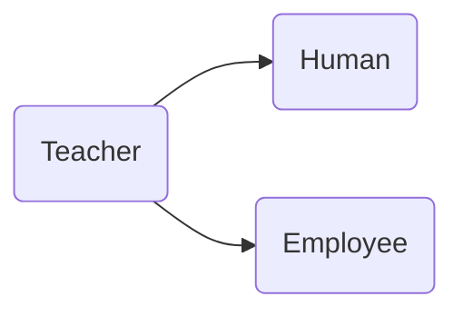

# Глава №11. Наследование в C++

## Оглавление

1. [Урок №162. Базовое наследование](#урок-162-базовое-наследование)
2. [Урок №163. Порядок построения дочерних классов](#урок-163-порядок-построения-дочерних-классов)
3. [Урок №164. Конструкторы и инициализация дочерних классов](#урок-164-конструкторы-и-инициализация-дочерних-классов)
4. [Урок №165. Наследование и спецификатор доступа `protected`](#урок-165-наследование-и-спецификатор-доступа-protected)
5. [Урок №166. Добавление нового функционала в дочерний класс](#урок-166-добавление-нового-функционала-в-дочерний-класс)
6. [Урок №167. Переопределение методов родительского класса](#урок-167-переопределение-методов-родительского-класса)
7. [Урок №168. Сокрытие методов родительского класса](#урок-168-сокрытие-методов-родительского-класса)
8. [Урок №169. Множественное наследование](#урок-169-множественное-наследование)

## [Урок №162. Базовое наследование](#урок-162-базовое-наследование)

Класс, от которого наследуют, называется **родительским** (или **"базовым"**,\
**"суперклассом"**), а класс, который наследует, называется **дочерним**\
(или **"производным"**, **"подклассом"**).

```c++
#include <iostream>
#include <string>

class Human {
public:
    std::string m_name;
    int m_age;

    explicit Human(std::string name = "", int age = 0) : m_name(std::move(name)), m_age(age) {}

    std::string &getName() { return m_name; }

    int &getAge() { return m_age; }
};

// BasketballPlayer открыто наследует Human
class BasketballPlayer : public Human {
public:
    double m_gameAverage;
    int m_points;

    explicit BasketballPlayer(double gameAverage = 0.0, int points = 0)
            : m_gameAverage(gameAverage), m_points(points) {}

    void printNameAndPoints() const {
        std::cout << m_name << ": " << m_points << '\n'; // используем переменные родительского класса
    }
};


int main() {
    BasketballPlayer kirill; // Создаем нового Баскетболиста
    kirill.m_name = "Kirill"; // Присваиваем ему имя (public)
    std::cout << kirill.getName(); // используем метод getName(), // Kirill
    // который мы унаследовали от класса Human
    kirill.m_points = 12;
    kirill.printNameAndPoints(); // Kirill: 12
    return 0;
}
```

## [Урок №163. Порядок построения дочерних классов](#урок-163-порядок-построения-дочерних-классов)

Когда C++ создает объекты дочерних классов, то он делает это поэтапно. Сначала\
создается самый верхний класс иерархии (тот, который родитель). Затем создается\
дочерний класс, который идет следующим по порядку, и так до тех пор, пока не будет\
создан последний класс (тот, который находится в самом низу иерархии).

### Резюме

Язык C++ выполняет построение дочерних классов поэтапно, начиная с верхнего\
класса иерархии и заканчивая нижним классом иерархии. По мере построения\
каждого класса для выполнения инициализации вызывается соответствующий\
конструктор соответствующего класса.

## [Урок №164. Конструкторы и инициализация дочерних классов](#урок-164-конструкторы-и-инициализация-дочерних-классов)

### Конструкторы и инициализация

```c++
class Parent {
public:
    int m_id;

    Parent(int id = 0) : m_id(id) {}

    int getId() const { return m_id; }
};

class Child : public Parent {
public:
    double m_value;

    Child(double value = 0.0) : m_value(value) {}

    double getValue() const { return m_value; }
};
```

```c++
int main() {
    Child child(1.5); // вызывается конструктор Child(double)
    return 0;
}
```

Вот что происходит при инициализации объекта `child`:

* выделяется память для объекта дочернего класса (достаточная порция\
  памяти для части `Parent` и части `Child` объекта класса `Child`);
* вызывается соответствующий конструктор класса `Child`;
* создается объект класса `Parent` с использованием соответствующего\
  конструктора класса `Parent`. Если такой конструктор программистом не\
  предоставлен, то будет использоваться конструктор по умолчанию класса\
  `Parent`;
* список инициализации инициализирует переменные;
* выполняется тело конструктора класса `Child`;
* точка выполнения возвращается обратно в `caller`.

Сначала выполняется конструктор родительского класса (для инициализации части\
родительского класса) и только потом уже выполняется конструктор дочернего\
класса.

### Инициализация членов родительского класса

Правильная инициализация `m_id` при создани объекта класса `Child`:

```c++
#include <iostream>

class Parent {
private:
    int m_id;
public:
    Parent(int id = 0) : m_id(id) {}

    int getId() const { return m_id; }
};

class Child : public Parent {
private:
    double m_value;
public:
    Child(double value = 0.0, int id = 0)
            : Parent(id), // вызывается конструктор Parent(int) со значением id!
              m_value(value) {}

    double getValue() const { return m_value; }
};

int main() {
    Child child(1.5, 7); // вызывается конструктор Child(double, int)
    std::cout << "ID: " << child.getId() << '\n'; // 7
    std::cout << "Value: " << child.getValue() << '\n'; // 1.5

    return 0;
}
```

### Еще один пример

```c++
#include <iostream>
#include <string>
#include <utility>

class Human {
private:
    std::string m_name;
    int m_age;
public:
    explicit Human(std::string name = "", int age = 0)
            : m_name(std::move(name)), m_age(age) {}

    std::string getName() const { return m_name; }

    int getAge() const { return m_age; }
};

// BasketballPlayer открыто наследует класс Human
class BasketballPlayer : public Human {
private:
    double m_gameAverage;
    int m_points;
public:
    explicit BasketballPlayer(std::string name = "", int age = 0,
                              double gameAverage = 0.0, int points = 0)
            : Human(std::move(name), age), // вызывается Human(std::string, int) для инициализации членов name и age
              m_gameAverage(gameAverage), m_points(points) {
    }

    double getGameAverage() const { return m_gameAverage; }

    int getPoints() const { return m_points; }
};

int main() {
    BasketballPlayer anton("Anton Ivanovuch", 45, 300, 310);

    std::cout << anton.getName() << '\n'; // Anton Ivanovuch
    std::cout << anton.getAge() << '\n'; // 45
    std::cout << anton.getPoints() << '\n'; // 310

    return 0;
}
```

### Деструкторы

**При уничтожении дочернего класса, каждый деструктор вызывается в порядке\
обратном построению классов.**

### Резюме

При инициализации объектов дочернего класса, конструктор дочернего класса\
отвечает за то, какой конструктор родительского класса вызывать. Если этот\
конструктор явно не указан, то вызывается конструктор по умолчанию\
родительского класса. Если же компилятор не может найти конструктор по\
умолчанию родительского класса (или этот конструктор не может быть создан\
автоматически), то компилятор выдаст ошибку.

### Тест

```c++
#include <iostream>
#include <string>
#include <utility>

class Fruit {
private:
    std::string m_name;
    std::string m_color;
public:
    Fruit(std::string name, std::string color)
            : m_name(std::move(name)), m_color(std::move(color)) {
    }

    std::string getName() const { return m_name; }

    std::string getColor() const { return m_color; }
};

class Apple : public Fruit {
private:
    double m_fiber;
public:
    Apple(std::string name, std::string color, double fiber)
            : Fruit(std::move(name), std::move(color)), m_fiber(fiber) {
    }

    double getFiber() const { return m_fiber; }

    friend std::ostream &operator<<(std::ostream &out, const Apple &a) {
        out << "Apple (" << a.getName() << ", " << a.getColor() << ", " <<
            a.getFiber() << ")\n";
        return out;
    }
};

class Banana : public Fruit {
public:
    Banana(std::string name, std::string color)
            : Fruit(std::move(name), std::move(color)) {
    }

    friend std::ostream &operator<<(std::ostream &out, const Banana &b) {
        out << "Banana (" << b.getName() << ", " << b.getColor() << ")\n";
        return out;
    }
};

int main() {
    const Apple a("Red delicious", "red", 7.3);
    std::cout << a; // Apple (Red delicious, red, 7.3)
    const Banana b("Cavendish", "yellow");
    std::cout << b; // Banana (Cavendish, yellow)
    return 0;
}
```

## [Урок №165. Наследование и спецификатор доступа `protected`](#урок-165-наследование-и-спецификатор-доступа-protected)

### Спецификатор доступа `protected`

**Спецификатор доступа `protected` открывает доступ к членам класса\
дружественным и дочерним классам.**

```c++
class Parent {
public:
    int m_public; // доступ к этому члену открыт для всех объектов
private:
    int m_private; // доступ к этому члену открыт только для других членов
    // класса Parent и для дружественных классов/функций (но не для дочерних классов)
protected:
    int m_protected; // доступ к этому члену открыт для других членов класса
    // Parent, дружественных классов/функций, дочерних классов
};

class Child : public Parent {
    Child() {
        m_public = 1; // разрешено: доступ к открытым членам родительского
        // класса из дочернего класса
        m_private = 2; // запрещено: доступ к закрытым членам родительского
        // класса из дочернего класса
        m_protected = 3; // разрешено: доступ к защищенным членам родительского
        // класса из дочернего класса
    }
};

int main() {
    Parent parent;
    parent.m_public = 1; // разрешено: доступ к открытым членам класса извне
    parent.m_private = 2; // запрещено: доступ к закрытым членам класса извне
    parent.m_protected = 3; // запрещено: доступ к защищенным членам класса извне
    
    return 0;
}
```

### Типы наследований. Доступ к членам

Существует три типа наследований классов:

* `public`;
* `private`;
* `protected`.

```c++
class Pub: public Parent {
};

class Pri: private Parent {
};

class Pro: protected Parent {
};

class Def: Parent { // по умолчанию private
};
```

### Наследование типа `public`

Когда вы открыто наследуете родительский класс, то унаследованные public-члены\
остаются public, унаследованные protected-члены остаются protected, а\
унаследованные private-члены остаются недоступными для дочернего класса.\
Ничего не меняется.

| Спецификатор доступа в<br>родительском классе | Спецификатор доступа при наследовании типа<br>public в дочернем классе |
|:---------------------------------------------:|:----------------------------------------------------------------------:|
|                    public                     |                                 public                                 |
|                    private                    |                               Недоступен                               |
|                   protected                   |                               protected                                |

**Правило: Используйте открытое наследование, если у вас нет веских причин\
делать иначе.**

### Наследование типа `private`

**При закрытом наследовании все члены родительского класса наследуются как\
закрытые.** Это означает, что private-члены остаются недоступными, а protected- и\
public-члены становятся private в дочернем классе.

```c++
class Parent {
public:
    int m_public;
private:
    int m_private;
protected:
    int m_protected;
};

class Priv : private Parent { // закрытое наследование
    // Закрытое наследование означает, что:
    // - public-члены становятся private (m_public теперь private) в дочернем
    // классе;
    // - protected-члены становятся private (m_protected теперь private) в
    // дочернем классе;
    // - private-члены остаются недоступными (m_private недоступен) в дочернем
    // классе.
public:
    Priv() {
        m_public = 1; // разрешено: m_public теперь private в Priv
        m_private = 2; // запрещено: дочерние классы не имеют доступ к закрытым
        // членам родительского класса
        m_protected = 3; // разрешено: m_protected теперь private в Priv
    }
};

int main() {
    Parent parent;
    parent.m_public = 1; // разрешено: m_public доступен извне через
    // родительский класс
    parent.m_private = 2; // запрещено: m_private недоступен извне через
    // родительский класс
    parent.m_protected = 3; // запрещено: m_protected недоступен извне через
    // родительский класс

    Priv priv;
    priv.m_public = 1; // запрещено: m_public недоступен извне через дочерний
    // класс
    priv.m_private = 2; // запрещено: m_private недоступен извне через дочерний
    // класс
    priv.m_protected = 3; // запрещено: m_protected недоступен извне через
    // дочерний класс
}
```

| Спецификатор доступа в<br>родительском классе | Спецификатор доступа при наследовании типа<br>private в дочернем классе |
|:---------------------------------------------:|:-----------------------------------------------------------------------:|
|                    public                     |                                 private                                 |
|                    private                    |                               Недоступен                                |
|                   protected                   |                                 private                                 |

**Закрытое наследование может быть полезно, когда дочерний класс не имеет\
очевидной связи с родительским классом, но использует его в своей реализации.**

### Наследование типа `protected`

| Спецификатор доступа в<br>родительском классе | Спецификатор доступа при наследовании типа<br>protected в дочернем классе |
|:---------------------------------------------:|:-------------------------------------------------------------------------:|
|                    public                     |                                 protected                                 |
|                    private                    |                                Недоступен                                 |
|                   protected                   |                                 protected                                 |

### Резюме

Способ взаимодействия спецификаторов доступа, типов наследования и дочерних\
классов может вызывать путаницу. Чтобы это устранить, проясним все еще раз:

* Во-первых, класс всегда имеет доступ к своим собственным не\
  унаследованным членам (и дружественные ему классы также имеют доступ).\
  Спецификаторы доступа влияют только на то, могут ли объекты вне класса и\
  дочерние классы обращаться к этим членам.
* Во-вторых, когда дочерние классы наследуют члены родительских классов, то\
  члены родительского класса могут изменять свои спецификаторы доступа в\
  дочернем классе. Это никак не влияет на собственные (не наследуемые)\
  члены дочерних классов (которые определены в дочернем классе и имеют\
  свои собственные спецификаторы доступа). Это влияет только на то, могут ли\
  объекты извне и классы, дочерние нашим дочерним классам, получить\
  доступ к унаследованным членам родительского класса.

| Спецификатор<br>доступа в<br>родительском<br>классе | Спецификатор<br>доступа при<br>наследовании<br>типа `public` в<br>дочернем классе | Спецификатор<br>доступа при<br>наследовании<br>типа `private` в<br>дочернем классе | Спецификатор<br>доступа при<br>наследовании<br>типа `protected` в<br>дочернем классе |
|:---------------------------------------------------:|:---------------------------------------------------------------------------------:|------------------------------------------------------------------------------------|--------------------------------------------------------------------------------------|
|                      `public`                       |                                     `public`                                      | `private`                                                                          | `protected`                                                                          |
|                      `private`                      |                                    Недоступен                                     | Недоступен                                                                         | Недоступен                                                                           |
|                     `protected`                     |                                    `protected`                                    | `private`                                                                          | `protected`                                                                          |

## [Урок №166. Добавление нового функционала в дочерний класс](#урок-166-добавление-нового-функционала-в-дочерний-класс)
```c++
#include <iostream>

class Parent {
protected:
    int m_value;
public:
    explicit Parent(int value) : m_value(value) {}

    static void identify() { std::cout << "I am a Parent\n"; }
};

class Child: public Parent {
public:
    explicit Child(int value) : Parent(value) {}
    
    int getValue() { return m_value; }
};


int main() {
    Child child(7);
    std::cout << child.getValue(); // 7
    
    Parent parent(4);
    std::cout << parent.getValue(); // не сработает
}
```

## [Урок №167. Переопределение методов родительского класса](#урок-167-переопределение-методов-родительского-класса)
### Вызов методов родительского класса
При вызове метода через объект дочернего класса, компилятор сначала смотрит,\
существует ли этот метод в дочернем классе. Если нет, то он начинает продвигаться\
по цепочке наследования вверх и проверяет, был ли этот метод определен в любом\
из родительских классов. Компилятор будет использовать первое найденное\
определение.

```c++
#include <iostream>

class Parent {
protected:
    int m_value;
public:
    explicit Parent(int value) : m_value(value) {}

    static void identify() { std::cout << "I am a Parent\n"; }
};

class Child: public Parent {
public:
    explicit Child(int value) : Parent(value) {}
};


int main() {
    Parent::identify(); // I am a Parent
    
    Child::identify(); // I am a Parent
}
```

### Переопределение методов родительского класса
```c++
#include <iostream>

class Parent {
protected:
    int m_value;
public:
    explicit Parent(int value) : m_value(value) {}

    static void identify() { std::cout << "I am a Parent\n"; }
};

class Child: public Parent {
public:
    explicit Child(int value) : Parent(value) {}

    static void identify() { std::cout << "I am a Child\n"; } // переопределяем метод
};


int main() {
    Parent::identify(); // I am a Parent

    Child::identify(); // I am a Parent
}
```

Когда мы переопределяем родительский метод в дочернем классе, то\
**дочерний метод не наследует спецификатор доступа родительского\
метода** с тем же именем:
```c++
#include <iostream>

class Parent {
private:
    static void print() { std::cout << "Parent\n"; }
};

class Child: public Parent {
public:
    static void print() { std::cout << "Child\n"; }
};


int main() {
    Child::print(); // вызов Child::print(), который является public - 'Child'
}
```

### Расширение функционала родительских методов
```c++
#include <iostream>

class Parent {
protected:
    int m_value;
public:
    explicit Parent(int value) : m_value(value) {}

    static void identify() { std::cout << "I am a Parent\n"; }
};

class Child: public Parent {
public:
    explicit Child(int value) : Parent(value) {}

    int GetValue() { return m_value; }

    static void identify() {
        // Parent:: нужен для того, чтобы вызвать конкретно метод родительского класса
        Parent::identify(); // сначала выполняется вызов Parent::identify()
        std::cout << "I am a Child\n"; // затем уже вывод этого текста
    }
};


int main() {
    Child::identify(); // I am a Parent \n I am a Child

    return 0;
}
```

## [Урок №168. Сокрытие методов родительского класса](#урок-168-сокрытие-методов-родительского-класса)
```c++
#include <iostream>

class Parent {
protected:
    int m_value;
public:
    explicit Parent(int value) : m_value(value) {}
protected:
    void printValue() const { std::cout << m_value; }
};

class Child: public Parent {
public:
    explicit Child(int value) : Parent(value) {}

    // Parent::printValue является protected, поэтому доступ к нему не является
    // открытым для всех объектов.
    // Но мы можем это исправить с помощью "using-объявления" и сделать метод public
    using Parent::printValue; // обратите внимание, нет никаких скобок
};


int main() {
    Child child(9);
    // Метод printValue() является public в классе Child, поэтому всё хорошо
    child.printValue(); // выведется 9

    return 0;
}
```

### Сокрытие родительских методов в дочернем классе
Инкапсуляция данных родительского класса в дочернем классе:
```c++
#include <iostream>

class Parent {
public:
    int m_value;
};

class Child : public Parent {
private:
    using Parent::m_value;
public:
    explicit Child(int value)
    // Мы не можем инициализировать m_value, поскольку это член класса Parent
    // (Parent должен инициализировать m_value)
    {
        // Но мы можем присвоить значение
        m_value = value;
    }
};


int main() {
    Child child(9);
    // Следующее не сработает, поскольку m_value был переопределен как private
    std::cout << child.m_value;

    return 0;
}
```

Инкапсуляция с помощью ключевого слова `delete`:
```c++
#include <iostream>

class Parent {
public:
    int m_value;
public:
    explicit Parent(int value) : m_value(value) {}

    int &getValue() { return m_value; }
};

class Child : public Parent {
public:
    explicit Child(int value) : Parent(value) {}

    int getValue() = delete; // делаем этот метод недоступным
};


int main() {
    Child child(9);
    
    // Следующее не сработает, поскольку getValue() удален
    std::cout << child.getValue();
    
    // Однако через объект родительского класса всё
    // будет работать, так как мы «удалили» getValue() только в дочернем классе.
    Parent parent(3);
    std::cout << parent.getValue();
    
    return 0;
}
```

## [Урок №169. Множественное наследование](#урок-169-множественное-наследование)
### Множественное наследование
**Множественное наследование** позволяет одному дочернему классу иметь\
несколько родителей.

