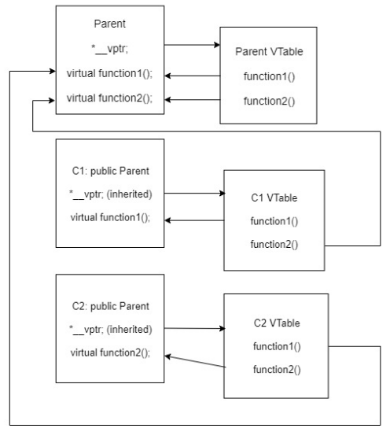
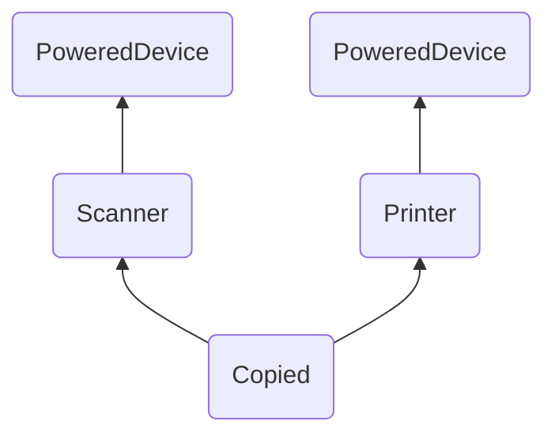

# Глава №12. Виртуальные функции в C++

## Содержание
1. [Урок №170. Указатели, Ссылки и Наследование](#урок-170-указатели-ссылки-и-наследование)
2. [Урок №171. Виртуальные функции и Полиморфизм](#урок-171-виртуальные-функции-и-полиморфизм)
3. [Урок №172. Модификаторы `override` и `final`](#урок-172-модификаторы-override-и-final)
4. [Урок №173. Виртуальные деструкторы и Виртуальное присваивание](#урок-173-виртуальные-деструкторы-и-виртуальное-присваивание)
5. [Урок №174. Раннее и Позднее Связывания](#урок-174-раннее-и-позднее-связывания)
6. [Урок №175. Виртуальные таблицы](#урок-175-виртуальные-таблицы)
7. [Урок №177. Виртуальный базовый класс](#урок-177-виртуальный-базовый-класс)
8. [Урок №178. Обрезка объектов](#урок-178-обрезка-объектов)
9. [Урок №179. Динамическое приведение типов. Оператор `dynamic_cast`](#урок-179-динамическое-приведение-типов-оператор-dynamiccast)

## [Урок №170. Указатели, Ссылки и Наследование](#урок-170-указатели-ссылки-и-наследование)
```c++
#include <iostream>

class Parent {
public:
    int m_value;
public:
    explicit Parent(int value) : m_value(value) {}

    const char *getName() { return "Parent"; }

    int &getValue() { return m_value; }
};

class Child : public Parent {
public:
    explicit Child(int value) : Parent(value) {}

    const char *getName() { return "Child"; }

    int getValueDoubled() { return m_value * 2; }
};


int main() {
    Child child(7);
    std::cout << "child is a " << child.getName() << " and has value " <<
              child.getValue() << '\n'; // child is a Child and has value 7
              
    // Мы можем дать команду указателям и ссылкам класса Child указывать на другие
    // объекты класса Child:
    Child &rChild = child;
    std::cout << "rChild is a " << rChild.getName() << " and has value " <<
              rChild.getValue() << '\n'; // rChild is a Child and has value 7
    Child *pChild = &child;
    std::cout << "pChild is a " << pChild->getName() <<
              " and has value " << pChild->getValue() << '\n'; // pChild is a Child and has value 7
              
    // также мы можем дать команду указателю или ссылке класса Parent указывать на 
    // объект класса Child:
    Parent &rParent = child;
    Parent *pParent = &child;
    std::cout << "child is a " << child.getName() << " and has value " <<
              child.getValue() << '\n'; // child is a Child and has value 7
    std::cout << "rParent is a " << rParent.getName() << " and has value " <<
              rParent.getValue() << '\n'; // rParent is a Parent and has value 7
    std::cout << "pParent is a " << pParent->getName() <<
              " and has value " << pParent->getValue() << '\n'; // pParent is a Parent and has value 7
    return 0;
}
```
Поскольку `rParent` и `pParent` являются ссылкой и указателем класса `Parent`, то\
они могут видеть только члены класса `Parent` (и члены любых других классов,\
которые наследует `Parent`). Таким образом, указатель/ссылка класса `Parent` не\
может увидеть `Child::getName()`. Следовательно, вызывается `Parent::getName()`, а\
`rParent` и `pParent` сообщают, что они относятся к классу `Parent`, а не к классу\
`Child`.

Обратите внимание, это также означает, что невозможно вызвать\
`Child::getValueDoubled()` через `rParent` или `pParent`. Они не могут видеть что-\
либо в классе `Child`.
```c++
std::cout << rParent.getValueDoubled() // ошибка
std::cout << pParent.getValueDoubled() // ошибка
```

Еще один пример:
```c++
#include <iostream>
#include <string>
#include <utility>

class Animal {
protected:
    std::string m_name;

    // Мы делаем этот конструктор protected так как не хотим, чтобы пользователи
    // создавали объекты класса Animal напрямую,
    // но хотим, чтобы у дочерних классов доступ был открыт
    Animal(std::string name)
            : m_name(std::move(name)) {
    }

public:
    std::string getName() { return m_name; }

    const char *speak() { return "???"; }
};

class Cat : public Animal {
public:
    Cat(std::string name)
            : Animal(std::move(name)) {
    }

    const char *speak() { return "Meow"; }
};

class Dog : public Animal {
public:
    Dog(std::string name)
            : Animal(std::move(name)) {
    }

    const char *speak() { return "Woof"; }
};

int main() {
    Cat cat("Matros");
    std::cout << "cat is named " << cat.getName() <<
              ", and it says " << cat.speak() << '\n'; // cat is named Matros, and it says Meow

    Dog dog("Barsik");
    std::cout << "dog is named " << dog.getName() <<
              ", and it says " << dog.speak() << '\n'; // dog is named Barsik, and it says Woof

    Animal *pAnimal = &cat;
    std::cout << "pAnimal is named " << pAnimal->getName() <<
              ", and it says " << pAnimal->speak() << '\n'; // pAnimal is named Matros, and it says ???

    pAnimal = &dog;
    std::cout << "pAnimal is named " << pAnimal->getName() <<
              ", and it says " << pAnimal->speak() << '\n'; // pAnimal is named Barsik, and it says ???

    return 0;
}
```
Мы видим здесь ту же проблему. Поскольку `pAnimal` является указателем типа\
`Animal`, то он может видеть только часть `Animal`. Следовательно,\
`pAnimal->speak()` вызывает `Animal::speak()`, а не `Dog::Speak()`\
или `Cat::speak()`.

### Указатели, ссылки и родительские классы
```c++
int main() {
    Cat matros("Matros"), ivan("Ivan"), martun("Martun");
    Dog barsik("Barsik"), tolik("Tolik"), tyzik("Tyzik");

    // Создаем массив указателей на наши объекты Cat и Dog
    Animal *animals[] = { &matros, &ivan, &martun, &barsik, &tolik, &tyzik};
    for (auto const animal : animals)
        std::cout << animal->getName() << " says " << animal->speak() << '\n';

    return 0;
}
```
Хотя это скомпилируется и выполнится, но, к сожалению, тот факт, что каждый\
элемент массива `animals` является указателем на `Animal`, означает, что\
`animal->speak()` будет вызывать `Animal::speak()`, вместо методов `speak()`\
дочерних классов.

### Тест
```c++
#include <iostream>
#include <string>
#include <utility>

class Animal {
protected:
    std::string m_name;
    const char *m_speak;

    // Мы делаем этот конструктор protected так как не хотим,
    // чтобы пользователи могли создавать объекты класса Animal напрямую,
    // но хотим, чтобы у дочерних классов доступ был открыт
    Animal(std::string name, const char *speak)
            : m_name(std::move(name)), m_speak(speak) {}

public:
    std::string getName() { return m_name; }

    const char *speak() { return m_speak; }
};

class Cat : public Animal {
public:
    Cat(std::string name) : Animal(std::move(name), "Meow") {}
};

class Dog : public Animal {
public:
    Dog(std::string name) : Animal(std::move(name), "Woof") {}
};

int main() {
    Cat matros("Matros"), ivan("Ivan"), martun("Martun");
    Dog barsik("Barsik"), tolik("Tolik"), tyzik("Tyzik");

    // Создаем массив указателей на наши объекты Cat и Dog
    Animal *animals[] = {&matros, &ivan, &martun, &barsik, &tolik, &tyzik};
    for (auto const animal: animals)
        std::cout << animal->getName() << " says " << animal->speak() << '\n';

    return 0;
}
```

```c++
<<< Matros says Meow
<<< Ivan says Meow
<<< Martun says Meow
<<< Barsik says Woof
<<< Tolik says Woof
<<< Tyzik says Woof
```

## [Урок №171. Виртуальные функции и Полиморфизм](#урок-171-виртуальные-функции-и-полиморфизм)
**Виртуальная функция в языке С++** — это особый тип функции, которая, при её\
вызове, выполняет «наиболее» дочерний метод, который существует между\
родительским и дочерними классами. Это свойство еще известно, как\
**полиморфизм**. Дочерний метод вызывается тогда, когда совпадает сигнатура (имя,\
типы параметров и является ли метод константным) и тип возврата дочернего\
метода с сигнатурой и типом возврата метода родительского класса. Такие методы\
называются **переопределениями** (или **"переопределенными методами"**).

```c++
#include <iostream>
#include <string>
#include <utility>

class Parent {
public:
    virtual const char *getName() { return "Parent"; } // добавили ключевое слово virtual
};

class Child : public Parent {
public:
    virtual const char *getName() { return "Child"; }
};

int main() {
    Child child;
    Parent &rParent = child;
    std::cout << "rParent is a " << rParent.getName(); // rParent is a Child

    return 0;
}
```

### Более сложный пример
```c++
#include <iostream>
#include <string>
#include <utility>

class Animal {
protected:
    std::string m_name;

    // Мы делаем этот конструктор protected так как не хотим, чтобы пользователи
    // создавали объекты класса Animal напрямую,
    // но хотим, чтобы у дочерних классов доступ был открыт
    Animal(std::string name)
            : m_name(std::move(name)) {
    }

public:
    std::string getName() { return m_name; }

    virtual const char *speak() { return "???"; }
};

class Cat : public Animal {
public:
    Cat(std::string name)
            : Animal(std::move(name)) {
    }

    virtual const char *speak() { return "Meow"; }
};

class Dog : public Animal {
public:
    Dog(std::string name)
            : Animal(std::move(name)) {
    }

    virtual char *speak() { return "Woof"; }
};


void report(Animal &animal) {
    std::cout << animal.getName() << " says " << animal.speak() << '\n';
}

int main() {
    Cat cat("Matros");
    Dog dog("Barsik");

    report(cat); // Matros says Meow
    report(dog); // Barsik says Woof

    return 0;
}
```

При обработке `animal.speak()`, компилятор видит, что метод `Animal::speak()`\
является виртуальной функцией. Когда animal ссылается на часть `Animal` объекта\
`cat`, то компилятор просматривает все классы между `Animal` и `Cat`, чтобы найти\
наиболее дочерний метод `speak()`. И находит `Cat::speak()`. В случае, когда\
`animal` ссылается на часть `Animal` объекта `dog`, компилятор находит `Dog::speak()`.

Также сработает:
```c++
Cat matros("Matros"), ivan("Ivan"), martun("Martun");
Dog barsik("Barsik"), tolik("Tolik"), tyzik("Tyzik");

// Создаем массив указателей на наши объекты Cat и Dog
Animal *animals[] = { &matros, &barsik, &ivan, &tolik, &martun, &tyzik};
for (auto const & animal : animals)
    std::cout << animal->getName() << " says " << animal->speak() << '\n';
```

> <picture>
>   <source media="(prefers-color-scheme: light)" srcset="https://raw.githubusercontent.com/Mqxx/GitHub-Markdown/main/blockquotes/badge/light-theme/danger.svg">
>   
> </picture><br>
>
> Сигнатура виртуального метода дочернего класса должна полностью\
> соответствовать сигнатуре виртуального метода родительского класса.\
> Если у дочернего метода будет другой тип параметров, нежели у\
> родительского, то вызываться этот метод не будет.

**Типы возврата виртуальной функции и её переопределений должны совпадать.**

> <picture>
>   <source media="(prefers-color-scheme: light)" srcset="https://raw.githubusercontent.com/Mqxx/GitHub-Markdown/main/blockquotes/badge/light-theme/warning.svg">
>   
> </picture><br>
>
> <b>Правило: Никогда не вызывайте виртуальные функции в теле конструкторов или\
> деструкторов.</b>

## [Урок №172. Модификаторы `override` и `final`](#урок-172-модификаторы-override-и-final)
### Модификатор `override`
Модификатор `override` используется для того, чтобы иметь дополнительный контроль\
переопределения методов класса:
```c++
#include <iostream>
#include <string>
#include <utility>

class A {
public:
    virtual const char *getName1(int x) { return "A"; }

    virtual const char *getName2(int x) { return "A"; }

    virtual const char *getName3(int x) { return "A"; }
};

class B : public A {
public:
    // ошибка компиляции, метод не является переопределением
    virtual const char *getName1(short int x) override { return "B"; }

    // ошибка компиляции, метод не является переопределением
    virtual const char *getName2(int x) const override { return "B"; }

    // всё хорошо, метод является переопределением A::getName3(int)
    const char *getName3(int x) override { return "B"; }
};

int main() {

    return 0;
}
```

> <picture>
>   <source media="(prefers-color-scheme: light)" srcset="https://raw.githubusercontent.com/Mqxx/GitHub-Markdown/main/blockquotes/badge/light-theme/warning.svg">
>   
> </picture><br>
>
> <b>Правило: Правило: Используйте модификатор override для каждого из своих\
> переопределений.</b>

### Модификатор `final`
Модификатор `final` используется для того, чтобы запретить переопределение\
виртуальных функций или наследование определенных классов:
```c++
// ДЛЯ МЕТОДОВ
class A {
public:
    virtual const char *getName() { return "A"; }
};

class B : public A {
public:
    const char *getName() final { return "B"; } // final не даст переопределить этот метод в будущем
};

class C : public B {
public:
    const char* getName() override { return "C"; } // ошибка компиляции,
    // из-за попытки переопределения final-метода
};
```

```c++
// ДЛЯ КЛАССОВ
class A {
public:
virtual const char *getName() { return "A"; }
};

class B final : public A { // final не даст унаследовать данный класс в будущем
public:
const char *getName() override { return "B"; }
};

class C : public B { // ошибка компиляции: нельзя наследовать final-класс
public:
const char* getName() override { return "C"; }
};
```

### Ковариантный тип возврата
Если типом возврата виртуальной функции является указатель или ссылка\
на класс, то переопределения могут возвращать указатель или ссылку на\
свой собственный класс (т.е. вместо родительского класса указывать на\
дочерний класс). Это называется **ковариантным типом возврата**:
```c++
#include <iostream>

class Parent {
public:
    // Этот метод getThis() возвращает указатель на класс Parent
    virtual Parent *getThis() {
        std::cout << "called Parent::getThis()\n";
        return this;
    }

    void printType() { std::cout << "returned a Parent\n"; }
};

class Child : public Parent {
public:
    // Обычно типы возврата переопределений и виртуальных функций
    // родительского класса должны совпадать.
    // Однако, поскольку Child наследует класс Parent, следующий метод может
    // возвращать Child* вместо Parent*
    virtual Child *getThis() {
        std::cout << "called Child::getThis()\n";
        return this;
    }

    void printType() { std::cout << "returned a Child\n"; }
};

int main() {
    Child ch;
    Parent *p = &ch;
    ch.getThis()->printType(); // вызывается Child::getThis(), возвращается Child*, вызывается Child::printType
    p->getThis()->printType(); // вызывается Child::getThis(), возвращается Parent*, вызывается Parent::printType
}

<<< called Child::getThis()
<<< returned a Child
<<< called Child::getThis()
<<< returned a Parent
```

## [Урок №173. Виртуальные деструкторы и Виртуальное присваивание](#урок-173-виртуальные-деструкторы-и-виртуальное-присваивание)
```c++
#include <iostream>

class Parent {
public:
    ~Parent() {
        std::cout << "Calling ~Parent()" << std::endl;
    }
};

class Child : public Parent {
private:
    int* m_array;
public:
    Child(int length) {
        m_array = new int[length];
    }

    ~Child() {
        std::cout << "Calling ~Child()" << std::endl;
        delete[] m_array;
    }
};

int main() {
    Child *child = new Child(7);
    Parent *parent = child;
    delete parent; // Calling ~Parent()
}
```

Поскольку `parent` является указателем класса `Parent`, то при его уничтожении\
компилятор будет смотреть, является ли деструктор класса `Parent` виртуальным.\
Поскольку это не так, то компилятор вызовет только деструктор класса `Parent`.

Тем не менее, нам нужно, чтобы `delete` вызывал деструктор класса `Child` (который, в\
свою очередь, будет вызывать деструктор класса `Parent`), иначе `m_array` не будет\
удален. Это можно выполнить, сделав деструктор класса `Parent` виртуальным:
```c++
#include <iostream>

class Parent {
public:
    virtual ~Parent() {
        std::cout << "Calling ~Parent()" << std::endl;
    }
};

class Child : public Parent {
private:
    int* m_array;
public:
    Child(int length) {
        m_array = new int[length];
    }

    ~Child() override {
        std::cout << "Calling ~Child()" << std::endl;
        delete[] m_array;
    }
};

int main() {
    Child *child = new Child(7);
    Parent *parent = child;
    delete parent; // Calling ~Child()  Calling ~Parent()
}
```

> <picture>
>   <source media="(prefers-color-scheme: light)" srcset="https://raw.githubusercontent.com/Mqxx/GitHub-Markdown/main/blockquotes/badge/light-theme/warning.svg">
>   
> </picture><br>
>
> <b>Правило: При работе с наследованием ваши деструкторы всегда должны быть виртуальными.</b>

### Игнорирование виртуальных функций
```c++
#include <iostream>

class Parent {
public:
    virtual const char* getName() { return "Parent"; }
};

class Child : public Parent {
public:
    const char* getName() override { return "Child"; }
};

int main() {
    Child child;
    Parent &parent = child;
    // Вызов Parent::GetName() вместо переопределения Child::GetName()
    std::cout << parent.Parent::getName() << std::endl; // Parent
}
```

## [Урок №174. Раннее и Позднее Связывания](#урок-174-раннее-и-позднее-связывания)
**Связывание** — это процесс, который используется для конвертации\
идентификаторов (таких как имена переменных или функций) в адреса.

### Раннее связывание
**Прямой вызов функции** — это стейтмент, который напрямую вызывает функцию.
```c++
#include <iostream>

void printValue(int value) {
    std::cout << value;
}

int main() {
    printValue(7); // это прямой вызов функции
    return 0;
}
```

Прямые вызовы функций выполняются с помощью раннего связывания. **Раннее\
связывание** (или **«статическая привязка»**) означает, что компилятор (или линкер)\
может напрямую связать имя идентификатора (например, имя функции или\
переменной) с машинным адресом.

### Позднее связывание
В некоторых программах невозможно знать наперёд, какая функция будет\
вызываться первой. В таком случае используется **позднее связывание** (или\
**«динамическая привязка»**). В языке C++ для выполнения позднего связывания\
используются указатели на функции. Вкратце, указатель на функцию — это тип\
указателя, который указывает на функцию вместо переменной. Функция, на\
которую указывает указатель, может быть вызвана через указатель и оператор\
вызова функции:
```c++
#include <iostream>

int add(int a, int b) {
    return a + b;
}

int main() {
    // Создаем указатель на функцию add
    int (*pFcn)(int, int) = add;
    std::cout << pFcn(4, 5) << std::endl; // вызов add(4 + 5)

    return 0;
}
```

Вызов функции через указатель на функцию также известен как **непрямой** (или\
**"косвенный"**) **вызов функции**.

Позднее связывание менее эффективное, так как присутствует "посредник" между\
процессором и функцией. С ранним связыванием процессор может перейти\
непосредственно к адресу функции. С поздним связыванием процессор должен\
прочитать адрес, хранящийся в указателе, и только затем перейти к этому адресу.\
Этот дополнительный шаг и замедляет весь процесс. Однако преимущество\
позднего связывания заключается в том, что оно более гибкое, нежели раннее\
связывание, так как не нужно решать, какую функцию следует вызывать до,\
собственно, запуска самой программы.

## [Урок №175. Виртуальные таблицы](#урок-175-виртуальные-таблицы)
### Виртуальные таблицы
**Виртуальная таблица в языке С++** — это таблица поиска функций для выполнения\
вызовов функций в режиме позднего (динамического) связывания. Виртуальную\
таблицу еще называют **«vtable»**, **«таблицей виртуальных функций»** или\
**«таблицей виртуальных методов»**.

1. Любой класс, который использует виртуальные функции (или дочерний класс,\
   родительский класс которого использует виртуальные функции), имеет свою\
   собственную виртуальную таблицу.
2. Компилятор добавляет скрытый указатель на родительский класс, который мы\
   будем называть `*__vptr`. тот указатель автоматически создается при создании\
   объекта класса и указывает на виртуальную таблицу этого класса. В отличие от\
   скрытого указателя `*this`, который фактически является параметром функции,\
   используемым компилятором для "указания на самого себя", `*__vptr` является\
   реальным указателем. Следовательно, размер каждого объекта увеличивается на\
   размер этого указателя. `*__vptr` также наследуется дочерними классами.

Здесь у нас есть 3 класса, соответственно, компилятор создаст 3 виртуальные\
таблицы: одна для `Parent`, одна для `C1` и одна для `C2`.\
Компилятор также добавит скрытый указатель на главный родительский класс с\
виртуальными функциями. Хотя компилятор делает это автоматически, мы\
покажем, где этот указатель добавляется:
```c++
class Parent {
public:
    FunctionPointer *__vptr; // здесь
    virtual void function1() {};
    virtual void function2() {};
};

class C1 : public Parent {
public:
    virtual void function1() {};
};

class C2 : public Parent {
public:
    virtual void function2() {};
};
```

При создании объектов классов `Parent`, `C1` или `C2`, `*__vptr` будет указывать на\
виртуальную таблицу класса `Parent`, `C1` или `C2` (соответственно).

### Как заполняются виртуальные таблицы?



`*__vptr` каждого класса указывает на виртуальную таблицу этого же класса. Записи\
в виртуальной таблице указывают на наиболее дочерние методы (переопределения),\
доступ к которым имеют объекты.

```c++
int main() {
    C1 c1; // Поскольку c1 является объектом класса C1, то он имеет свой *__vptr, который
    // указывает на виртуальную таблицу класса C1.

    // Поскольку cPtr является указателем класса Parent, то он указывает только на часть
    // Parent объекта c1. Однако *__vptr тоже находится в части Parent, поэтому cPtr
    // имеет доступ к этому указателю. Наконец, cPtr->__vptr будет указывать на
    // виртуальную таблицу C1, поскольку cPtr указывает на объект класса C1! Даже если
    // cPtr является указателем класса Parent, он все равно имеет доступ к виртуальной
    // таблице C1.
    Parent *cPtr = &c1;

    // Во-первых, компилятор распознает, что function1() является виртуальной функцией.
    // Во-вторых, он будет использовать cPtr->__vptr для перехода к виртуальной
    // таблице C1. В-третьих, он будет искать, какую версию function1() вызывать в
    // виртуальной таблице C1. Он найдет C1::function1(). Следовательно, cPtr->function1()
    // будет вызывать C1::function1()!
    cPtr -> function1();
}
```

**Вызов виртуальной функции происходит медленнее, чем вызов невиртуальной\
функции из-за следующего:**
* Во-первых, мы должны использовать `*__vptr` для перехода к\
  соответствующей виртуальной таблице.
* Во-вторых, мы должны индексировать виртуальную таблицу, чтобы найти\
  правильную функцию для вызова.
* И только теперь мы сможем выполнить вызов функции.

### Резюме 
> <picture>
>   <source media="(prefers-color-scheme: light)" srcset="https://raw.githubusercontent.com/Mqxx/GitHub-Markdown/main/blockquotes/badge/light-theme/success.svg">
>   
> </picture><br>
>
> Любой класс, который использует виртуальные функции, имеет свой `*__vptr`, и\
> размер каждого объекта этого класса увеличивается на размер этого указателя.\
> Виртуальные функции мощные, но цена этому — производительность.

## Урок №176. Чистые виртуальные функции, Интерфейсы и Абстрактные классы
C++ позволяет создавать особый вид виртуальных функций, так называемых\
**чистых виртуальных функций** (или **«абстрактных функций»**), которые вообще не\
имеют определения! Переопределяют их дочерние классы.

При создании чистой виртуальной функции, вместо определения (написания тела)\
виртуальной функции, мы просто присваиваем ей значение 0:
```c++
class Parent {
public:
    const char* sayHi() { return "Hi"; } // обычная невиртуальная функция

    virtual const char* getName() { return "Parent"; } // обычная виртуальная функция

    virtual int getValue() = 0; // чистая виртуальная функция

    int doSomething() = 0; // ошибка компиляции: нельзя присвоить невиртуальным функциям значение 0
};
```

Таким образом, мы сообщаем компилятору: _«Реализацией этой функции займутся\
дочерние классы»_.

Использование чистой виртуальной функции имеет два основных последствия:
1. **Любой класс с одной и более чистыми виртуальными функциями\
   становится абстрактным классом, объекты которого создавать нельзя**:
    ```c++
    int main() {
        Parent parent; // мы не можем создавать объекты абстрактного класса
        parent.getValue();
    }
    ```
2. Все дочерние классы абстрактного родительского класса должны\
   переопределять все чистые виртуальные функции, в противном случае —\
   они также будут считаться абстрактными классами.

### Пример чистой виртуальной функции
```c++
#include <iostream>
#include <string>
#include <utility>

class Animal // этот Animal является абстрактным родительским классом
{
protected:
    std::string m_name;

public:
    Animal(std::string name) : m_name(std::move(name)) {}

    std::string getName() { return m_name; }

    virtual const char *speak() = 0; // обратите внимание, speak() является
    // чистой виртуальной функцией
};

class Lion : public Animal {
public:
    Lion(std::string name) : Animal(name) {}

    virtual const char *speak() { return "RAWRR!"; }
};


int main() {
    Lion lion("John");
    std::cout << lion.getName() << " says " << lion.speak() << '\n'; // John says RAWRR!

    return 0;
}
```

> <picture>
>   <source media="(prefers-color-scheme: light)" srcset="https://raw.githubusercontent.com/Mqxx/GitHub-Markdown/main/blockquotes/badge/light-theme/info.svg">
>   
> </picture><br>
>
> Чистая виртуальная функция абстрактного родительского класса вынуждает дочерние\
> классы переопределить эту функцию, иначе объекты этих классов создавать будет\
> невозможно.

### Чистые виртуальные функции с определениями
```c++
#include <iostream>
#include <string>
#include <utility>

class Animal { // этот Animal является абстрактным родительским классом
protected:
    std::string m_name;

public:
    Animal(std::string name) : m_name(std::move(name)) {}

    std::string getName() { return m_name; }

    virtual const char *speak() = 0; // присваивание значения "= 0" говорит о
    // том, что эта функция является чистой виртуальной функцией...
};

const char *Animal::speak() { // ...несмотря на то, что вот здесь находится её определение
    return "buzz"; // реализация по умолчанию
}

class Dragonfly : public Animal {
public:
    Dragonfly(std::string name) : Animal(std::move(name)) {}

    const char *speak() override { // этот класс уже не является абстрактным,
        // так как мы переопределили функцию speak()
        return Animal::speak(); // используется реализация по умолчанию класса Animal
    }
};


int main() {
    Dragonfly dfly("Barbara");
    std::cout << dfly.getName() << " says " << dfly.speak() << '\n'; // Barbara says buzz

    return 0;
}
```

Это полезно, когда вы хотите, чтобы дочерние классы имели возможность\
переопределять виртуальную функцию или оставить её **реализацию по умолчанию**\
(которую предоставляет родительский класс). В случае, если дочерний класс\
доволен реализацией по умолчанию, он может просто вызвать её напрямую.

### Интерфейсы
**Интерфейс** — это класс, который не имеет переменных-членов и все методы\
которого являются чистыми виртуальными функциями. Интерфейсы еще называют\
**«классами-интерфейсами»** или **«интерфейсными классами»**.

Интерфейсные классы принято называть с `I` в начале, например:
```c++
#include <cmath> // для sqrt()

class IErrorLog {
public:
    virtual bool openLog(const char *filename) = 0;
    virtual bool closeLog() = 0;
    virtual bool writeError(const char *errorMessage) = 0;
    virtual ~IErrorLog() {}; // создаем виртуальный деструктор, чтобы вызывался
    // соответствующий деструктор дочернего класса в случае, если удалим указатель
    // на IErrorLog
};

double mySqrt(double value, IErrorLog &log) {
    if (value < 0.0) {
        log.writeError("Tried to take square root of value less than 0");
        return 0.0;
    } else
        return sqrt(value);
}
```

### Тест
_Чем отличается абстрактный класс от интерфейса в языке C++?_

Абстрактный класс может иметь переменные-члены и имеет как минимум одну\
чистую виртуальную функцию, в то время как интерфейс не имеет переменных-\
членов, и все его методы должны быть чистыми виртуальными функциями.

## [Урок №177. Виртуальный базовый класс](#урок-177-виртуальный-базовый-класс)
### Алмаз смерти
```c++
#include <iostream>

class PoweredDevice {
public:
    PoweredDevice(int power) {
        std::cout << "PoweredDevice: " << power << '\n';
    }
};

class Scanner : public PoweredDevice {
public:
    Scanner(int scanner, int power) : PoweredDevice(power) {
        std::cout << "Scanner: " << scanner << '\n';
    }
};

class Printer : public PoweredDevice {
public:
    Printer(int printer, int power) : PoweredDevice(power) {
        std::cout << "Printer: " << printer << '\n';
    }
};

class Copier : public Scanner, public Printer {
public:
    Copier(int scanner, int printer, int power)
            : Scanner(scanner, power), Printer(printer, power) {
    }
};

int main() {
    Copier copier(1, 2, 3); // PoweredDevice создается дважды
    // PoweredDevice: 3 Scanner: 1
    // PoweredDevice: 3 Printer: 2

    return 0;
}

```



### Виртуальные базовые классы
Чтобы сделать родительский (базовый) класс общим, используется **ключевое слово**\
`virtual` в строке объявления дочернего класса. **Виртуальный базовый класс** — это\
класс, объект которого является общим для использования всеми дочерними классами.
```c++
class PoweredDevice
{
};

class Scanner: virtual public PoweredDevice
{
};

class Printer: virtual public PoweredDevice
{
};

class Copier: public Scanner, public Printer
{
};
```

Теперь, при создании класса `Copier`, мы получим только одну копию `PoweredDevice`,\
которая будет общей как для `Scanner`, так и для `Printer`.

```c++
#include <iostream>

class PoweredDevice {
public:
    PoweredDevice(int power) {
        std::cout << "PoweredDevice: " << power << '\n';
    }
};

class Scanner : virtual public PoweredDevice { // PoweredDevice теперь виртуальный базовый класс
public:
    Scanner(int scanner, int power)
            : PoweredDevice(power) { // эта строка необходима для создания объектов
        // класса Scanner, но в этой программе она игнорируется
        std::cout << "Scanner: " << scanner << '\n';
    }
};

class Printer : virtual public PoweredDevice { // PoweredDevice теперь виртуальный базовый класс
public:
    Printer(int printer, int power)
            : PoweredDevice(power) { // эта строка необходима для создания объектов
        // класса Printer, но в этой программе она игнорируется
        std::cout << "Printer: " << printer << '\n';
    }
};

class Copier : public Scanner, public Printer {
public:
    Copier(int scanner, int printer, int power)
            : Scanner(scanner, power), Printer(printer, power),
              PoweredDevice(power) // построение PoweredDevice выполняется здесь
              {}
};

int main() {
    Copier copier(1, 2, 3); // PoweredDevice создается только один раз
    // PoweredDevice: 3
    // Scanner: 1
    // Printer: 2

    return 0;
}
```

## [Урок №178. Обрезка объектов](#урок-178-обрезка-объектов)
```c++
#include <iostream>

class Parent {
protected:
    int m_value;

public:
    Parent(int value)
            : m_value(value) {
    }

    virtual const char *getName() const { return "Parent"; }

    int getValue() const { return m_value; }
};

class Child : public Parent {
public:
    Child(int value)
            : Parent(value) {
    }

    virtual const char *getName() const { return "Child"; }
};

int main() {
    Child child(7);
    std::cout << "child is a " << child.getName() << " and has value " << child.getValue() << '\n'; // Child 7

    Parent &ref = child;
    std::cout << "ref is a " << ref.getName() << " and has value " << ref.getValue() << '\n'; // Child 7

    Parent *ptr = &child;
    std::cout << "ptr is a " << ptr->getName() << " and has value " << ptr->getValue() << '\n'; // Child 7

    return 0;
}
```

Здесь ссылка `ref` и указатель `ptr` ссылаются/указывают на объект `child`, который\
имеет как часть `Parent`, так и часть `Child`. Поскольку `ref` и `ptr` являются типа `Parent`,\
то они могут видеть часть `Parent` объекта `child`. Часть `Child` объекта `child`\
существует на протяжении всего времени жизни объекта, но доступ к ней для\
`ref` или `ptr` — закрыт. Однако, используя виртуальные функции, мы получаем\
доступ к наиболее дочернему методу.

Помните, что `child` имеет как часть `Parent`, так и часть `Child`. Когда мы присваиваем\
объект класса `Child` объекту класса `Parent`, то копируется только часть `Parent`, часть\
`Child` не копируется. В примере, приведенном ниже, `parent` получает копию части\
`Parent` объекта `child`, а часть `Child` объекта `child` «обрезается». Это называется\
**обрезкой объектов** (или просто **«обрезкой»**):
```c++
int main() {
    Child child(7);
    Parent parent = child;
    std::cout << "parent is a " << parent.getName() << " and has value " <<
              parent.getValue() << '\n'; // Parent 7

    return 0;
}
```
Поскольку переменная `parent` не имеет части `Child`, то `parent.getName()`\
вызывает `Parent::getName()`.

### Обрезка объектов и функции
```c++
void printName(const Parent parent) {
    std::cout << "I am a " << parent.getName() << '\n';
}

int main() {
    Child child(7);
    printName(child); // "I am a Parent" при передаче по значению

    return 0;
}
```
Объект `child` класса `Child` обрезается, и только часть `Parent` копируется в\
передаваемый параметр `parent`. При выполнении `parent.getName()`, несмотря на то,\
что функция `getName()` является виртуальной, для нее не существует части `Child`.

Избежать этого можно, используя передачу по ссылке:
```c++
void printName(const Parent& parent) { // примечание: Передача по ссылке
    std::cout << "I am a " << parent.getName() << '\n';
}

int main() {
    Child child(7);
    printName(child); // I am a Child

    return 0;
}
```

### Обрезка векторов
```c++
int main() {
    std::vector<Parent> v;
    v.emplace_back(7); // добавляем объект класса Parent в наш вектор
    v.emplace_back(Child(8)); // добавляем объект класса Child в наш вектор

    // Выводим все элементы нашего вектора
    for (auto const el : v)
        std::cout << "I am a " << el.getName() << " with value " << el.getValue() << '\n';
    // I am a Parent with value 7
    // I am a Parent with value 8
    
    return 0;
}
```

Поскольку `std::vector` был объявлен как вектор класса `Parent`, то при добавлении к\
нему `Child(8)` выполнилась обрезка объекта.

Одним из способов решения этой проблемы является создание вектора с\
указателями на объекты, однако, **это не лучший способ**, так как нам\
придется иметь дело с динамическим выделением памяти:
```c++
int main() {
    std::vector<Parent*> v;
    v.emplace_back(new Parent(7)); // добавляем объект класса Parent в наш вектор
    v.emplace_back(new Child(8)); // добавляем объект класса Child в наш вектор

    // Выводим все элементы нашего вектора
    for (auto const el : v)
        std::cout << "I am a " << el->getName() << " with value " << el->getValue() << '\n';
    // I am a Parent with value 7
    // I am a Child with value 8
    
    return 0;
}
```

### `std::reference_wrapper`
`std::reference_wrapper` - это класс, который работает как ссылка, но\
позволяет выполнять операции присваивания и копирования и совместим с\
`std::vector`.
```c++
int main() {
    std::vector<std::reference_wrapper<Parent> > v;
    Parent parent(7); // parent и child не могут быть анонимными объектами
    Child child(8);
    v.emplace_back(parent);
    v.emplace_back(child);

    // Выводим все элементы нашего вектора
    for (auto const el: v)
        // используем .get() для получения элементов из std::reference_wrapper
        std::cout << "I am a " << el.get().getName() << " with value " << el.get().getValue() << '\n';
    // I am a Parent with value 7
    // I am a Child with value 8

    return 0;
}
```
Всё отлично, и нам не нужно заморачиваться с динамическим выделением памяти.

### Резюме
> <picture>
>   <source media="(prefers-color-scheme: light)" srcset="https://raw.githubusercontent.com/Mqxx/GitHub-Markdown/main/blockquotes/badge/light-theme/success.svg">
>   
> </picture><br>
>
> Хотя язык C++ поддерживает присваивание объектов дочерних классов объектам\
> родительского класса посредством обрезки объектов, это приносит больше боли,\
> нежели пользы, поэтому рекомендуется избегать случаев с выполнением обрезки\
> объектов. Когда дело доходит до работы с дочерними классами, всегда\
> перепроверяйте параметры своих функций, чтобы ни в коем случае не выполнялась\
> передача по значению.

## [Урок №179. Динамическое приведение типов. Оператор `dynamic_cast`](#урок-179-динамическое-приведение-типов-оператор-dynamiccast)
