# Глава №18. Ввод/Вывод в C++
## Содержание
1. [Урок №215. Потоки ввода и вывода](#урок-215-потоки-ввода-и-вывода)
2. [Урок №216. Функционал класса `istream`](#урок-216-функционал-класса-istream)
3. [Урок №217. Функционал классов ostream и ios. Форматирование вывода](#урок-217-функционал-классов-ostream-и-ios-форматирование-вывода)
4. [Урок №218. Потоковые классы и Строки](#урок-218-потоковые-классы-и-строки)
5. [Урок №219. Состояния потока и валидация пользовательского ввода](#урок-219-состояния-потока-и-валидация-пользовательского-ввода)
6. [Урок №220. Базовый файловый ввод и вывод](#урок-220-базовый-файловый-ввод-и-вывод)
7. [Урок №221. Рандомный файловый ввод и вывод](#урок-221-рандомный-файловый-ввод-и-вывод)

## [Урок №215. Потоки ввода и вывода](#урок-215-потоки-ввода-и-вывода)
### Библиотека `iostream`

```mermaid
graph BT
    C("istream_withassign<br>(cin)") --> E("istream<br>(ввод)")
    A(iostream_withassign) --> B(iostream)  --> E
    D("ostream_withassign<br>(cout, cerr, clog)") --> F("ostream<br>(вывод)")
    B --> F
    E --> G("ios") --> H(ios_base)
    F --> G
    
    style B fill: #00004D
    style E fill: #00004D
    style F fill: #00004D
    style G fill: #00004D
```


### Потоки в С++
Абстрактно, **поток** — это последовательность символов, к которым можно получить\
доступ.

**Поток ввода** (или **_«входной поток»_**) используется для хранения данных, полученных от\
источника данных.

### Ввод/вывод в C++
**Класс `istream`** используется для работы с входными потоками. **Оператор\
извлечения `>>`** используется для извлечения значений из потока.

**Класс `ostream`** используется для работы с выходными потоками. **Оператор вставки\
`<<`** используется для помещения значений в поток.

**Класс `iostream`** может обрабатывать как ввод, так и вывод данных, что позволяет\
ему осуществлять двунаправленный ввод/вывод.

### Стандартные потоки в C++
**Стандартный поток** — это предварительно подключенный поток, который\
предоставляется программе её окружением. Язык C++ поставляется с 4-мя\
предварительно определенными стандартными объектами потоков, которые вы\
можете использовать (первые три вы уже встречали):
* `cin` — класс `istream_withassign`, связанный со стандартным вводом\
  (обычно это клавиатура);
* `cout` — класс `ostream_withassign`, связанный со стандартным выводом\
  (обычно это монитор);
* `cerr` — класс `ostream_withassign`, связанный со стандартной ошибкой\
  (обычно это монитор), обеспечивающий небуферизованный вывод;
* `clog` — класс `ostream_withassign`, связанный со стандартной ошибкой\
  (обычно это монитор), обеспечивающий буферизованный вывод.

Небуферизованный вывод обычно обрабатывается сразу же, тогда как\
буферизованный вывод обычно сохраняется и выводится как блок. Поскольку\
`clog` используется редко, то его обычно игнорируют.

### Пример на практике
```c++
#include <iostream>
#include <cstdlib> // для exit()

int main() {
    // Сначала мы используем оператор вставки с объектом cout для вывода текста на монитор
    std::cout << "Enter your age: " << std::endl;

    // Затем мы используем оператор извлечения с объектом cin для получения пользовательского ввода
    int nAge;
    std::cin >> nAge;

    if (nAge <= 0) {
        // В этом случае мы используем оператор вставки с объектом cerr для вывода сообщения об ошибке
        std::cerr << "Oops, you entered an invalid age!" << std::endl;
        exit(1);
    }

    // А здесь мы используем оператор вставки с объектом cout для вывода результата
    std::cout << "You entered " << nAge << " years old" << std::endl;

    return 0;
}
```

## [Урок №216. Функционал класса `istream`](#урок-216-функционал-класса-istream)
> <picture>
>   <source media="(prefers-color-scheme: light)" srcset="https://raw.githubusercontent.com/Mqxx/GitHub-Markdown/main/blockquotes/badge/light-theme/info.svg">
>   
> </picture><br>
>
> **Примечание:** Весь функционал объектов, которые работают с потоками\
> ввода/вывода, находится в пространстве имен `std`. Это означает, что вам нужно\
> либо добавлять префикс `std::` ко всем объектам и функциям ввода/вывода,\
> либо использовать строку `using namespace std;`.

### Оператор извлечения
**Манипулятор** — это объект, который применяется для изменения потока данных\
с использованием операторов извлечения (`>>`) или вставки (`<<`).

`setw()` (из заголовочного файла `iomanip`) используется для ограничения\
количества символов, считываемых из потока.
```c++
#include <iostream>
#include <iomanip>

int main() {
    char buf[12];
    std::cin >> std::setw(12) >> buf; // TaracovKirill
    std::cout << std::string(buf); // TaracovKiri
}
```

Эта программа теперь прочитает только первые 11 символов из входного потока (+\
один символ для нуль-терминатора). Все остальные символы останутся в потоке до\
следующего извлечения.

### Извлечение и пробелы
Важный момент: оператор извлечения работает с «отформатированными»\
данными, т.е. он игнорирует все пробелы, символы табуляции и символ новой\
строки. Например:
```c++
#include <iostream>

int main() {
    char ch;
    while (std::cin >> ch)
        std::cout << ch;

    return 0;
}
```

Если пользователь введет следующее:\
`Hello! My name is Anton`\
То оператор извлечения пропустит все пробелы и символы новой строки.\
Следовательно, результат выполнения программы:\
`Hello!MynameisAnton`

Часто пользовательский ввод все же нужен со всеми его пробелами. Для этого класс\
`istream` предоставляет множество функций. Одной из наиболее полезных\
является **фунция `get()`**, которая извлекает символ из входного потока. Вот\
вышеприведенная программа, но уже с использованием функции `get()`:
```c++
#include <iostream>

int main() {
    char ch;
    while (std::cin.get(ch))
        std::cout << ch;

    return 0;
}
```
Теперь, если мы введем следующее:\
`Hello! My name is Anton`\
То получим:\
`Hello! My name is Anton`

Функция `get()` также имеет строковую версию, в которой можно указать\
максимальное количество символов для извлечения. Например:
```c++
#include <iostream>

int main() {
    char strBuf[12];
    std::cin.get(strBuf, 12); // Tarasov Kirill
    std::cout << strBuf << std::endl; // Tarasov Kir

    return 0;
}
```

> <picture>
>   <source media="(prefers-color-scheme: light)" srcset="https://raw.githubusercontent.com/Mqxx/GitHub-Markdown/main/blockquotes/badge/light-theme/warning.svg">
>   
> </picture><br>
>
> Программа считывает только N-1 символов (+ нуль-терминатор), где N - длина массива.\
> Остальные символы остаются во входном потоке.

Один важный нюанс: **функция `get()` не считывает символ новой строки**:
```c++
#include <iostream>

int main() {
    char strBuf[12];

    // Считываем первые 11 символов
    std::cin.get(strBuf, 12); // Hello!
    std::cout << strBuf << std::endl; // Hello! и программа завершается!

    // Считываем дополнительно еще 11 символов
    std::cin.get(strBuf, 12);
    std::cout << strBuf << std::endl;
    return 0;
}
```

Программа сразу же завершит свое выполнение потому, что первый `get()` считывает\
символы до символа новой строки, а затем останавливается. Второй `get()` видит,\
что во входном потоке все еще есть данные и пытается их извлечь. Но первый символ,\
на который он натыкается — символ новой строки, поэтому происходит второй «Стоп!».

Для решения данной проблемы класс `istream` предоставляет функцию `getline()`,\
которая работает точно так же, как и функция `get()`, но при этом может считывать\
символы новой строки:
```c++
#include <iostream>

int main() {
    char strBuf[12];

    // Считываем 11 символов
    std::cin.getline(strBuf, 12); // Kirill
    std::cout << strBuf << std::endl;

    // Считываем дополнительно еще 11 символов
    std::cin.getline(strBuf, 12);
    std::cout << strBuf << std::endl;
    return 0;
}
```

Если вам нужно узнать количество символов, извлеченных последним `getline()`,\
используйте функцию `gcount()`:
```c++
#include <iostream>

int main() {
    char strBuf[100];
    std::cin.getline(strBuf, 100); // Hello! My name is Anton
    std::cout << strBuf << std::endl; // Hello! My name is Anton
    std::cout << std::cin.gcount() << " characters were read" << std::endl; // 24 characters were read

    return 0;
}
```

### Специальная версия функции `getline()` для `std::string`
Есть специальная версия функции `getline()`, которая находится вне класса `istream` и\
используется для считывания переменных типа `std::string`. Она не является членом\
ни `ostream`, ни `istream`, а подключается заголовочным файлом `string`. Например:
```c++
#include <iostream>
#include <string>

int main() {
    using namespace std;

    string strBuf;
    getline(cin, strBuf); // Kirill Victorovich Tarasov
    cout << strBuf << endl; // Kirill Victorovich Tarasov

    return 0;
}
```

### Еще несколько полезных функций класса `istream`
* **функция `ignore()`** — игнорирует первый символ из потока;
* **функция `ignore(int nCount)`** — игнорирует первые nCount (количество)\
  символов из потока;
* **функция `peek()`** — считывает символ из потока, при этом не удаляя его из\
  потока;
* **функция `unget()`** — возвращает последний считанный символ обратно в\
  поток, чтобы его можно было извлечь в следующий раз;
* **функция `putback(char ch)`** — помещает выбранный вами символ обратно в\
  поток, чтобы его можно было извлечь в следующий раз.

## [Урок №217. Функционал классов ostream и ios. Форматирование вывода](#урок-217-функционал-классов-ostream-и-ios-форматирование-вывода)
> <picture>
>   <source media="(prefers-color-scheme: light)" srcset="https://raw.githubusercontent.com/Mqxx/GitHub-Markdown/main/blockquotes/badge/light-theme/info.svg">
>   
> </picture><br>
>
> **Примечание:** Весь функционал объектов, которые работают с потоками\
> ввода/вывода, находится в пространстве имен `std`. Это означает, что вам нужно\
> либо добавлять префикс `std::` ко всем объектам и функциям ввода/вывода,\
> либо использовать в программе строку `using namespace std;`.

### Форматирование вывода
**Манипуляторы** — это объекты, которые помещаются в поток и влияют на\
способ ввода/вывода данных.

Для включения флага используйте функцию `setf()` с соответствующим флагом в\
качестве параметра. Например, по умолчанию C++ не выводит знак + перед\
положительными числами. Однако, используя флаг `std::showpos`, мы можем это\
изменить:
```c++
#include <iostream>

int main() {
    std::cout.setf(std::ios::showpos); // включаем флаг std::showpos
    std::cout << 30 << '\n'; // +30
}
```

Также можно включить сразу несколько флагов, используя побитовый оператор\
ИЛИ (`|`):
```c++
#include <iostream>

int main() {
    std::cout.setf(
            std::ios::showpos | std::ios::uppercase); // включаем флаги std::showpos и std::uppercase
    std::cout << 30 << '\n';
}
```

Чтобы отключить флаг, используйте функцию `unsetf()`:
```c++
#include <iostream>

int main() {
    std::cout.setf(std::ios::showpos); // включаем флаг std::showpos
    std::cout << 30 << '\n'; // +30
    std::cout.unsetf(std::ios::showpos); // выключаем флаг std::showpos
    std::cout << 31 << '\n'; // 31
}
```

**Группа форматирования** — это группа флагов, которые задают аналогичные\
(иногда взаимоисключающие) параметры форматирования вывода.

**Флаги группы форматирования `basefield`:**
* `oct` (от англ. "**oct**al" = "восьмеричный") — восьмеричная система счисления;
* `dec` (от англ. "**dec**imal" = "десятичный") — десятичная система счисления;
* `hex` (от англ. "**hex**adecimal" = "шестнадцатеричный") — шестнадцатеричная\
  система счисления.


Так как `setf()` только включает флаги и не настолько умен, чтобы одновременно\
отключать другие (взаимоисключающие) флаги, необходимо:
```c++
#include <iostream>

int main() {
    // Либо
    std::cout.unsetf(std::ios::dec); // выключаем вывод в десятичной системе счисления
    std::cout.setf(std::ios::hex); // включаем вывод в шестнадцатеричной системе счисления
    std::cout << 30 << '\n'; // 1e
    
    // Либо
    // Включаем и оставляем включенным единственный флаг (std::hex) группы форматирования std::basefield
    std::cout.setf(std::ios::hex, std::ios::basefield);
    std::cout << 30 << '\n'; // 1e
}
```

Также можно использовать **манипуляторы**. Их фишка в том, что они достаточно\
умны, чтобы одновременно включать и выключать соответствующие флаги:
```c++
#include <iostream>

int main() {
    // выводим 30 в шестнадцатеричной системе счисления
    std::cout << std::hex << 30 << '\n'; // 1e
    // мы все еще находимся в шестнадцатеричной системе счисления
    std::cout << 31 << '\n'; // 1f
    // перемещаемся обратно в десятичную систему счисления
    std::cout << std::dec << 32 << '\n'; // 32
}
```

### Полезные флаги, манипуляторы и методы
Флаги находятся в классе `ios`, манипуляторы — в пространстве имен `std`, а методы\
— в классе `ostream`.

**Флаг:**
* `boolalpha` — если включен, то логические значения выводятся как\
  `true`/`false`. Если выключен, то логические значения выводятся как `0`/`1`.

**Манипуляторы:**
* `boolalpha` — логические значения выводятся как `true`/`false`.
* `noboolalpha` — логические значения выводятся как `0`/`1`.

```c++
#include <iostream>

int main() {
    std::cout << true << " " << false << '\n'; // 1 0

    std::cout.setf(std::ios::boolalpha);
    std::cout << true << " " << false << '\n'; // true false

    std::cout << std::noboolalpha << true << " " << false << '\n'; // 1 0

    std::cout << std::boolalpha << true << " " << false << '\n'; // true false
}
```

**Флаг:**
* `showpos` — если включен, то перед положительными числами указывается знак `+`.

**Манипуляторы:**
* `showpos` — перед положительными числами указывается знак `+`.
* `noshowpos` — перед положительными числами не указывается знак `+`.

```c++
#include <iostream>

int main() {
    std::cout << 7 << '\n'; // 7

    std::cout.setf(std::ios::showpos);
    std::cout << 7 << '\n'; // +7

    std::cout << std::noshowpos << 7 << '\n'; // 7

    std::cout << std::showpos << +7 << '\n'; // +7
    std::cout << -7 << '\n'; // -7
}
```

**Флаг:**
* `uppercase` — если включен, то используются заглавные буквы.

**Манипуляторы:**
* `uppercase` — используются заглавные буквы.
* `nouppercase` — используются строчные буквы.

```c++
#include <iostream>

int main() {
    std::cout << 12345678.9 << '\n'; // 1.23457e+07

    std::cout.setf(std::ios::uppercase);
    std::cout << 12345678.9 << '\n'; // 1.23457E+07

    std::cout << std::nouppercase << 12345678.9 << '\n'; // 1.23457e+07

    std::cout << std::uppercase << 12345678.9 << '\n'; // 1.23457E+07
}
```

**Флаги группы форматирования `basefield`:**
* `dec` — значения выводятся в десятичной системе счисления;
* `hex` — значения выводятся в шестнадцатеричной системе счисления;
* `oct` — значения выводятся в восьмеричной системе счисления.

**Манипуляторы:**
* `dec` — значения выводятся в десятичной системе счисления;
* `hex` — значения выводятся в шестнадцатеричной системе счисления;
* `oct` — значения выводятся в восьмеричной системе счисления.

```c++
#include <iostream>

int main() {
    std::cout << 30 << '\n'; // 30

    std::cout.setf(std::ios::dec, std::ios::basefield);
    std::cout << 30 << '\n'; // 30

    std::cout.setf(std::ios::oct, std::ios::basefield);
    std::cout << 30 << '\n'; // 36

    std::cout.setf(std::ios::hex, std::ios::basefield);
    std::cout << 30 << '\n'; // 1e

    std::cout << std::dec << 30 << '\n'; // 30
    std::cout << std::oct << 30 << '\n'; // 36
    std::cout << std::hex << 30 << '\n'; // 1e
}
```

### Точность, запись чисел и десятичная точка
Используя манипуляторы (или флаги), можно изменить точность и формат вывода\
значений типа с плавающей точкой.

**Флаги группы форматирования `floatfield`:**
* `fixed` — используется десятичная запись чисел типа с плавающей точкой;
* `scientific` — используется экспоненциальная запись чисел типа с плавающей\
  точкой;
* `showpoint` — всегда отображается десятичная точка и конечные нули для\
  чисел типа с плавающей точкой.

**Манипуляторы:**
* `fixed` — используется десятичная запись значений;
* `scientific` — используется экспоненциальная запись значений;
* `showpoint` — отображается десятичная точка и конечные нули чисел типа с\
  плавающей точкой;
* `noshowpoint` — не отображаются десятичная точка и конечные нули чисел\
  типа с плавающей точкой;
* `setprecision(int)` — задаем точность для чисел типа с плавающей точкой.

**Методы:**
* `precision()` — возвращаем текущую точность для чисел типа с плавающей\
  точкой;
* `precision(int)` — задаем точность для чисел типа с плавающей точкой.

```c++
#include <iostream>
#include <iomanip> // для setprecision()

int main() {
    std::cout << std::fixed;
    std::cout << std::setprecision(3) << 123.456 << '\n'; // 123.456
    std::cout << std::setprecision(4) << 123.456 << '\n'; // 123.4560
    std::cout << std::setprecision(5) << 123.456 << '\n'; // 123.45600
    std::cout << std::setprecision(6) << 123.456 << '\n'; // 123.456000
    std::cout << std::setprecision(7) << 123.456 << '\n'; // 123.4560000

    std::cout << std::scientific << '\n';
    std::cout << std::setprecision(3) << 123.456 << '\n'; // 1.235e+02
    std::cout << std::setprecision(4) << 123.456 << '\n'; // 1.2346e+02
    std::cout << std::setprecision(5) << 123.456 << '\n'; // 1.23456e+02
    std::cout << std::setprecision(6) << 123.456 << '\n'; // 1.234560e+02
    std::cout << std::setprecision(7) << 123.456 << '\n'; // 1.2345600e+02
}
```

Если не используются ни десятичная, ни экспоненциальная запись чисел, то\
точность определяет, сколько значащих цифр будет отображаться. Например:
```c++
#include <iostream>
#include <iomanip> // для setprecision()

int main() {
    std::cout << std::setprecision(3) << 123.456 << '\n'; // 123
    std::cout << std::setprecision(4) << 123.456 << '\n'; // 123.5
    std::cout << std::setprecision(5) << 123.456 << '\n'; // 123.46
    std::cout << std::setprecision(6) << 123.456 << '\n'; // 123.456
    std::cout << std::setprecision(7) << 123.456 << '\n'; // 123.456
}
```

Используя манипулятор или флаг showpoint, мы можем заставить программу\
выводить десятичную точку и конечные нули. Например:
```c++
#include <iostream>
#include <iomanip> // для setprecision()

int main() {
    std::cout << std::showpoint;
    std::cout << std::setprecision(3) << 123.456 << '\n'; // 123.
    std::cout << std::setprecision(4) << 123.456 << '\n'; // 123.5
    std::cout << std::setprecision(5) << 123.456 << '\n'; // 123.46
    std::cout << std::setprecision(6) << 123.456 << '\n'; // 123.456
    std::cout << std::setprecision(7) << 123.456 << '\n'; // 123.4560
}
```

### Ширина поля, символы-заполнители и выравнивание
**Флаги группы форматирования `adjustfield`:**
* `internal` — знак значения выравнивается по левому краю, а само значение —\
  по правому краю;
* `left` — значение и его знак выравниваются по левому краю;
* `right` — значение и его знак выравниваются по правому краю.

**Манипуляторы:**
* `internal` — знак значения выравнивается по левому краю, а само значение —\
  по правому краю;
* `left` — значение и его знак выравниваются по левому краю;
* `right` — значение и его знак выравниваются по правому краю;
* `setfill(char)` — задаем символ-заполнитель;
* `setw(int)` — задаем ширину поля.

**Методы:**
* `fill()` — возвращаем текущий символ-заполнитель;
* `fill(char)` — задаем новый символ-заполнитель;
* `width()` — возвращаем текущую ширину поля;
* `width(int)` — задаем ширину поля.

Чтобы использовать любой из вышеперечисленных объектов, нужно сначала\
установить ширину поля. Это делается с помощью метода `width(int)` или\
манипулятора `setw()`. Обратите внимание, по умолчанию при использовании\
ширины поля значения выравниваются по правому краю. Например:
```c++
#include <iostream>
#include <iomanip> // для setw()

int main() {
    // выводим значение без использования ширины поля
    std::cout << -12345 << '\n';
    // выводим значение с использованием ширины поля
    std::cout << std::setw(10) << -12345 << '\n';
    // выравниваем по левому краю
    std::cout << std::setw(10) << std::left << -12345 << '\n';
    // выравниваем по правому краю
    std::cout << std::setw(10) << std::right << -12345 << '\n';
    // знак значения выравнивается по левому краю, а само значение - по правому
    std::cout << std::setw(10) << std::internal << -12345 << '\n'; 
}

// -12345
//     -12345
// -12345    
//     -12345
// -    12345
```

Теперь давайте зададим свой собственный символ-заполнитель:
```c++
#include <iostream>
#include <iomanip> // для setw()

int main() {
    std::cout.fill('*');
    // выводим значение без использования ширины поля
    std::cout << -12345 << '\n';
    // выводим значение с использованием ширины поля
    std::cout << std::setw(10) << -12345 << '\n';
    // выравниваем по левому краю
    std::cout << std::setw(10) << std::left << -12345 << '\n';
    // выравниваем по правому краю
    std::cout << std::setw(10) << std::right << -12345 << '\n';
    // знак значения выравнивается по левому краю, а само значение - по правому
    std::cout << std::setw(10) << std::internal << -12345 << '\n';
}

// -12345
// ****-12345
// -12345****
// ****-12345
// -****12345
```

## [Урок №218. Потоковые классы и Строки](#урок-218-потоковые-классы-и-строки)
### Потоковые классы
Есть 6 потоковых классов, которые используются для чтения и записи строк:
* класс `istringstream` (является дочерним от класс `istream`);
* класс `ostringstream` (является дочерним от класса `ostream`);
* класс `stringstream` (является дочерним от класса `iostream`);
* класс `wistringstream`;
* класс `wostringstream`;
* класс `wstringstream`.

**Класс `stringstream`:**
```c++
#include <iostream>
#include <sstream> // для stringstream

int main() {
    std::stringstream myString;

    // Либо
    myString << "Lorem ipsum!" << std::endl; // вставляем "Lorem ipsum!" в stringstream

    // Либо
    myString.str("Lorem ipsum!"); // присваиваем буферу stringstream значение "Lorem ipsum!"

    // Либо
    myString << "Lorem ipsum!" << std::endl;

    std::cout << myString.str(); // Lorem ipsum!
}
```

Так, оператор извлечения (`>>`) перебирает буфер данных по значению, учитывая\
пробелы между ними (т.е. одно использование оператора извлечения (`>>`) равно\
одному значению из буфера). В то время, как функция `str()` возвращает все данные\
из потока (не частично, а полностью), даже если перед ней использовался оператор\
извлечения:
```c++
#include <iostream>
#include <sstream> // для stringstream

int main() {
    std::stringstream myString;
    myString << "336000 12.14"; // вставляем (числовую) строку в поток

    std::string part1;
    myString >> part1; // вставляем 336000

    std::string part2;
    myString >> part2; // 12.14

    // Выводим числа
    std::cout << part1 << " and " << part2 << std::endl; // 336000 and 12.14
    std::cout << myString.str(); // 336000 12.14
}
```

### Конвертация строк в числа и наоборот
Конвертация чисел в строки:
```c++
#include <iostream>
#include <sstream> // для stringstream

int main() {
    std::stringstream myString;

    int nValue = 336000;
    double dValue = 12.14;
    myString << nValue << " " << dValue;

    std::string strValue1, strValue2;
    myString >> strValue1 >> strValue2;

    std::cout << strValue1 << " and " << strValue2 << std::endl; // 336000 and 12.14
}
```

А теперь конвертация (числовой) строки обратно в числа:
```c++
#include <iostream>
#include <sstream> // для stringstream

int main() {
    std::stringstream myString;
    myString << "336000 12.14"; // вставляем (числовую) строку в поток
    int nValue;
    double dValue;

    myString >> nValue >> dValue;

    std::cout << typeid(nValue).name() << " " << typeid(dValue).name() << std::endl; // i d (int и double)
}
```

### Очистка `stringstream` для повторного использования
Есть несколько способов очистить буфер `stringstream`:
1. Использовать функцию `str()` с пустой строкой C-style:
    ```c++
    #include <iostream>
    #include <sstream> // для stringstream
    
    int main() {
        std::stringstream myString;
        myString << "Hello ";
        myString.str(""); // очищаем буфер
        myString << "World!";
        std::cout << myString.str(); // World!
    }
    ```
2. Использовать функцию `str()` с пустым объектом `std::string`:
    ```c++
    #include <iostream>
    #include <sstream> // для stringstream
    
    int main() {
        std::stringstream myString;
        myString << "Hello ";
        myString.str(std::string()); // очищаем буфер
        myString << "World!";
        std::cout << myString.str(); // World!
    }
    ```

Также хорошей практикой является использование **метода `clear()`**, которая\
сбрасывает все флаги ошибок, которые были ранее установлены, и возвращает\
поток обратно в его прежнее (без ошибок) состояние:
```c++
#include <iostream>
#include <sstream> // для stringstream

int main() {
    std::stringstream myString;
    myString << "Hello ";

    myString.str(""); // очищаем буфер
    myString.clear(); // сбрасываем все флаги ошибок

    myString << "World!";
    std::cout << myString.str(); // World!
}
```

## [Урок №219. Состояния потока и валидация пользовательского ввода](#урок-219-состояния-потока-и-валидация-пользовательского-ввода)
Класс `ios_base` содержит следующие флаги для обозначения состояния потоков:
* `goodbit` — всё хорошо;
* `badbit` — произошла какая-то фатальная ошибка (например, программа\
  попыталась прочитать данные после конца файла);
* `eofbit` — поток достиг конца файла;
* `failbit` — произошла какая-то НЕ фатальная ошибка (например, пользователь\
  ввел буквы, когда программа ожидала числа).

`ios` также предоставляет **ряд методов для доступа к вышеперечисленным\
состояниям потока:**
* `good()` — возвращает `true`, если установлен `goodbit` (значит, что с потоком\
  всё ок);
* `bad()` — возвращает `true`, если установлен `badbit` (значит, что произошла\
  какая-то фатальная ошибка);
* `eof()` — возвращает `true`, если установлен `eofbit` (значит, что поток находится\
  в конце файла);
* `fail()` — возвращает `true`, если установлен `failbit` (значит, что произошла\
  какая-то НЕ фатальная ошибка);
* `clear()` — сбрасывает все текущие флаги состояния потока и задает ему `goodbit`;
* `clear(state)` — сбрасывает все текущие флаги состояния потока и устанавливает\
  флаг, переданный в качестве параметра (`state`);
* `rdstate()` — возвращает текущие установленные флаги;
* `setstate(state)` — устанавливает флаг состояния, переданный в качестве\
  параметра (`state`).

### Валидация пользовательского ввода
**Валидация пользовательского ввода** — это процесс проверки того, соответствует\
ли пользовательский ввод заданным критериям. Обычно, валидация ввода бывает\
числовой и строковой.

Со **строковой валидацией** мы принимаем весь пользовательский ввод в качестве\
строки, а затем либо принимаем эту строку, либо отклоняем её (в зависимости от\
критериев проверки).

С **числовой валидацией** мы обычно заботимся о том, чтобы число, которое ввел\
пользователь, находилось в определенном диапазоне.\
Однако в отличие от строковой валидации, пользователь может ввести данные,\
которые вообще не являются числами, а нам нужно будет обрабатывать и такие\
случаи.

Функции, позволяющие определить, являются ли конкретные символы цифрами или буквами:
* **функция `isalnum(int)`** — возвращает ненулевое значение, если параметром\
  является буква или цифра;
* **функция `isalpha(int)`** — возвращает ненулевое значение, если параметром\
  является буква;
* **функция `iscntrl(int)`** — возвращает ненулевое значение, если параметром\
  является управляющий символ;
* **функция `isdigit(int)`** — возвращает ненулевое значение, если параметром\
  является цифра;
* **функция `isgraph(int)`** — возвращает ненулевое значение, если параметром\
  является выводимый символ (но не пробел);
* **функция `isprint(int)`** — возвращает ненулевое значение, если параметром\
  является выводимый символ, включая пробел;
* **функция `ispunct(int)`** — возвращает ненулевое значение, если параметром не\
  являются ни буква, ни цифра, ни пробел;
* **функция `isspace(int)`** — возвращает ненулевое значение, если параметром\
  является пробел;
* **функция `isxdigit(int)`** — возвращает ненулевое значение, если параметром\
  является шестнадцатеричная цифра (`0-9`, `a-f`, `A-F`).

### Строковая валидация
```c++
#include <iostream>
#include <cctype>
#include <string>

int main() {
    while (true) {
        // Просим пользователя ввести свое имя
        std::cout << "Enter your name: ";
        std::string strName;
        std::getline(std::cin, strName); // извлекаем целую строку, включая пробелы

        bool bRejected = false;
        
        for (auto const &s: strName) {
            if (isalpha(s)) // Если текущий символ является буквой, то всё ок
                continue;
            if (s == ' ') // Если пробел, то тоже ок
                continue;
            bRejected = true; // В противном случае, отклоняем весь пользовательский ввод
            break;
        }

        // Если пользовательский ввод был принят, то мы выходим из цикла while,
        // и программа завершает свое выполнение.
        // В противном случае, мы просим пользователя ввести свое имя еще раз
        if (!bRejected)
            break;
    }
    std::cout << "Done!";
}
```

**Валидация номера телефона.**
Шаблон будет работать следующим образом:
* `#` — любая цифра в пользовательском вводе;
* `@` — любая буква в пользовательском вводе;
* `_` — любой пробел в пользовательском вводе;
* `?` — вообще любой символ.

Пользовательский ввод должен соответствовать шаблону `(###) ###-####`,\
то есть `(`три цифры`)`, пробел, три цифры, тире и еще четыре цифры.\
Если что-то из этого не совпадет, то пользовательский ввод будет отклонен:
```c++
#include <iostream>
#include <string>

bool InputMatches(std::string strUserInput, std::string strTemplate) {
    if (strTemplate.length() != strUserInput.length())
        return false;

    // Перебираем каждый символ пользовательского ввода
    for (unsigned int nIndex = 0; nIndex < strTemplate.length(); nIndex++) {
        switch (strTemplate[nIndex]) {
            case '#': // = цифра
                if (!isdigit(strUserInput[nIndex]))
                    return false;
                break;
            case '_': // = пробел
                if (!isspace(strUserInput[nIndex]))
                    return false;
                break;
            case '@': // = буква
                if (!isalpha(strUserInput[nIndex]))
                    return false;
                break;
            case '?': // = вообще любой символ
                break;
            default: // = точное совпадение с символом
                if (strUserInput[nIndex] != strTemplate[nIndex])
                    return false;
        }
    }
    return true;
}

int main() {
    std::string strValue;

    while (true) {
        std::cout << "Enter a phone number (###) ###-####: ";
        std::getline(std::cin, strValue); // извлекаем целую строку, включая пробелы
        if (InputMatches(strValue, "(###) ###-####"))
            break;
    }

    std::cout << "You entered: " << strValue << std::endl;
}

// Enter a phone number (###) ###-####: (951) 125-1242
// You entered: (951) 125-1242
```

### Числовая валидация
```c++
#include <iostream>

int main() {
    int nAge;

    while (true) {
        std::cout << "Enter your age: ";
        std::cin >> nAge;

        if (std::cin.fail()) { // если никакого извлечения не произошло
            std::cin.clear(); // то сбрасываем все текущие флаги состояния и
            // устанавливаем goodbit, чтобы иметь возможность использовать функцию ignore()
            std::cin.ignore(32767, '\n'); // очищаем поток от мусора
            continue; // просим пользователя ввести свой возраст еще раз
        }

        std::cin.ignore(32767, '\n'); // очищаем весь мусор, который
        // остался в потоке после извлечения
        if (std::cin.gcount() > 1) // если мы очистили более одного символа
            continue; // то этот ввод считается некорректным, и мы просим
            // пользователя ввести свой возраст еще раз
            // на пример, если пользователь ввел "12qwerty", то в потоке останется "qwerty"

        if (nAge <= 0) // убеждаемся, что nAge является положительным числом
            continue;

        break;
    }

    std::cout << "You entered: " << nAge << std::endl;
}
```

### Числовая валидация с помощью строки
Однако, есть способ проще, чем вышеприведенный:
```c++
#include <iostream>
#include <sstream> // для stringstream

int main() {
    int nAge;

    while (true) {
        std::cout << "Enter your age: ";
        std::string strAge;
        std::cin >> strAge;

        // Убеждаемся, что каждый символ является цифрой
        bool bValid = true;
        for (char nIndex : strAge)
            if (!isdigit(nIndex)) {
                bValid = false;
                break;
            }
        if (!bValid)
            continue;

        // На данный момент у нас есть что-то, что мы можем конвертировать в число,
        // поэтому мы используем stringstream для выполнения конвертации
        std::stringstream strStream;
        strStream << strAge;
        strStream >> nAge;

        if (nAge <= 0) // убеждаемся, что nAge является положительным числом
            continue;

        break;
    }

    std::cout << "You entered: " << nAge << std::endl;
}
```

## [Урок №220. Базовый файловый ввод и вывод](#урок-220-базовый-файловый-ввод-и-вывод)
Есть **три основных класса файлового ввода/вывода в языке C++**:
* `ifstream` (является дочерним классу `istream`);
* `ofstream` (является дочерним классу `ostream`); 
* `fstream` (является дочерним классу `iostream`).

### Файловый вывод
Для записи в файл используется класс `ofstream`:
```c++
#include <iostream>
#include <fstream>
#include <cstdlib> // для использования функции exit()

int main() {
    using namespace std;

    // Класс ofstream используется для записи данных в файл.
    // Создаем файл SomeText.txt
    ofstream outf("SomeText.txt");

    // Если мы не можем открыть этот файл для записи данных,
    if (!outf) {
        // то выводим сообщение об ошибке и выполняем функцию exit()
        cerr << "Uh oh, SomeText.txt could not be opened for writing!" << endl;
        exit(1);
    }

    // Записываем в файл следующие две строки
    outf << "See line #1!" << endl;
    outf << "See line #2!" << endl;
    outf.put('K'); // Для записи одного символа

    return 0;

    // Когда outf выйдет из области видимости, то деструктор класса ofstream автоматически закроет наш файл
}
```

Теперь, перейдя в каталог проекта, можно увидеть файл `SomeText.txt`, внутри которого:\
`See line #1!`\
`See line #2!`\
`K`

### Файловый ввод
Для чтения файла используется `ifstream`, который возвратит `0`, если\
мы достигли конца файла:
```c++
#include <iostream>
#include <fstream>
#include <string>
#include <cstdlib> // для использования функции exit()

int main() {
    using namespace std;

    // ifstream используется для чтения содержимого файлов.
    // Мы попытаемся прочитать содержимое файла SomeText.txt
    ifstream inf("SomeText.txt");

    // Если мы не можем открыть файл для чтения его содержимого,
    if (!inf) {
        // то выводим следующее сообщение об ошибке и выполняем функцию exit()
        cerr << "Uh oh, SomeText.txt could not be opened for reading!" << endl;
        exit(1);
    }

    // Пока есть, что читать,
    while (inf) {
        // то перемещаем то, что можем прочитать, в строку, а затем выводим эту строку на экран
        string strInput;
        getline(inf, strInput);
        cout << strInput << endl; // See line #1!   See line #2!    K
    }

    return 0;

    // Когда inf выйдет из области видимости, то деструктор класса ifstream автоматически закроет наш файл
}
```

### Буферизованный вывод
Когда данные буфера записываются на диск, то это называется **очисткой буфера**.

Буфер можно очистить вручную, используя метод `ostream::flush()` или отправив\
`std::flush` в выходной поток.

> <picture>
>   <source media="(prefers-color-scheme: light)" srcset="https://raw.githubusercontent.com/Mqxx/GitHub-Markdown/main/blockquotes/badge/light-theme/info.svg">
>   
> </picture><br>
>
> Интересный нюанс: Поскольку `std::endl;` также очищает выходной поток, то\
> его чрезмерное использование (приводящее к ненужным очисткам буфера)\
> может повлиять на производительность программы (так как очистка буфера в\
> некоторых случаях может быть затратной операцией). По этой причине\
> программисты, которые заботятся о производительности своего кода, часто\
> используют `\n` вместо `std::endl` для вставки символа новой строки в выходной\
> поток, дабы избежать ненужной очистки буфера.

### Режимы открытия файлов
Флаги:
* `app` — открывает файл в режиме добавления;
* `ate` — переходит в конец файла перед чтением/записью;
* `binary` — открывает файл в бинарном режиме (вместо текстового режима);
* `in` — открывает файл в режиме чтения (по умолчанию для `ifstream`);
* `out` — открывает файл в режиме записи (по умолчанию для `ofstream`);
* `trunc` — удаляет файл, если он уже существует.

Можно указать сразу несколько флагов путем использования побитового ИЛИ (`|`).
* `ifstream` по умолчанию работает в режиме `ios::in`;
* `ofstream` по умолчанию работает в режиме `ios::out`;
* `fstream` по умолчанию работает в режиме `ios::in` ИЛИ `ios::out`, что означает,\
  что вы можете выполнять как чтение содержимого файла, так и запись\
  данных в файл.

```c++
#include <iostream>
#include <cstdlib> // для использования функции exit()
#include <fstream>

int main() {
    using namespace std;

    // Передаем флаг ios:app, чтобы сообщить fstream, что мы собираемся
    // добавить свои данные к уже существующим данным файла.
    // Мы не собираемся перезаписывать файл.
    // Нам не нужно передавать флаг ios::out, поскольку ofstream
    // по умолчанию работает в режиме ios::out
    ofstream outf("SomeText.txt", ios::app);

    // Если мы не можем открыть файл для записи данных,
    if (!outf) {
        // то выводим следующее сообщение об ошибке и выполняем функцию exit()
        cerr << "Uh oh, SomeText.txt could not be opened for writing!" << endl;
        exit(1);
    }

    outf << "See line #3!" << endl;
    outf << "See line #4!" << endl;

    return 0;

    // Когда outf выйдет из области видимости, то деструктор класса ofstream автоматически закроет наш файл
}
// See line #1!
// See line #2!
// See line #3!
// See line #4!
```

### Явное открытие файлов с помощью функции `open()`
```c++
#include <fstream>

int main() {
    using namespace std;

    ofstream outf("SomeText.txt");
    outf << "See line #1!" << endl;
    outf << "See line #2!" << endl;
    outf.close(); // явно закрываем файл

    // Упс, мы кое-что забыли сделать
    outf.open("SomeText.txt", ios::app);
    outf << "See line #3!" << endl;
    outf.close();

    return 0;

    // Когда outf выйдет из области видимости, то деструктор класса ofstream автоматически закроет наш файл
}

// See line #1!
// See line #2!
// See line #3!
```

## [Урок №221. Рандомный файловый ввод и вывод](#урок-221-рандомный-файловый-ввод-и-вывод)
### Файловый указатель
Каждый класс файлового ввода/вывода содержит **файловый указатель**, который\
используется для отслеживания текущей позиции чтения/записи данных в файле.

### Рандомный доступ к файлам с помощью функций `seekg()` и `seekp()`
Рандомный доступ к файлу осуществляется путем манипулирования файловым\
указателем с помощью функции `seekg()` (окончание _"**g**"_ = _"**g**et"_, т.е.\
«получить/достать») — для ввода, и функции `seekp()` (окончание _"**p**"_ = _"**p**ut"_\
(т.е. «положить/поместить») — для вывода.

Функции `seekg()` и `seekp()` принимают следующие два параметра:
* **первый параметр** — это смещение на которое следует переместить\
  файловый указатель (измеряется в байтах);
* **второй параметр** — это флаг `ios`, который обозначает место, от которого\
  следует отталкиваться при выполнении смещения.

Флаги `ios`, которые принимают функции `seekg()` и `seekp()` в качестве\
второго параметра:
* `beg` — cмещение относительно начала файла (по умолчанию);
* `cur` — cмещение относительно текущего местоположения файлового\
  указателя;
* `end` — смещение относительно конца файла.

```c++
inf.seekg(15, ios::cur); // перемещаемся вперед на 15 байт относительно текущего местоположения файлового указателя
inf.seekg(-17, ios::cur); // перемещаемся назад на 17 байт относительно текущего местоположения файлового указателя
inf.seekg(24, ios::beg); // перемещаемся к 24-му байту относительно начала файла
inf.seekg(25); // перемещаемся к 25-му байту файла
inf.seekg(-27, ios::end); // перемещаемся к 27-му байту от конца файла

inf.seekg(0, ios::beg); // перемещаемся в начало файла
inf.seekg(0, ios::end); // перемещаемся в конец файла
```

```c++
#include <iostream>
#include <fstream>
#include <string>
#include <cstdlib> // для использования функции exit()

int main() {
    using namespace std;

    ifstream inf("SomeText.txt");

    // Если мы не можем открыть файл для чтения его содержимого,
    if (!inf) {
        // то выводим следующую ошибку и выполняем функцию exit()
        cerr << "Uh oh, SomeText.txt could not be opened for reading!" << endl;
        exit(1);
    }

    string strData;

    inf.seekg(6); // перемещаемся к 6-му символу первой строки
    // Получаем остальную часть строки и выводим её на экран
    getline(inf, strData);
    cout << strData << endl; // ne #1!

    inf.seekg(9, ios::cur); // перемещаемся вперед на 9 байт относительно
    // текущего местоположения файлового указателя
    // Получаем остальную часть строки и выводим её на экран
    getline(inf, strData);
    cout << strData << endl;

    inf.seekg(-13, ios::end); // перемещаемся на 14 байт назад относительно конца файла
    // Получаем остальную часть строки и выводим её на экран
    getline(inf, strData);
    cout << strData << endl; // See line #4!

    return 0;
}
```

Есть еще две другие полезные функции — `tellg()` и `tellp()`, которые возвращают\
абсолютную позицию файлового указателя. Это полезно при определении размера\
файла:
```c++
#include <iostream>
#include <fstream>

int main() {
    std::ifstream inf("SomeText.txt");
    inf.seekg(0, std::ios::end); // перемещаемся в конец файла
    std::cout << inf.tellg(); // 52 - размер файла в байтах
}
```

### Одновременное чтение и запись в файл с помощью `fstream`
Теперь давайте напишем программу, которая откроет файл, прочитает его\
содержимое и заменит все найденные гласные буквы на символ `#`:
```c++
#include <iostream>
#include <fstream>
#include <cstdlib> // для использования функции exit()

int main() {
    using namespace std;

    // Мы должны указать как in, так и out, поскольку используем fstream
    fstream iofile("SomeText.txt", ios::in | ios::out);

    // Если мы не можем открыть iofile,
    if (!iofile) {
        // то выводим сообщение об ошибке и выполняем функцию exit()
        cerr << "Uh oh, SomeText.txt could not be opened!" << endl;
        exit(1);
    }

    char chChar;

    // Пока есть данные для обработки
    while (iofile.get(chChar)) {
        switch (chChar) {
            // Если мы нашли гласную букву,
            case 'a':
            case 'e':
            case 'i':
            case 'o':
            case 'u':
            case 'A':
            case 'E':
            case 'I':
            case 'O':
            case 'U':
                // то перемещаемся на один символ назад относительно текущего местоположения файлового указателя
                iofile.seekg(-1, ios::cur);

                // Поскольку мы выполнили операцию поиска, то теперь можем переключиться на запись данных в файл.
                // Заменим найденную гласную букву символом #
                iofile << '#';

                // Теперь нам нужно вернуться назад в режим чтения файла.
                // Выполняем функцию seekg() к текущей позиции
                iofile.seekg(iofile.tellg(), ios::beg);

                break;
            default:
                continue;
        }
    }

    return 0;
}

// S## l#n# #1!
// S## l#n# #2!
// S## l#n# #3!
// S## l#n# #4!
```

Другие полезные методы классов файлового ввода/вывода в языке C++:
* `remove()` — удаляет файл;
* `is_open()` — возвращает `true`, если поток в данный момент открыт, и\
  `false` — если закрыт.

### Предупреждение о записи указателей в файлы
> <picture>
>   <source media="(prefers-color-scheme: light)" srcset="https://raw.githubusercontent.com/Mqxx/GitHub-Markdown/main/blockquotes/badge/light-theme/warning.svg">
>   
> </picture><br>
>
> <b>Правило: Не сохраняйте адреса переменных в файлах. Переменные, которые\
> изначально были по одним адресам, при повторном запуске программы могут\
> находиться уже по другим адресам.</b>