# Глава №18. Ввод/Вывод в C++
## Содержание
1. [Урок №215. Потоки ввода и вывода](#урок-215-потоки-ввода-и-вывода)
2. [Урок №216. Функционал класса `istream`](#урок-216-функционал-класса-istream)
3. [Урок №217. Функционал классов ostream и ios. Форматирование вывода](#урок-217-функционал-классов-ostream-и-ios-форматирование-вывода)

## [Урок №215. Потоки ввода и вывода](#урок-215-потоки-ввода-и-вывода)
### Библиотека `iostream`

```mermaid
graph BT
    C("istream_withassign<br>(cin)") --> E("istream<br>(ввод)")
    A(iostream_withassign) --> B(iostream)  --> E
    D("ostream_withassign<br>(cout, cerr, clog)") --> F("ostream<br>(вывод)")
    B --> F
    E --> G("ios") --> H(ios_base)
    F --> G
    
    style B fill: #00004D
    style E fill: #00004D
    style F fill: #00004D
    style G fill: #00004D
```


### Потоки в С++
Абстрактно, **поток** — это последовательность символов, к которым можно получить\
доступ.

**Поток ввода** (или **_«входной поток»_**) используется для хранения данных, полученных от\
источника данных.

### Ввод/вывод в C++
**Класс `istream`** используется для работы с входными потоками. **Оператор\
извлечения `>>`** используется для извлечения значений из потока.

**Класс `ostream`** используется для работы с выходными потоками. **Оператор вставки\
`<<`** используется для помещения значений в поток.

**Класс `iostream`** может обрабатывать как ввод, так и вывод данных, что позволяет\
ему осуществлять двунаправленный ввод/вывод.

### Стандартные потоки в C++
**Стандартный поток** — это предварительно подключенный поток, который\
предоставляется программе её окружением. Язык C++ поставляется с 4-мя\
предварительно определенными стандартными объектами потоков, которые вы\
можете использовать (первые три вы уже встречали):
* `cin` — класс `istream_withassign`, связанный со стандартным вводом\
  (обычно это клавиатура);
* `cout` — класс `ostream_withassign`, связанный со стандартным выводом\
  (обычно это монитор);
* `cerr` — класс `ostream_withassign`, связанный со стандартной ошибкой\
  (обычно это монитор), обеспечивающий небуферизованный вывод;
* `clog` — класс `ostream_withassign`, связанный со стандартной ошибкой\
  (обычно это монитор), обеспечивающий буферизованный вывод.

Небуферизованный вывод обычно обрабатывается сразу же, тогда как\
буферизованный вывод обычно сохраняется и выводится как блок. Поскольку\
`clog` используется редко, то его обычно игнорируют.

### Пример на практике
```c++
#include <iostream>
#include <cstdlib> // для exit()

int main() {
    // Сначала мы используем оператор вставки с объектом cout для вывода текста на монитор
    std::cout << "Enter your age: " << std::endl;

    // Затем мы используем оператор извлечения с объектом cin для получения пользовательского ввода
    int nAge;
    std::cin >> nAge;

    if (nAge <= 0) {
        // В этом случае мы используем оператор вставки с объектом cerr для вывода сообщения об ошибке
        std::cerr << "Oops, you entered an invalid age!" << std::endl;
        exit(1);
    }

    // А здесь мы используем оператор вставки с объектом cout для вывода результата
    std::cout << "You entered " << nAge << " years old" << std::endl;

    return 0;
}
```

## [Урок №216. Функционал класса `istream`](#урок-216-функционал-класса-istream)
> <picture>
>   <source media="(prefers-color-scheme: light)" srcset="https://raw.githubusercontent.com/Mqxx/GitHub-Markdown/main/blockquotes/badge/light-theme/info.svg">
>   
> </picture><br>
>
> **Примечание:** Весь функционал объектов, которые работают с потоками\
> ввода/вывода, находится в пространстве имен `std`. Это означает, что вам нужно\
> либо добавлять префикс `std::` ко всем объектам и функциям ввода/вывода,\
> либо использовать строку `using namespace std;`.

### Оператор извлечения
**Манипулятор** — это объект, который применяется для изменения потока данных\
с использованием операторов извлечения (`>>`) или вставки (`<<`).

`setw()` (из заголовочного файла `iomanip`) используется для ограничения\
количества символов, считываемых из потока.
```c++
#include <iostream>
#include <iomanip>

int main() {
    char buf[12];
    std::cin >> std::setw(12) >> buf; // TaracovKirill
    std::cout << std::string(buf); // TaracovKiri
}
```

Эта программа теперь прочитает только первые 11 символов из входного потока (+\
один символ для нуль-терминатора). Все остальные символы останутся в потоке до\
следующего извлечения.

### Извлечение и пробелы
Важный момент: оператор извлечения работает с «отформатированными»\
данными, т.е. он игнорирует все пробелы, символы табуляции и символ новой\
строки. Например:
```c++
#include <iostream>

int main() {
    char ch;
    while (std::cin >> ch)
        std::cout << ch;

    return 0;
}
```

Если пользователь введет следующее:\
`Hello! My name is Anton`\
То оператор извлечения пропустит все пробелы и символы новой строки.\
Следовательно, результат выполнения программы:\
`Hello!MynameisAnton`

Часто пользовательский ввод все же нужен со всеми его пробелами. Для этого класс\
`istream` предоставляет множество функций. Одной из наиболее полезных\
является **фунция `get()`**, которая извлекает символ из входного потока. Вот\
вышеприведенная программа, но уже с использованием функции `get()`:
```c++
#include <iostream>

int main() {
    char ch;
    while (std::cin.get(ch))
        std::cout << ch;

    return 0;
}
```
Теперь, если мы введем следующее:\
`Hello! My name is Anton`\
То получим:\
`Hello! My name is Anton`

Функция `get()` также имеет строковую версию, в которой можно указать\
максимальное количество символов для извлечения. Например:
```c++
#include <iostream>

int main() {
    char strBuf[12];
    std::cin.get(strBuf, 12); // Tarasov Kirill
    std::cout << strBuf << std::endl; // Tarasov Kir

    return 0;
}
```

> <picture>
>   <source media="(prefers-color-scheme: light)" srcset="https://raw.githubusercontent.com/Mqxx/GitHub-Markdown/main/blockquotes/badge/light-theme/warning.svg">
>   
> </picture><br>
>
> Программа считывает только N-1 символов (+ нуль-терминатор), где N - длина массива.\
> Остальные символы остаются во входном потоке.

Один важный нюанс: **функция `get()` не считывает символ новой строки**:
```c++
#include <iostream>

int main() {
    char strBuf[12];

    // Считываем первые 11 символов
    std::cin.get(strBuf, 12); // Hello!
    std::cout << strBuf << std::endl; // Hello! и программа завершается!

    // Считываем дополнительно еще 11 символов
    std::cin.get(strBuf, 12);
    std::cout << strBuf << std::endl;
    return 0;
}
```

Программа сразу же завершит свое выполнение потому, что первый `get()` считывает\
символы до символа новой строки, а затем останавливается. Второй `get()` видит,\
что во входном потоке все еще есть данные и пытается их извлечь. Но первый символ,\
на который он натыкается — символ новой строки, поэтому происходит второй «Стоп!».

Для решения данной проблемы класс `istream` предоставляет функцию `getline()`,\
которая работает точно так же, как и функция `get()`, но при этом может считывать\
символы новой строки:
```c++
#include <iostream>

int main() {
    char strBuf[12];

    // Считываем 11 символов
    std::cin.getline(strBuf, 12); // Kirill
    std::cout << strBuf << std::endl;

    // Считываем дополнительно еще 11 символов
    std::cin.getline(strBuf, 12);
    std::cout << strBuf << std::endl;
    return 0;
}
```

Если вам нужно узнать количество символов, извлеченных последним `getline()`,\
используйте функцию `gcount()`:
```c++
#include <iostream>

int main() {
    char strBuf[100];
    std::cin.getline(strBuf, 100); // Hello! My name is Anton
    std::cout << strBuf << std::endl; // Hello! My name is Anton
    std::cout << std::cin.gcount() << " characters were read" << std::endl; // 24 characters were read

    return 0;
}
```

### Специальная версия функции `getline()` для `std::string`
Есть специальная версия функции `getline()`, которая находится вне класса `istream` и\
используется для считывания переменных типа `std::string`. Она не является членом\
ни `ostream`, ни `istream`, а подключается заголовочным файлом `string`. Например:
```c++
#include <iostream>
#include <string>

int main() {
    using namespace std;

    string strBuf;
    getline(cin, strBuf); // Kirill Victorovich Tarasov
    cout << strBuf << endl; // Kirill Victorovich Tarasov

    return 0;
}
```

### Еще несколько полезных функций класса `istream`
* **функция `ignore()`** — игнорирует первый символ из потока;
* **функция `ignore(int nCount)`** — игнорирует первые nCount (количество)\
  символов из потока;
* **функция `peek()`** — считывает символ из потока, при этом не удаляя его из\
  потока;
* **функция `unget()`** — возвращает последний считанный символ обратно в\
  поток, чтобы его можно было извлечь в следующий раз;
* **функция `putback(char ch)`** — помещает выбранный вами символ обратно в\
  поток, чтобы его можно было извлечь в следующий раз.

## [Урок №217. Функционал классов ostream и ios. Форматирование вывода](#урок-217-функционал-классов-ostream-и-ios-форматирование-вывода)