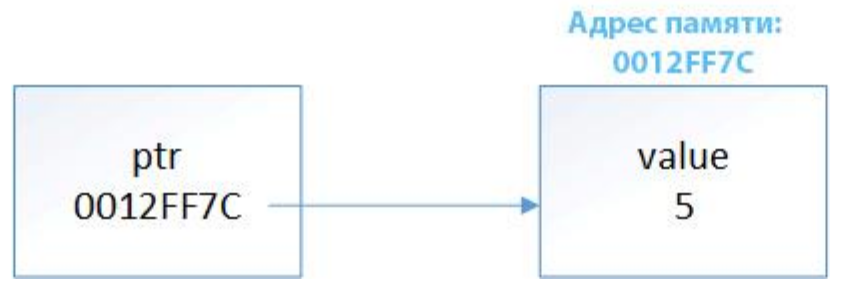

# Глава №6.
## Урок №77. Массивы
```c++
int testResult[30]; // выделяем 30 целочисленных переменных, используя фиксированный массив
testResult[0] = 12;
```

```c++
struct Rectangle {
    int length;
    int width;
};
Rectangle rects[4]; // объявляем массив с 4-мя прямоугольниками
rects[0] = {12, 15};
rects[0].width = 22;
```

### Индексы массивов
В языке C++ индексы массивов **всегда должны быть интегрального типа данных**\
(т.е. типа `char`, `short`, `int`, `long`, `long long`, `bool` и т.д.).

### Объявление массивов фиксированного размера
При объявлении массива фиксированного размера, его длина должна быть\
константой типа `compile-time`:
```c++
// Используем литерал
int array[7]; // хорошо

// Используем макрос-объект с текст_замена в качестве символьной константы
#define ARRAY_WIDTH 4
int array[ARRAY_WIDTH]; // синтаксически хорошо, но не делайте этого

// Используем символьную константу
const int arrayWidth = 7;
int array[arrayWidth]; // хорошо

// Используем перечислитель
enum ArrayElements {
    MIN_ARRAY_WIDTH = 3
};
int array[MIN_ARRAY_WIDTH]; // хорошо

// Используем неконстантную переменную
int width;
std::cin >> width;
int array[width]; // плохо: width должна быть константой типа compile-time!

// Используем константную переменную типа runtime
int temp = 8;
const int width = temp;
int array[width]; // плохо: здесь width является константой типа runtime, но должна быть константой типа compile-time!
```

## Урок №78. Фиксированные массивы
```c++
int array[5] = { 4, 5, 8, 9, 12 }; // используется список инициализаторов для инициализации фиксированного массива
```
Если в списке инициализаторов меньше, чем может содержать массив, то\
остальные элементы будут проинициализированы значением `0`. Если больше - ошибка.

```c++
int array[5] = { }; // Инициализируем все элементы массива значением 0

int array[5] { 4, 5, 8, 9, 12 }; // используем uniform-инициализацию для инициализации фиксированного массива
```

### Длина массива
```c++
int array[5] = { 0, 1, 2, 3, 4 }; // явно указываем длину массива
int array[] = { 0, 1, 2, 3, 4 }; // список инициализаторов автоматически определит длину массива
```

### Массивы и перечисления
```c++
const int numberOfStudents(5);
int testScores[numberOfStudents];
testScores[3] = 65;
```
Кто представлен элементом `testScores[3]`? Непонятно!

Это можно решить, используя перечисление, в котором перечислители\
сопоставляются каждому из возможных индексов массива:
```c++
#include <iostream>

enum StudentNames {
    SMITH, // 0
    ANDREW, // 1
    IVAN, // 2
    JOHN, // 3
    ANTON, // 4
    MAX_STUDENTS // 5
};

int main() {
    int testScores[StudentNames::MAX_STUDENTS]; // всего 5 студентов
    testScores[JOHN] = 65;

    return 0;
}
```
`MAX_STUDENTS` используется во время объявления массива для\
гарантирования того, что массив имеет корректную длину (она должна быть на\
единицу больше самого большого индекса). Это полезно как для подсчета\
элементов, так и для возможности автоматического изменения длины массива,\
если добавить еще один перечислитель:
```c++
enum StudentNames {
    SMITH, // 0
    ANDREW, // 1
    IVAN, // 2
    JOHN, // 3
    ANTON, // 4
    KIRILL, // 5
    MAX_STUDENTS // 6
};
```

### Массивы и классы `enum`
```c++
#include <iostream>

enum class StudentNames {
    SMITH, // 0
    ANDREW, // 1
    IVAN, // 2
    JOHN, // 3
    ANTON, // 4
    MAX_STUDENTS // 5
};

int main() {
    int testScores[static_cast<int>(StudentNames::MAX_STUDENTS)]; // всего 5 студентов
    testScores[static_cast<int>(StudentNames::JOHN)] = 65;

    return 0;
}
```

Стандартное перечисление внутри пространства имен:
```c++
#include <iostream>

namespace StudentNames {
    enum StudentNames {
        SMITH, // 0
        ANDREW, // 1
        IVAN, // 2
        JOHN, // 3
        ANTON, // 4
        MAX_STUDENTS // 5
    };
}

int main() {
    int testScores[static_cast<int>(StudentNames::MAX_STUDENTS)]; // всего 5 студентов
    testScores[static_cast<int>(StudentNames::JOHN)] = 65;

    return 0;
}
```

### Передача массивов в функции
**Когда обычная переменная передается по значению, то C++ копирует значение\
аргумента в параметр функции. Поскольку параметр является копией, то изменение\
значения параметра не изменяет значение исходного аргумента.**

Однако, поскольку копирование больших массивов — дело трудоёмкое, то **C++ не
копирует массив при его передаче в функцию**. Вместо этого передается фактический
массив.

**Примечание:** Если вы **не хотите**, чтобы функция изменяла значения элементов
массива, переданного в нее в качестве параметра, то нужно сделать массив
константным:
```c++
// Даже если array является фактическим массивом, внутри этой функции он должен рассматриваться как константный
void passArray(const int array[5]) {
    // Поэтому каждая из следующих строк вызовет ошибку компиляции!
    array[0] = 11;
    array[1] = 7;
    array[2] = 5;
    array[3] = 3;
    array[4] = 2;
}
```

### Оператор `sizeof` и массивы
```c++
#include <iostream>

void printSize(int array[]) {
    std::cout << sizeof(array) << '\n'; // выводится размер указателя, а не массива
}

int main() {
    int array[] = { 1, 3, 3, 4, 5, 9, 14, 17 };
    std::cout << sizeof(array) << '\n'; // выводится размер массива
    printSize(array);
    
    return 0;
}

<< 32
<< 8
```

### Определение длины фиксированного массива
Чтобы определить длину фиксированного массива, поделите размер всего массива\
на размер одного элемента массива:
```c++
#include <iostream>

int main() {
    int array[] = { 1, 3, 3, 4, 5, 9, 14, 17 };
    // размер массива = длина массива * размер одного элемента
    std::cout << "The array has: " << sizeof(array) / sizeof(array[0]) << " elements\n";
    
    return 0;
}

<< The array has 8 elements
```

**Правило: При использовании массивов убедитесь, что ваши индексы корректны и\
соответствуют диапазону вашего массива.**

### Тест
**Задание №1.**\
Объявите массив для хранения температуры (дробное число) каждого дня в году\
(всего 365 дней). Проинициализируйте массив значением 0.0 для каждого дня.
```c++
double temperature[365] = { 0.0 };
```

**Задание №2.**\
Создайте перечисление со следующими перечислителями: `chicken`, `lion`,\
`giraffe`, `elephant`, `duck` и `snake`. Поместите перечисление в пространство\
имен. Объявите массив, где элементами будут эти перечислители и, используя\
список инициализаторов, инициализируйте каждый элемент соответствующим\
количеством лап определенного животного. В функции `main()` выведите количество\
ног у слона, используя перечислитель.
```c++
#include <iostream>

namespace Animals {
    enum Animals {
        CHICKEN,
        LION,
        GIRAFFE,
        ELEPHANT,
        DUCK,
        SNAKE,
        MAX_ANIMALS
    };
}

int main() {
    int legs[Animals::MAX_ANIMALS] = { 2, 4, 4, 4, 2, 0 };
    std::cout << "An elephant has " << legs[Animals::ELEPHANT] << " legs.\n";
    return 0;
}
```

## Урок №79. Массивы и циклы
```c++
int students[] = { 73, 85, 84, 44, 78};
const int numStudents = sizeof(students) / sizeof(students[0]);
int totalScore = 0;
// Используем цикл для вычисления totalScore
for (int person = 0; person < numStudents; ++person)
    totalScore += students[person];
double averageScore = static_cast<double>(totalScore) / numStudents;

<< 72.8
```

### Тест
**Задание №1.**\
Выведите на экран следующий массив с помощью цикла:\
`int array[] = { 7, 5, 6, 4, 9, 8, 2, 1, 3 };`

```c++
#include <iostream>
int main() {
    int array[] = { 7, 5, 6, 4, 9, 8, 2, 1, 3 };
    const int arrayLength = sizeof(array) / sizeof(array[0]);
    for (int index=0; index < arrayLength; ++index)
        std::cout << array[index] << " ";
    
    return 0;
}
```

**Задание №2.**\
Используя массив из задания №1:\
Попросите пользователя ввести число от 1 до 9. Если пользователь введет что-либо\
другое — попросите его снова ввести число и так до тех пор, пока он не введет\
корректное значение из заданного диапазона. Как только пользователь введет\
число от 1 до 9, выведите массив на экран. Затем найдите в массиве элемент с\
числом, которое ввел пользователь, и выведите его индекс.

```c++
#include <iostream>

int main() {
    // Сначала принимаем корректный пользовательский ввод
    int number = 0;
    do {
        std::cout << "Enter a number between 1 and 9: ";
        std::cin >> number;
        // Если пользователь ввел некорректное значение
        if (std::cin.fail())
            std::cin.clear();
        std::cin.ignore(32767, '\n');
    } while (number < 1 || number > 9);
    
    // Дальше выводим массив на экран
    int array[] = { 7, 5, 6, 4, 9, 8, 2, 1, 3 };
    const int arrayLength = sizeof(array) / sizeof(array[0]);
    for (int index=0; index < arrayLength; ++index)
        std::cout << array[index] << " ";
    std::cout << "\n";
    
    // Затем ищем в массиве число, которое ввел пользователь и выводим его индекс
    for (int index=0; index < arrayLength; ++index) {
        if (array[index] == number) {
            std::cout << "The number " << number << " has index " << index << "\n";
            break; // так как каждый элемент в массиве уникальный, то нет надобности продолжать перебирать элементы дальше
        }
    }
    return 0;
}
```

**Задание №3.**\
Измените следующую программу так, чтобы вместо `maxScore` с наибольшим\
значением, переменная `maxIndex` содержала индекс элемента с наибольшим\
значением:
```c++
#include <iostream>
int main() {
    int scores[] = { 73, 85, 84, 44, 78 };
    const int numStudents = sizeof(scores) / sizeof(scores[0]);
    int maxIndex = 0; // отслеживаем самую высокую оценку  (maxScore = 0;)
    for (int student = 0; student < numStudents; ++student)
        if (scores[student] > scores[maxIndex])
            maxIndex = student;  // (maxScore = scores[student];)
    std::cout << "The best score: " << scores[maxIndex] << '\n';
    std::cout << "Index of the best score: " << maxIndex << '\n';
    return 0;
}
```

## Урок №80. Сортировка массивов методом выбора
Чтобы поменять два элемента местами, мы можем использовать функцию\
`std::swap()` из заголовочного файла `utility`.
```c++
#include <iostream>
#include <utility> 

int main() {
    int a = 3;
    int b = 5;
    std::cout << "Before swap: a = " << a << ", b = " << b << '\n';
    std::swap(a, b); // меняем местами значения переменных a и b
    std::cout << "After swap: a = " << a << ", b = " << b << '\n';
    
    return 0;
}

<< Before swap: a = 3, b = 5
<< After swap: a = 5, b = 3
```

### Функция `std::sort()`
```c++
#include <iostream>
#include <algorithm> // для std::sort()

int main() {
    const int length = 5;
    int array[length] = {30, 50, 20, 10, 40};
    std::sort(array, array + length);

    for (int i : array)
        std::cout << i << ' ';
    
    return 0;
}

<< 10 20 30 40 50 
```

## Урок №81. Многомерные массивы
Массив массивов называется **многомерным массивом**:
```c++
// первый элемент - количество строк, второй - количество столбцов
int array[2][4]; // двумерный массив
```

### Инициализация двумерных массивов
```c++
int array[3][5] =
            {
                    { 1, 2, 3, 4, 5 }, // строка №0
                    { 6, 7, 8, 9, 10 }, // строка №1
                    { 11, 12, 13, 14, 15 } // строка №2
            };

int array[3][5] =
            {
                    { 2, 4 }, // строка №0 = 2, 4, 0, 0, 0
                    { 1, 3, 7 }, // строка №1 = 1, 3, 7, 0, 0
                    { 8, 9, 11, 12 } // строка №2 = 8, 9, 11, 12, 0
            };

int array[][5] =  // можно не указывать только левый индекс (длину массива)
            {
                    { 1, 2, 3, 4, 5 },
                    { 6, 7, 8, 9, 10 },
                    { 11, 12, 13, 14, 15 }
            };

// многомерные массивы можно инициализировать значением 0
// это работает только в случае, когда явно объявляется длина массива
int array[3][5] = { 0 };
```

### Доступ к элементам в двумерном массиве
```c++
for (int row = 0; row < numRows; ++row) // доступ по строкам
    for (int col = 0; col < numCols; ++col) // доступ к каждому элементу в строке
        std::cout << array[row][col];
```

https://stackoverflow.com/questions/15927033/what-is-the-correct-way-of-using-c11s-range-based-for
```c++
for (auto & row : array)
        for (int col : row)
            std::cout << col << ' ';
```

### Многомерные массивы более двух измерений
```c++
int array[4][3][2]; // трехмерный массив
std::cout << array[3][2][1];
```

## Урок №82. Строки `C-style`
**Современный C++ поддерживает два разных типа строк:**
* `std::string` (как часть Стандартной библиотеки С++);
* **строки `C-style`** (изначально унаследованные от языка Cи).

### Строки `C-style`
**Строка `C-style`** — это простой массив символов, который использует нуль-\
терминатор. **Нуль-терминатор** — это специальный символ (ASCII-код которого\
равен 0), используемый для обозначения конца строки. Строка C-style еще\
называется "**нуль-терминированной строкой**".

```c++
char mystring[] = "string";
```
Хотя `string` имеет только 6 букв, C++ автоматически добавляет нуль-терминатор в\
конец строки (нам не нужно добавлять его вручную). Следовательно, длина массива\
`mystring` на самом деле равна 7.

```c++
#include <iostream>

int main() {
    char mystring[] = "string";
    // эквивалентно sizeof(mystring) / sizeof(mystring[0])
    std::cout << mystring << " has " << sizeof(mystring) << " characters.\n";

    for (char index : mystring)  // эквивалентно for (int index = 0; index < sizeof(mystring); ++index)
        std::cout << static_cast<int>(index) << " ";

    return 0;
}

<< string has 7 characters.
<< 115 116 114 105 110 103 0 
```
Нуль в конце является ASCII-кодом нуль-терминатора, который был добавлен в конец строки.

```c++
char mystring[] = "string"; // ок
mystring = "cat"; // не ок!

// эквивалентно
int array[] = { 4, 6, 8, 2 }; // ок
array = 7; // что это значит?
```

```c++
// так как строки C-style - массивы, то:
char mystring[] = "string";
mystring[1] = 'p';
std::cout << mystring;

<< spring
```

### Строки `C-style` и `std::cin`
Вызов `cin.getline()` будет принимать до 254 символов в массив name (оставляя\
место для нуль-терминатора!). Любые лишние символы будут проигнорированы.\
Таким образом, мы можем гарантировать, что массив не будет переполнен.
```c++
#include <iostream>

int main() {
    char name[255]; // объявляем достаточно большой массив (для хранения 255 символов)
    std::cout << "Enter your name: ";
    std::cin.getline(name, 255);
    std::cout << "You entered: " << name << '\n';

    return 0;
}
```

### Управление строками `C-style`
**Функция `strcpy_s()`** позволяет копировать содержимое одной строки в другую.\
Чаще всего это используется для присваивания значений строке:
```c++
#include <iostream>
#include <cstring>

int main() {
    char text[] = "Print this!";
    char dest[50]; // длина массива должна быть не меньше длины копируемой строки
    strcpy_s(dest, text); // в dest - text
    std::cout << dest; // выводим "Print this!"
    
    return 0;
}
```

Еще одной полезной функцией управления строками является **функция `strlen()`**,\
которая возвращает длину строки `C-style` (без учета нуль-терминатора):
```c++
#include <iostream>
#include <cstring>

int main() {
    char name[15] = "Max"; // используется только 4 символа (3 буквы + нуль-терминатор)
    std::cout << "My name is " << name << '\n';
    std::cout << name << " has " << strlen(name) << " letters.\n";
    std::cout << name << " has " << sizeof(name) << " characters in the array.\n";
    
    return 0;
}

<< My name is Max
<< Max has 3 letters.
<< Max has 15 characters in the array.
```

Вот еще полезные функции для управления строками C-style:
* **функция `strcat()`** — добавляет одну строку к другой (опасно);
* **функция `strncat()`** — добавляет одну строку к другой (с проверкой размера\
  места назначения);
* **функция `strcmp()`** — сравнивает две строки (возвращает 0, если они равны);
* **функция `strncmp()`** — сравнивает две строки до определенного количества\
  символов (возвращает 0, если до указанного символа не было различий).

### Стоит ли использовать строки `C-style`?
**Правило: Используйте `std::string` вместо строк `C-style`.**

## Урок №83. Введение в класс `std::string_view`
### Введение в класс `std::string_view`
В стандарте С++17 вводится еще один способ использования строк — с помощью\
класса `std::string_view`, который находится в заголовочном файле `string_view`.

В отличие от объектов класса `std::string`, которые хранят свою собственную копию\
строки, класс `std::string_view` обеспечивает **представление** (англ. "**view**") для\
заданной строки, которая может быть определена где-нибудь в другом месте.

```c++
#include <iostream>
#include <string_view>

int main() {
    std::string_view text{ "hello" }; // представление для строки "hello", которое хранится в бинарном виде
    std::string_view str{ text }; // представление этой же строки - "hello"
    std::string_view more{ str }; // представление этой же строки - "hello"
    std::cout << text << ' ' << str << ' ' << more << '\n';
    
    return 0;
}

<< hello hello hello
```
**При таком подходе, у нас не будут созданы лишние копии строки `hello`**

```c++
#include <iostream>
#include <string_view>

int main() {
    std::string_view str{ "Trains are fast!" };
    std::cout << str.length() << '\n'; // 16
    std::cout << str.substr(0, str.find(' ')) << '\n'; // Trains
    std::cout << (str == "Trains are fast!") << '\n'; // 1
    
    // Начиная с C++20
    std::cout << str.starts_with("Boats") << '\n'; // 0
    std::cout << str.ends_with("fast!") << '\n'; // 1
    
    std::cout << str << '\n'; // Trains are fast!
    
    return 0;
}
```

Т.к. объект класса `std::string_view` не создает копии строки, то, изменив исходную\
строку, мы, тем самым, повлияем и на её представление в связанном с ней\
объектом `std::string_view`:
```c++
#include <iostream>
#include <string_view>

int main() {
    char arr[]{"Gold"};
    std::string_view str{arr};

    std::cout << str << '\n'; // Gold
    // Изменяем 'd' на 'f' в arr
    arr[3] = 'f';
    std::cout << str << '\n'; // Golf

    return 0;
}
```

**Совет:** Используйте `std::string_view` вместо строк `C-style`.\ 
Для строк, которые не планируете изменять в дальнейшем, предпочтительнее\
использовать класс `std::string_view` вместо `std::string`.

### Функции, модифицирующие представление
Можно изменять представление строки без изменения исходной строки.\
Для этого используются следующие функции:
* `remove_prefix()` — удаляет символы из левой части представления;
* `remove_suffix()` — удаляет символы из правой части представления.
```c++
#include <iostream>
#include <string_view>

int main() {
    std::string_view str{ "Peach" };
    std::cout << str << '\n'; // Peach

    // Игнорируем первый символ
    str.remove_prefix(1);
    std::cout << str << '\n'; // each

    // Игнорируем последние 2 символа
    str.remove_suffix(2); 
    std::cout << str << '\n';  // ea

    return 0;
}
```
**Важно:** Изменив однажды область видимости, вы уже не сможете вернуться\
к первоначальным значениям.

### `std::string_view` и обычные строки
В отличие от строк `C-Style`, объекты классов `std::string` и `std::string_view` **не\
используют нулевой символ (нуль-терминатор)** в качестве метки для обозначения\
конца строки. Данные объекты знают, где заканчивается строка, т.к. отслеживают её длину:
```c++
#include <iostream>
#include <iterator> // для функции std::size()
#include <string_view>

int main() {
    // Нет нуль-терминатора
    char vowels[]{ 'a', 'e', 'i', 'o', 'u' };

    // Массив vowels не является нуль-терминированным. Мы должны передавать длину вручную.
    // Поскольку vowels является массивом, то мы можем использовать функцию std::size(), чтобы получить его длину
    std::string_view str{ vowels, std::size(vowels) };
    
    // Или просто
    std::string_view str{ vowels };

    std::cout << str << '\n'; // это безопасно, так как std::cout знает, как выводить std::string_view

    return 0;
}
```

### Проблемы владения и доступа
Поскольку `std::string_view` является всего лишь представлением строки, его время\
жизни не зависит от времени жизни строки, которую он представляет. Если\
отображаемая строка выйдет за пределы области видимости, то s`td::string_view`\
больше не сможет её отображать и при попытке доступа к ней мы получим\
неопределенные результаты:
```c++
#include <iostream>
#include <string>
#include <string_view>

std::string_view askForName() {
    std::cout << "What's your name?\n";
    // Используем std::string, поскольку std::cin будет изменять строку
    std::string str{};
    std::cin >> str;
    // Мы переключаемся на std::string_view только в демонстрационных целях.
    // Если вы уже имеете std::string, то нет необходимости переключаться на std::string_view
    std::string_view view{ str };
    std::cout << "Hello " << view << '\n';
    
    return view;
} // str уничтожается и, таким образом, уничтожается и строка, созданная str

int main() {
    std::string_view view{ askForName() };
    // view пытается обратиться к строке, которой уже не существует
    std::cout << "Your name is " << view << '\n'; // неопределенное поведение

    return 0;
}

<< Whats your name?
>> Kirill
<< Hello Kirill
<< Your name is  0#�Y
```

**Предупреждение:** Следите за тем, чтобы исходная строка, на которую ссылается\
объект std::string_view, не выходила за пределы области видимости и не\
изменялась до тех пор, пока используется ссылающийся на нее объект\
`std::string_view`.

### Конвертация `std::string_view` в `std::string`
Объекты класса `std::string_view` не конвертируются неявным образом в объекты\
класса `std::string`, но конвертируются при явном преобразовании:
```c++
#include <iostream>
#include <string>
#include <string_view>

void print(std::string s) {
    std::cout << s << '\n';
}

int main() {
    std::string_view sv{ "balloon" };
    sv.remove_suffix(3); // удаляем 3 элемента справа
    // print(sv); // ошибка компиляции: неявная конвертация запрещена
    std::string str{ sv }; // явное преобразование
    print(str); // ок
    print(static_cast<std::string>(sv)); // ок

    return 0;
}

<< ball
<< ball
```

### Конвертация `std::string_view` в строку `C-style`
Некоторые старые функции (такие как `strlen()`) работают только со строками `C-style`.\
Для того чтобы преобразовать объект класса `std::string_view` в строку `C-style`,\
мы сначала должны конвертировать его в объект класса `std::string`:
```c++
#include <cstring>
#include <iostream>
#include <string>
#include <string_view>

int main() {
    std::string_view sv{ "balloon" };
    sv.remove_suffix(3);
    // Создание объекта std::string из объекта std::string_view
    std::string str{ sv };
    // Получаем строку C-style с нуль-терминатором
    auto szNullTerminated{ str.c_str() };
    // Передаем строку с нуль-терминатором в функцию, которую мы хотим использовать
    std::cout << str << " has " << std::strlen(szNullTerminated) << " letter(s)\n";

    return 0;
}

<< ball has 4 letter(s)
```
Однако стоит учитывать, что создание объекта класса `std::string` всякий раз, когда\
мы хотим преобразовать объект `std::string_view `в строку `C-style`, является\
дорогостоящей операцией, поэтому мы должны по возможности избегать\
подобных ситуаций.

### Функция `data()`
Доступ к исходной строке объекта `std::string_view` можно получить при помощи
**функции `data()`**, которая возвращает строку `C-style`. Но это следует\
использовать только тогда, когда объект `std::string_view` не был изменен (например,\
при помощи функций `remove_prefix()` или `remove_suffix()`) и связанная с\
ним строка имеет нуль-терминатор (так как это строка `C-style`).\

В следующем примере функция `std::strlen()` ничего не знает о `std::string_view`,\
поэтому мы передаем ей функцию `str.data()`:
```c++
#include <cstring> // для функции std::strlen()
#include <iostream>
#include <string_view>

int main() {
    std::string_view str{ "balloon" };
    std::cout << str << '\n';
    // Для простоты мы воспользуемся функцией std::strlen(). Вместо нее можно
    // было бы использовать любую другую функцию, которая работает со строкой с нуль-терминатором в конце.
    // Здесь мы можем использовать функцию data(), так как мы не изменяли представление и строка имеет нуль-терминатор
    std::cout << std::strlen(str.data()) << '\n';

    return 0;
}

<< balloon
<< 7
```

В следующем примере показано, что происходит, когда мы обращаемся к функции\
`data()` после изменения представления строки:
```c++
#include <cstring> // для функции std::strlen()
#include <iostream>
#include <string_view>

int main() {
    std::string_view str{ "balloon" };
    // Удаляем символ "b"
    str.remove_prefix(1);
    // Удаляем часть "oon"
    str.remove_suffix(3);
    // Помните, что предыдущие 2 команды не изменяют исходную строку, они
    // работают лишь с её представлением
    std::cout << str << " has " << std::strlen(str.data()) << " letter(s)\n";
    std::cout << "str.data() is " << str.data() << '\n';
    std::cout << "str is " << str << '\n';

    return 0;
}

<< all has 6 letter(s)
<< str.data() is alloon
<< str is all
```
`std::strlen` и `std::cout` продолжают считывать символы из исходной строки до тех пор,\
пока не встретят нуль-терминатор, который находится в конце строки `baloon`.

**Предупреждение:** Используйте `std::string_view::data()` только в том случае, если\
представление `std::string_view` не было изменено и отображаемая строка\
содержит завершающий нулевой символ (нуль-терминатор). Использование\
функции `std::string_view::data()` со строкой без нуль-терминатора чревато\
возникновением ошибок.

### Нюансы `std::string_view`
```c++
std::string s{ "hello" };
std::string_view v{ "world" };

// Не работает
std::cout << (s + v) << '\n';
std::cout << (v + s) << '\n';

// Потенциально небезопасно или не то, что мы хотим получить,
// поскольку мы пытаемся использовать объект std::string_view в качестве строки C-style
std::cout << (s + v.data()) << '\n'; // helloworld
std::cout << (v.data() + s) << '\n'; // worldhello

// Приемлемо, т.к. нам нужно создать новый объект std::string, но некрасиво и нерационально
std::cout << (s + std::string{ v }) << '\n'; // helloworld
std::cout << (std::string{ v } + s) << '\n'; // worldhello
std::cout << (s + static_cast<std::string>(v)) << '\n'; // helloworld
std::cout << (static_cast<std::string>(v) + s) << '\n'; // worldhello
```

## Урок №84. Указатели
**Оператор адреса `&`** позволяет узнать, какой адрес памяти присвоен определенной\
переменной:
```c++
#include <iostream>

int main() {
    int a = 7;
    std::cout << a << '\n'; // выводим значение переменной a - 7
    std::cout << &a << '\n'; // выводим адрес памяти переменной a - 0x7ffee236f894
    
    return 0;
}
```

### Оператор разыменования `*`
**Оператор разыменования `*`** позволяет получить значение по указанному адресу:
```c++
#include <iostream>

int main() {
    int a = 7;
    std::cout << a << '\n'; // выводим значение переменной a - 7
    std::cout << &a << '\n'; // выводим адрес переменной a - 0x7ffda98f8d24
    std::cout << *&a << '\n'; /// выводим значение ячейки памяти переменной a - 7

    return 0;
}
```

### Указатели
**Указатель** — это переменная, значением которой является адрес ячейки памяти.
```c++
int *iPtr; // указатель на значение типа int
double *dPtr; // указатель на значение типа double
int* iPtr3; // корректный синтаксис (допустимый, но не желательный)
int * iPtr4; // корректный синтаксис (не делайте так)
int *iPtr5, *iPtr6; // объявляем два указателя для переменных типа int
```

### Присваивание значений указателю
```c++
#include <iostream>

int main() {
    int value = 5;
    int *ptr = &value; // инициализируем ptr адресом значения переменной
    std::cout << *ptr << '\n'; // 5
    value = 2;
    std::cout << *ptr; // 2
    
    return 0;
}
```
`ptr` содержит адрес значения переменной `value`, и, можно сказать, `ptr` указывает на это значение:



```c++
    std::cout << &value << '\n'; // выводим адрес значения переменной value - 0x7ffdf2ddefcc
    std::cout << ptr << '\n'; // выводим адрес, который хранит ptr - 0x7ffdf2ddefcc
```

Тип указателя должен соответствовать типу переменной, на которую он указывает:
```c++
int iValue = 7;
double dValue = 9.0;
int *iPtr = &iValue; // ок
double *dPtr = &dValue; // ок
iPtr = &dValue; // неправильно: указатель типа int не может указывать на адрес переменной типа double
dPtr = &iValue; // неправильно: указатель типа double не может указывать на адрес переменной типа int
```

Указатели могут содержать только адреса, а целочисленный литерал 7 не имеет адреса памяти,\
из-за этого следующее не является допустимым:
```c++
int *ptr = 7;
```

Язык C++ также не позволит вам напрямую присваивать адреса памяти указателю:
```c++
double *dPtr = 0x0012FF7C; // не ок: рассматривается как присваивание целочисленного литерала
```

### Оператор адреса возвращает указатель
Стоит отметить, что оператор адреса `&` не возвращает адрес своего операнда в\
качестве литерала. Вместо этого он возвращает указатель, содержащий адрес\
операнда, тип которого получен из аргумента:
```c++
#include <iostream>

int main() {
    int value(4);
    std::cout << typeid(&value).name(); // Pi

    return 0;
}
```

### Разыменование указателей
```c++
#include <iostream>

int main() {
    int value{5};
    std::cout << &value << std::endl; // выводим адрес value - 0x7ffee21f238c
    std::cout << value << std::endl; // выводим содержимое value - 5

    int *ptr = &value; // ptr указывает на value
    std::cout << ptr << std::endl; // выводим адрес, который хранится в ptr, т.е. &value - 0x7ffee21f238c
    std::cout << *ptr << std::endl; // разыменовываем ptr (получаем значение на которое указывает ptr) - 5

    return 0;
}
```

Одному указателю можно присваивать разные значения:
```c++
int value1 = 5;
int value2 = 7;
int *ptr;
ptr = &value1; // ptr указывает на value1
std::cout << *ptr; // выведется 5
ptr = &value2; // ptr теперь указывает на value2
std::cout << *ptr; // выведется 7
```

Когда адрес значения переменной присвоен указателю, то выполняется следующее:
* `ptr` — это то же самое, что и `&value`;
* `*ptr` обрабатывается так же, как и `value`.

Поскольку `*ptr` обрабатывается так же, как и `value`, то мы можем присваивать\
ему значения так, как если бы это была обычная переменная. Например:
```c++
int value = 5;
int *ptr = &value; // ptr указывает на value
*ptr = 7; // *ptr - это то же самое, что и value, которому мы присвоили значение 7
std::cout << value; // выведется 7
```

### В чём польза указателей?
Указатели полезны в следующих случаях:
* **Случай №1: Массивы реализованы с помощью указателей.** Указатели могут\
  использоваться для итерации по массиву.
* **Случай №2: Они являются единственным способом динамического\
  выделения памяти в C++.** Это, безусловно, самый распространенный вариант\
  использования указателей.
* **Случай №3: Они могут использоваться для передачи большого количества\
  данных в функцию без копирования этих данных.**
* **Случай №4: Они могут использоваться для передачи одной функции в\
  качестве параметра другой функции.**
* **Случай №5: Они используются для достижения полиморфизма при работе с\
  наследованием.**
* **Случай №6: Они могут использоваться для представления одной\
  структуры/класса в другой структуре/классе, формируя, таким образом,\
  целые цепочки.**

### Резюме
Указатели — это переменные, которые содержат адреса памяти. Их можно\
разыменовать с помощью оператора разыменования `*` для извлечения значений,\
хранимых по адресу памяти. Разыменование указателя, значением которого\
является мусор, приведет к сбою в вашей программе.

**Совет:** При объявлении указателя указывайте звёздочку возле имени\
переменной.

### Тест
**Задание №1.**
```c++
#include <iostream>

int main() {
    short value = 7; // &value = 0x7fff193d623c
    short otherValue = 3; // &otherValue = 0x7fff193d623e

    short *ptr = &value;

    std::cout << &value << '\n'; // 0x7fff193d623c
    std::cout << value << '\n'; // 7
    std::cout << ptr << '\n'; // 0x7fff193d623c
    std::cout << *ptr << '\n'; // 7
    std::cout << '\n';

    *ptr = 9;

    std::cout << &value << '\n'; // 0x7fff193d623c
    std::cout << value << '\n'; // 9
    std::cout << ptr << '\n'; // 0x7fff193d623c
    std::cout << *ptr << '\n'; // 9
    std::cout << '\n';

    ptr = &otherValue;

    std::cout << &otherValue << '\n';  // 0x7fff193d623e
    std::cout << otherValue << '\n'; // 3
    std::cout << ptr << '\n'; // 0x7fff193d623e
    std::cout << *ptr << '\n'; // 3
    std::cout << '\n';

    std::cout << sizeof(ptr) << '\n'; // 8 - размер в байтах для 64 разрядной системы
    std::cout << sizeof(*ptr) << '\n'; // 2 - тип short составляет 2 байта

    return 0;
}
```

****Задание №2.****\
Что не так со следующим фрагментом кода:
```c++
int value = 45;
int *ptr = &value; // объявляем указатель и инициализируем его адресом переменной value
*ptr = &value; // присваиваем адрес value для ptr
```

В третьей строке звёздочка уже является оператором разыменования, и\
используется для вытаскивания значения, на которое указывает указатель.\
Таким образом, эта строка говорит: «Вытаскиваем значение, на которое\
указывает `ptr` (целочисленное значение), и переписываем его на адрес этого же\
значения». А это уже какая-то чепуха — вы не можете присвоить адрес\
целочисленному значению!

Должно быть:
```c++
    ptr = &value;
```

## Урок №85. Нулевые указатели
### Нулевое значение и нулевые указатели
**Нулевое значение** (или **"значение `null`"**) — это специальное значение,\
которое означает, что указатель ни на что не указывает. Указатель, содержащий\
значение `null`, называется **нулевым указателем**.
```c++
int *ptr(0); // ptr теперь нулевой указатель

int *ptr1; // ptr1 не инициализирован
ptr1 = 0; // ptr1 теперь нулевой указатель
```

**Совет:** Инициализируйте указатели нулевым значением, если не собираетесь\
присваивать им другие значения.

### Макрос `NULL`
```c++
int *ptr(NULL); // присваиваем адрес 0 указателю ptr
```
**Не рекомендуется использовать.**

### Ключевое слово `nullptr` в C++11
Начиная с C++11, при работе с нулевыми указателями, использование `nullptr`\
является более предпочтительным вариантом, нежели использование `0`:
```c++
// примечание: ptr по-прежнему остается указателем типа int, просто со значением null (0)
int *ptr = nullptr; 
```

```c++
#include <iostream>

void doAnything(int *ptr) {
    if (ptr)
        std::cout << "You passed in " << *ptr << '\n';
    else
        std::cout << "You passed in a null pointer\n";
}

int main() {
    // теперь аргумент является точно нулевым указателем, а не целочисленным значением
    doAnything(nullptr); // You passed in a null pointer

    return 0;
}
```

**Совет: В C++11 используйте `nullptr` для инициализации нулевых указателей.**

### Тип данных `std::nullptr_t` в C++11
В C++11 добавили новый тип данных `std::nullptr_t`, который находится в\
заголовочном файле `cstddef`. `std::nullptr_t` может иметь только одно\
значение — `nullptr`:
```c++
#include <iostream>

void doAnything(std::nullptr_t *ptr) {
    if (ptr)
        std::cout << "You passed in " << *ptr << '\n';
    else
        std::cout << "You passed in a null pointer\n";
}

int main() {
    // вызов функции doAnything() с аргументом типа std::nullptr_t
    doAnything(nullptr);

    return 0;
}
```

## Урок №86. Указатели и массивы
### Сходства между указателями и массивами
Переменная array содержит адрес первого элемента массива, как если бы это был\
указатель:
```c++
#include <iostream>

int main() {
    int array[4] = { 5, 8, 6, 4 };
    // Выводим значение массива (переменной array)
    std::cout << "The array has address: " << array << '\n'; // 0x7ffe2200bb00
    // Выводим адрес элемента массива
    std::cout << "Element 0 has address: " << &array[0] << '\n'; // 0x7ffe2200bb00

    return 0;
}
```

Разыменование массива:
```c++
int array[4] = { 5, 8, 6, 4 };
std::cout << *array << '\n';  // 5

char name[] = "Kirill";
std::cout << *name; // K
```

Обратите внимание, мы не разыменовываем фактический массив. Массив (типа\
`int[4]`) неявно конвертируется в указатель (типа `int *`), и мы разыменовываем\
указатель, который указывает на значение первого элемента массива.

Также мы можем создать указатель и присвоить ему `array`:
```c++
#include <iostream>

int main() {
    int array[4] = { 5, 8, 6, 4 };
    std::cout << *array; // выведется 5

    int *ptr = array;
    std::cout << *ptr; // выведется 5

    return 0;
}
```
Это работает из-за того, что переменная array распадается в указатель типа\
`int *`, а тип нашего указателя такой же (т.е. `int *`).

### Различия между указателями и массивами
При использовании в фиксированном массиве, оператор `sizeof`\
возвращает размер всего массива (`длина массива * размер элемента`). При\
использовании с указателем, оператор sizeof возвращает размер адреса памяти\
(в байтах). Например:
```c++
#include <iostream>

int main() {
    int array[4] = {5, 8, 6, 4};
    std::cout << sizeof(array) << '\n'; // выведется sizeof(int) * длина array - 16
    int *ptr = array;
    std::cout << sizeof(ptr) << '\n'; // выведется размер указателя - 8
    return 0;
}
```
Фиксированный массив знает свою длину, а указатель на массив — нет.

### Передача массивов в функции
```c++
#include <iostream>

void printSize(int *array) {
    // Здесь массив рассматривается как указатель
    std::cout << sizeof(array) << '\n'; // выведется размер указателя, а не длина массива!
}

int main() {
    int array[] = {1, 2, 3, 4, 4, 9, 15, 25};
    std::cout << sizeof(array) << '\n'; // выведется sizeof(int) * длина массива - 32
    printSize(array); // здесь аргумент array распадается на указатель - 8
    return 0;
}
```

C++ неявно конвертирует параметр из синтаксиса массива (`[]`) в синтаксис\
указателя (`*`). Это означает, что следующие два объявления функции идентичны:
```c++
void printSize(int array[]);
void printSize(int *array);
```

**Совет:** Используйте синтаксис указателя (`*`) вместо синтаксиса массива (`[]`) при\
передаче массивов в качестве параметров в функции.

### Передача по адресу
```c++
#include <iostream>

// Параметр ptr содержит копию адреса массива
void changeArray(int *ptr) {
    *ptr = 5; // поэтому изменение элемента массива приведет к изменению фактического массива
}

int main() {
    int array[] = {1, 2, 3, 4, 4, 9, 15, 25};
    std::cout << "Element 0 has value: " << array[0] << '\n'; // 1
    changeArray(array);
    std::cout << "Element 0 has value: " << array[0] << '\n'; // 5

    return 0;
}
```

## Урок №87. Адресная арифметика и индексация массивов
### Адресная арифметика
Обратите внимание, `ptr + 1` не возвращает следующий любой адрес памяти,\
который находится сразу после `ptr`, но он возвращает адрес памяти следующего\
объекта, тип которого совпадает с типом значения, на которое указывает `ptr`.\
Если ptr указывает на адрес памяти целочисленного значения (размер которого 4\
байта), то `ptr + 3` будет возвращать адрес памяти третьего целочисленного\
значения после `ptr`. Если `ptr` указывает на адрес памяти значения **типа `char`**, то\
`ptr + 3` будет возвращать адрес памяти третьего значения типа `char` после `ptr`.

При вычислении результата выражения **адресной арифметики** (или "**арифметики\
с указателями**") компилятор всегда умножает целочисленный операнд на размер\
объекта, на который указывает указатель. Например:
```c++
#include <iostream>

int main() {
    short value = 8;
    short *ptr = &value;

    // каждый последующий адрес увеличивается на 2, так как
    // размер типа short составляет 2 байта
    std::cout << ptr << '\n'; // 0x7fff387ddf5e
    std::cout << ptr+1 << '\n'; // 0x7fff387ddf60
    std::cout << ptr+2 << '\n'; // 0x7fff387ddf62
    std::cout << ptr+3 << '\n'; // 0x7fff387ddf64a

    return 0;
}
```

### Расположение элементов массива в памяти
```c++
#include <iostream>

int main() {
    int array[] = { 7, 8, 2, 4, 5 };
    
    // Используя оператор адреса &, мы можем легко определить, что элементы массива
    // расположены в памяти последовательно
    std::cout << "Element 0 is at address: " << &array[0] << '\n'; // 0x7fffe2dc1020
    std::cout << "Element 1 is at address: " << &array[1] << '\n'; // 0x7fffe2dc1024
    std::cout << "Element 2 is at address: " << &array[2] << '\n'; // 0x7fffe2dc1028
    std::cout << "Element 3 is at address: " << &array[3] << '\n'; // 0x7fffe2dc102c

    return 0;
}
```

### Индексация массивов
Можно предположить, что добавление единицы к идентификатору массива\
приведет к возврату адреса памяти второго элемента (элемента под индексом 1) массива.
```c++
#include <iostream>

int main() {
    int array [5] = { 7, 8, 2, 4, 5 };

    std::cout << &array[1] << '\n'; // выведется адрес памяти элемента под индексом 1 - 0x7fff0152adf4
    std::cout << array+1 << '\n'; // выведется адрес памяти указателя на массив + 1 - 0x7fff0152adf4

    std::cout << array[1] << '\n'; // выведется 8
    std::cout << *(array+1) << '\n'; // выведется 8 (обратите внимание на скобки, они здесь обязательны,
    // поскольку оператор * имеет более высокий приоритет, чем оператор +)

    return 0;
}
```

Оказывается, когда компилятор видит оператор индекса `[]`, он, на самом деле,\
конвертирует его в указатель с операцией сложения и разыменования! То есть,\
`array[n]` — это то же самое, что и `*(array + n)`, где `n` является целочисленным\
значением. Оператор индекса `[]` используется в целях удобства, чтобы не нужно\
было всегда помнить о скобках.

### Использование указателя для итерации по массиву
```c++
#include <iostream>

int main() {
    const int arrayLength = 9;
    char name[arrayLength] = "Jonathan";
    int numVowels(0);
    for (char *ptr = name; ptr < name + arrayLength; ++ptr) {
        switch (*ptr)
        {
            case 'A':
            case 'a':
            case 'E':
            case 'e':
            case 'I':
            case 'i':
            case 'O':
            case 'o':
            case 'U':
            case 'u':
                ++numVowels;
        }
    }

    std::cout << name << " has " << numVowels << " vowels.\n"; // Jonathan has 3 vowels.

    return 0;
}

```
Как это работает? Программа использует указатель для прогона каждого элемента\
массива поочередно. Помните, что массив распадается в указатель на первый\
элемент массива? Поэтому, присвоив `name` для `ptr`, сам `ptr` стал указывать на\
первый элемент массива. Каждый элемент разыменовывается с помощью\
выражения `switch`, и, если текущий элемент массива является гласной буквой, то\
`numVowels` увеличивается. Для перемещения указателя на следующий символ\
(элемент) массива в цикле `for` используется оператор `++`. Работа цикла завершится,\
когда все символы будут проверены.

## Урок №88. Символьные константы строк C-style
Еще один способ создания символьных констант строк `C-style` — через указатели:
```c++
#include <iostream>

int main() {
    const char *myName = "Kirill";  // вместо char myName[] = "Kirill";
    std::cout << myName; // Kirill

    return 0;
}
```

```c++
const char* getName() {
    return "Kirill";
}
```
В фрагменте, приведенном выше, функция `getName()` возвращает указатель на\
строку C-style `Kirill`. Всё хорошо, так как `Kirill` не выходит из области видимости,\
когда `getName()` завершает свое выполнение, поэтому вызывающий объект все\
равно имеет доступ к строке.

### `std::cout` и указатели типа `char`
```c++
#include <iostream>

int main() {
    int nArray[5] = { 9, 7, 5, 3, 1 };
    char cArray[] = "Hello!";
    const char *name = "John";

    std::cout << nArray << '\n'; // nArray распадается в указатель типа int - 0x7ffed3c6fd90
    std::cout << cArray << '\n'; // cArray распадается в указатель типа char - Hello!
    std::cout << name << '\n'; // name уже и так является указателем типа char - John

    return 0;
}
```

## Урок №89. Динамическое выделение памяти
Язык С++ поддерживает три основных типа **выделения** (или **"распределения"**)\
**памяти**, с двумя из которых, мы уже знакомы:
* **Статическое выделение памяти** выполняется для статических и глобальных\
  переменных. Память выделяется один раз (при запуске программы) и\
  сохраняется на протяжении работы всей программы.
* **Автоматическое выделение памяти** выполняется для параметров функции и\
  локальных переменных. Память выделяется при входе в блок, в котором\
  находятся эти переменные, и удаляется при выходе из него.
* **Динамическое выделение памяти** является темой этого урока.

### Динамическое выделение переменных
**Динамическое выделение памяти** — это способ запроса памяти из\
операционной системы запущенными программами по мере необходимости. Эта\
память не выделяется из ограниченной памяти стека программы, а выделяется из\
гораздо большего хранилища, управляемого операционной системой — **кучи**. На\
современных компьютерах размер кучи может составлять гигабайты памяти.

Для динамического выделения памяти одной переменной используется **оператор `new`**:
```c++
// динамически выделяем целочисленную переменную и сразу же отбрасываем результат (так как нигде его не сохраняем)
new int; 
```

Для доступа к выделенной памяти создается указатель:
```c++
// динамически выделяем целочисленную переменную и присваиваем её адрес ptr, чтобы затем иметь доступ к ней
int *ptr = new int;
```

Затем мы можем разыменовать указатель для получения значения:
```c++
*ptr = 8; // присваиваем значение 8 только что выделенной памяти
```

### Освобождение памяти
Когда вы динамически выделяете переменную, то вы также можете её\
инициализировать посредством прямой инициализации или uniform-\
инициализации (в С++11):
```c++
int *ptr1 = new int (7); // используем прямую инициализацию
int *ptr2 = new int { 8 }; // используем uniform-инициализацию
```

Когда уже всё, что требовалось, выполнено с динамически выделенной переменной\
— нужно явно указать для С++ освободить эту память. Для переменных это\
выполняется с помощью **оператора `delete`**:
```c++
// Предположим, что ptr ранее уже был выделен с помощью оператора new
delete ptr; // возвращаем память, на которую указывал ptr, обратно в операционную систему
ptr = nullptr; // делаем ptr нулевым указателем
```

Оператор `delete` на самом деле ничего не удаляет. Он просто возвращает память,\
которая была выделена ранее, обратно в операционную систему. Затем\
операционная система может переназначить эту память другому приложению (или\
этому же снова).

### Висячие указатели
Указатель, указывающий на освобожденную память, называется **висячим\
указателем**. Разыменование или удаление висячего указателя приведет к\
неожиданным результатам. Рассмотрим следующую программу:
```c++
#include <iostream>

int main() {
    int *ptr = new int; // динамически выделяем целочисленную переменную
    *ptr = 8; // помещаем значение в выделенную ячейку памяти

    delete ptr; // возвращаем память обратно в операционную систему, ptr теперь является висячим указателем

    std::cout << *ptr; // разыменование висячего указателя приведет к неожиданным результатам
    delete ptr; // попытка освободить память снова приведет к неожиданным результатам также

    return 0;
}
```

В программе, приведенной выше, значение `8`, которое ранее было присвоено\
динамической переменной, после освобождения может и далее находиться там, а\
может и нет. Также возможно, что освобожденная память уже могла быть выделена\
другому приложению (или для собственного использования операционной\
системы), и попытка доступа к ней приведет к тому, что операционная система\
автоматически прекратит выполнение вашей программы.

Процесс освобождения памяти может также привести и к созданию нескольких\
висячих указателей. Рассмотрим следующий пример:
```c++
#include <iostream>

int main() {
    int *ptr = new int; // динамически выделяем целочисленную переменную
    int *otherPtr = ptr; // otherPtr теперь указывает на ту же самую выделенную память, что и ptr

    delete ptr; // возвращаем память обратно в операционную систему. ptr и otherPtr теперь висячие указатели

    ptr = 0; // ptr теперь уже nullptr
    // Однако, otherPtr по-прежнему является висячим указателем!

    return 0;
}
```

**Правило: Присваивайте удаленным указателям значение 0 (или nullptr в C++11),\
если они не выходят из области видимости сразу же после удаления.**

### Оператор `new`
Альтернативная форма оператора `new`, которая возвращает нулевой указатель, если\
память не может быть выделена - `std::nothrow`:
```c++
// указатель value станет нулевым, если динамическое выделение целочисленной переменной не выполнится
int *value = new (std::nothrow) int;
```

Наилучшей практикой является проверка всех запросов на выделение памяти для\
обеспечения того, что эти запросы будут выполнены успешно и память выделится:
```c++
int *value = new (std::nothrow) int; // запрос на выделение динамической памяти для целочисленного значения
if (!value) { // обрабатываем случай, когда new возвращает null (т.е. память не выделяется)
    // Обработка этого случая
    std::cout << "Could not allocate memory";
}
```

### Нулевые указатели и динамическое выделение памяти
Если `ptr` не является нулевым, то динамически выделенная переменная будет\
удалена. Если значением указателя является нуль, то ничего не произойдет.
```c++
// Если для ptr до сих пор не выделено памяти, то выделяем её
if (!ptr)
    ptr = new int;
...
delete ptr;
```

### Утечка памяти
```c++
void doSomething() {
    int *ptr = new int;
}
```
Здесь мы динамически выделяем целочисленную переменную, но никогда не\
освобождаем память через использование оператора delete. Поскольку указатели\
следуют всем тем же правилам, что и обычные переменные, то, когда функция\
завершит свое выполнение, `ptr` выйдет из области видимости. Поскольку `ptr` —\
это единственная переменная, хранящая адрес динамически выделенной\
целочисленной переменной, то, когда `ptr` уничтожится, больше не останется\
указателей на динамически выделенную память. Это означает, что программа\
«потеряет» адрес динамически выделенной памяти. И в результате эту\
динамически выделенную целочисленную переменную нельзя будет удалить.

Это называется **утечкой памяти**. Утечка памяти происходит, когда ваша программа\
теряет адрес некоторой динамически выделенной части памяти (например,\
переменной или массива), прежде чем вернуть её обратно в операционную\
систему. Когда это происходит, то программа уже не может удалить эту\
динамически выделенную память, поскольку больше не знает, где выделенная\
память находится. Операционная система также не может использовать эту память,\
поскольку считается, что она по-прежнему используется вашей программой.

Только после того, как выполнение вашей программы завершится, операционная\
система сможет очистить и вернуть всю память, которая "утекла".

Однако, возможны и другие способы, которые могут привести к утечкам памяти.\
Например, если указателю, хранящему адрес динамически выделенной памяти,\
присвоить другое значение:
```c++
int value = 7;
int *ptr = new int; // выделяем память
ptr = &value; // старый адрес утерян - произойдет утечка памяти
```

Это легко решается удалением указателя перед операцией переприсваивания:
```c++
int value = 7;
int *ptr = new int; // выделяем память
delete ptr; // возвращаем память обратно в операционную систему
ptr = &value; // переприсваиваем указателю адрес value
```

Кроме того, утечка памяти также может произойти и через двойное выделение\
памяти (можно избежать удалением указателя перед операцией переприсваивания):
```c++
int *ptr = new int;
ptr = new int; // старый адрес утерян - произойдёт утечка памяти
```

### Резюме
С помощью операторов new и delete можно динамически выделять отдельные\
переменные в программе. Динамически выделенная память не имеет области\
видимости и остается выделенной до тех пор, пока не произойдет её освобождение\
или пока программа не завершит свое выполнение. Будьте осторожны, не\
разыменовывайте висячие или нулевые указатели.

## Урок №90. Динамические массивы
### Динамические массивы
Для выделения динамического массива и работы с ним используются отдельные\
формы операторов new и delete: `new[]` и `delete[]`.
```c++
#include <iostream>

int main() {
    std::cout << "Enter a positive integer: ";
    int length;
    std::cin >> length;
    
    // Используем оператор new[] для выделения массива. 
    // Обратите внимание, переменная length не обязательно должна быть константой!
    int *array = new int[length]; 

    std::cout << "I just allocated an array of integers of length " << length << '\n';

    array[0] = 7; // присваиваем элементу под индексом 0 значение 7
    delete[] array; // используем оператор delete[] для освобождения выделенной массиву памяти
    array = nullptr;

    return 0;
}
```

### Удаление динамического массива
При удалении динамических массивов также используется форма оператора `delete`\
для массивов — `delete[]`.

### Инициализация динамических массивов
```c++
int *array = new int[length](); // инициализация динамического массива значением 0
```

```c++
int fixedArray[5] = { 9, 7, 5, 3, 1 }; // инициализируем фиксированный массив
int *array = new int[5] { 9, 7, 5, 3, 1 }; // инициализируем динамический массив
char *array = new char[] { "Hello, world!" };
```

### Тест
Напишите программу, которая:
* спрашивает у пользователя, сколько имен он хочет ввести;
* просит пользователя ввести каждое имя;
* вызывает функцию для сортировки имен в алфавитном порядке;
* выводит отсортированный список имен.

```c++
#include <iostream>
#include <string>
#include <utility> // для std::swap()

void sortArray(std::string *array, int length) {
    // Перебираем каждый элемент массива
    for (int startIndex = 0; startIndex < length; ++startIndex) {
        // smallestIndex - индекс наименьшего элемента, с которым мы столкнулись
        int smallestIndex = startIndex;
        // Ищем наименьший элемент, который остался в массиве (начиная со startIndex+1)
        for (int currentIndex = startIndex + 1; currentIndex < length; ++currentIndex) {
            // Если текущий элемент меньше нашего ранее найденного наименьшего элемента,
            if (array[currentIndex] < array[smallestIndex])
                // то тогда это новое наименьшее значение в этой итерации
                smallestIndex = currentIndex;
        }
        // Меняем местами наш начальный элемент с найденным наименьшим элементом массива
        std::swap(array[startIndex], array[smallestIndex]);
    }
}

int main() {
    std::cout << "How many names would you like to enter? ";
    int length;
    std::cin >> length;
    // Выделяем массив для хранения имен
    auto *names = new std::string[length];
    // Просим пользователя ввести все имена
    for (int i = 0; i < length; ++i) {
        std::cout << "Enter name #" << i + 1 << ": ";
        std::cin >> names[i];
    }
    
    // Сортируем массив
    sortArray(names, length);
    std::cout << "\nHere is your sorted list:\n";
    // Выводим отсортированный массив
    for (int i = 0; i < length; ++i)
        std::cout << "Name #" << i + 1 << ": " << names[i] << '\n';
    delete[] names; // не забываем использовать оператор delete[] для освобождения памяти
    names = nullptr;
    return 0;
}
```

## Урок №91. Указатели и `const`
### Указатели на константные значения
**Указатель на константное значение** — это неконстантный указатель, который\
указывает на неизменное значение. Для объявления указателя на константное\
значение, используется **ключевое слово `const` перед типом данных**:
```c++
const int value = 7;
const int *ptr = &value; // здесь всё ок: ptr - это неконстантный указатель, который указывает на "const int"
*ptr = 8; // нельзя, мы не можем изменить константное значение
```

**Указатель на константную переменную может указывать и на неконстантную\
переменную**: указатель на константную переменную обрабатывает переменную\
как константу при получении доступа к ней независимо от того, была\
ли эта переменная изначально определена как const или нет:
```c++
int value = 7;
const int *ptr = &value; // ptr указывает на "const int"
value = 8; // переменная value уже не константа, если к ней получают доступ через неконстантный идентификатор
```

Однако следующее работать не будет:
```c++
int value = 7;
const int *ptr = &value; // ptr указывает на "const int"
*ptr = 8; // ptr обрабатывает value как константу, поэтому изменение значения переменной value через ptr не допускается
```

Указателю на константное значение, который сам при этом не является\
константным (он просто указывает на константное значение), можно присвоить и\
другое значение:
```c++
int value1 = 7;
const int *ptr = &value1; // ptr указывает на const int
int value2 = 8;
ptr = &value2; // хорошо, ptr теперь указывает на другой const int
```

### Константные указатели
**Константный указатель** — это указатель, значение которого не может быть изменено\
после инициализации. Для объявления константного указателя используется **ключевое\
слово `const` между звёздочкой и именем указателя**:
```c++
int value = 7;
int *const ptr = &value; // всегда будет указывать на один и тот же адрес
```

Однако, поскольку переменная `value`, на которую указывает указатель, не является\
константой, то её значение можно изменить путем разыменования константного\
указателя:
```c++
int value = 7;
int *const ptr = &value; // ptr всегда будет указывать на value
*ptr = 8; // ок, так как ptr указывает на тип данных (неконстантный int)
```

### Константные указатели на константные значения
Наконец, можно объявить константный указатель на константное значение,\
используя **ключевое слово const как перед типом данных, так и перед именем\
указателя**:
```c++
int value = 7;
const int *const ptr = &value;
```
Константный указатель на константное значение нельзя перенаправить указывать\
на другое значение также, как и значение, на которое он указывает, — нельзя\
изменить.

### Резюме
Подводя итоги, вам нужно запомнить всего лишь 4 правила:
* Неконстантный указатель можно перенаправить указывать на любой другой адрес.
* С помощью указателя на неконстантное значение можно изменить это же\
  значение (на которое он указывает).
* Константный указатель всегда указывает на один и тот же адрес, и этот адрес\
  не может быть изменен.
* Указатель на константное значение обрабатывает значение как константное\
  (даже если оно таковым не является) и, следовательно, это значение через\
  указатель изменить нельзя.

Тип значения, на который указывает указатель, всегда находится слева\
(в самом начале):
```c++
int value = 7;
// ptr1 указывает на "const int", поэтому это указатель на константное значение
const int *ptr1 = &value;
// ptr2 указывает на "int", поэтому это константный указатель на неконстантное значение
int *const ptr2 = &value; 
// ptr3 указывает на "const int", поэтому это константный указатель на константное значение
const int *const ptr3 = &value; 
```

Указатели на константные значения в основном используются в параметрах\
функций (например, при передаче массива) для гарантии того, что функция\
случайно не изменит значение(я) переданного ей аргумента.

## Урок №92. Ссылки
### Ссылки
**Ссылка** — это тип переменной в языке C++, который работает как псевдоним
другого объекта или значения. **Язык C++ поддерживает 3 типа ссылок**:
* **Ссылки на неконстантные значения** (обычно их называют просто «ссылки»\
  или «неконстантные ссылки»).
* **Ссылки на константные значения** (обычно их называют «константные ссылки»).
* В C++11 добавлены **ссылки r-value**.

Ссылка (на неконстантное значение) объявляется с использованием амперсанда (`&`)\
между типом данных и именем ссылки:
```c++
// В этом контексте амперсанд не означает «оператор адреса», он означает «ссылка на».
int value = 7; // обычная переменная
int &ref = value; // ссылка на переменную value
```

### Ссылки в качестве псевдонимов
Ссылки обычно ведут себя идентично значениям, на которые они ссылаются. В этом\
смысле ссылка работает как псевдоним объекта, на который она ссылается, например:
```c++
#include <iostream>

int main() {
    int value = 7; // обычная переменная
    int &ref = value; // ссылка на переменную value

    value = 8; // value теперь 8
    ref = 9; // value теперь 9

    std::cout << value << std::endl; // выведется 9
    ++ref;
    std::cout << value << std::endl; // выведется 10

    return 0;
}
```

Использование оператора адреса с ссылкой приведет к возврату адреса\
значения, на которое ссылается ссылка:
```c++
std::cout << &value; // выведется 0035FE58
std::cout << &ref; // выведется 0035FE58
```

### Краткий обзор `l-value` и `r-value`
`l-value` — это объект, который имеет определенный адрес памяти (например,\
переменная x) и сохраняется за пределами одного выражения. `r-value` — это\
временное значение без определенного адреса памяти и с областью видимости\
выражения (т.е. сохраняется в пределах одного выражения). В качестве `r-values`\
могут быть как результаты выражения (например, `2 + 3`), так и литералы.

### Инициализация ссылок
Ссылки должны быть инициализированы при создании:
```c++
int value = 7;
int &ref = value; // корректная ссылка: инициализирована переменной value

int &invalidRef; // некорректная ссылка: ссылка должна ссылаться на что-либо
```

В отличие от указателей, которые могут содержать нулевое значение, **ссылки
нулевыми быть не могут**.

Ссылки на неконстантные значения могут быть инициализированы только\
неконстантными `l-values`. Они не могут быть инициализированы константными\
`l-values` или `r-values`:
```c++
int a = 7;
int &ref1 = a; // ок: a - это неконстантное l-value
const int b = 8;
int &ref2 = b; // не ок: b - это константное l-value

int &ref3 = 4; // не ок: 4 - это r-value
```

После инициализации изменить объект, на который указывает ссылка — нельзя:
```c++
#include <iostream>

int main() {
    int value1 = 2;
    int value2 = 8;
    int &ref = value1; // ок: ref - теперь псевдоним для value1
    ref = value2; // Присваиваем 8 (значение переменной value2) переменной value1.
    // Здесь НЕ изменяется объект, на который ссылается ссылка!
    std::cout << ref << std::endl; // выведется 8
    std::cout << value1 << std::endl; // выведется 8
    ++ref;
    std::cout << value1 << std::endl; // выведется 9
    std::cout << value2 << std::endl; // выведется 8

    return 0;
}
```
Вместо переприсваивания `ref` (ссылаться на переменную value2), значение из\
`value2` присваивается переменной `value1` (на которое и ссылается `ref`).

### Ссылки в качестве параметров в функциях
```c++
#include <iostream>
#include <iostream>

// ref - это ссылка на переданный аргумент, а не копия аргумента
void changeN(int &ref) {
    ref = 8;
}

int main() {
    int x = 7;
    std::cout << x << '\n'; // 7
    changeN(x); // обратите внимание, этот аргумент не обязательно должен быть ссылкой
    std::cout << x << '\n'; // 8

    return 0;
}
```
Когда аргумент `x` передается в функцию, то параметр функции `ref` становится\
ссылкой на аргумент `x`. Это позволяет функции изменять значение `x`\
непосредственно через `ref`.

**Совет:** Передавайте аргументы в функцию через неконстантные ссылки-\
параметры, если они должны быть изменены функцией в дальнейшем.

### Ссылки как более легкий способ доступа к данным
Второе (гораздо менее используемое) применение ссылок заключается в более\
легком способе доступа к вложенным данным. Рассмотрим следующую структуру:
```c++
struct Something {
    int value1;
    float value2;
};

struct Other {
    Something something;
    int otherValue;
};

Other other;
```

Предположим, что нам нужно работать с полем `value1` структуры\
`Something` переменной `other` структуры `Other` (звучит сложно, но такое также\
встречается на практике). Обычно, доступ к этому полю осуществлялся бы через\
`other.something.value1`. А что, если нам нужно неоднократно получать доступ\
к этому члену? В этом случае код становится громоздким и беспорядочным. Ссылки\
же предоставляют более легкий способ доступа к данным:
```c++
// ref теперь может использоваться вместо other.something.value1
int &ref = other.something.value1;

// следующие два стейтмента идентичны:
other.something.value1 = 7;
ref = 7;
```

### Ссылки vs. Указатели
Ссылка — это тот же указатель, который неявно разыменовывается при доступе к\
значению, на которое он указывает ("под капотом" ссылки реализованы с помощью\
указателей):
```c++
int value = 7;
int *const ptr = &value;
int &ref = value;

// *ptr и ref обрабатываются одинаково. Т.е. это одно и то же:
*ptr = 7;
ref = 7;
```

Если определенное задание может быть решено с помощью как ссылок, так и\
указателей, то лучше использовать ссылки. Указатели следует использовать только в\
тех ситуациях, когда ссылки являются недостаточно эффективными (например, при\
динамическом выделении памяти).

### Резюме
Ссылки позволяют определять псевдонимы для других объектов или значений.\
Ссылки на неконстантные значения могут быть инициализированы только\
неконстантными `l-values`. Они не могут быть переприсвоены после инициализации.\
Ссылки чаще всего используются в качестве параметров в функциях, когда мы хотим\
изменить значение аргумента или хотим избежать его затратного копирования.

## Урок №93. Ссылки и `const`
### Ссылки на константные значения
Объявить ссылку на константное значение можно путем добавления **ключевого\
слова `const` перед типом данных**:
```c++
const int value = 7;
const int &ref = value; // ref - это ссылка на константную переменную value
```
Ссылки на константные значения часто называют просто **«ссылки на константы»**\
или **«константные ссылки»**.

### Инициализация ссылок на константы
В отличие от ссылок на неконстантные значения, которые могут быть\
инициализированы только неконстантными `l-values`, ссылки на константные\
значения могут быть инициализированы неконстантными `l-values`, константными\
`l-values` и `r-values`:
```c++
int a = 7;
const int &ref1 = a; // ок: a - это неконстантное l-value
const int b = 9;
const int &ref2 = b; // ок: b - это константное l-value
const int &ref3 = 5; // ок: 5 - это r-value
```

Как и в случае с указателями, константные ссылки также могут ссылаться и на\
неконстантные переменные. При доступе к значению через константную ссылку, это\
значение автоматически считается `const`, даже если исходная переменная таковой\
не является:
```c++
int value = 7;
const int &ref = value; // создаем константную ссылку на переменную value
value = 8; // ок: value - это не константа
ref = 9; // нельзя: ref - это константа
```

### Ссылки `r-values`
Обычно `r-values` имеют область видимости выражения, что означает, что они\
уничтожаются в конце выражения, в котором созданы:
```c++
// 3 + 4 вычисляется в r-value 7, которое уничтожается в конце этого стейтмента
std::cout << 3 + 4;
```

Однако, когда константная ссылка инициализируется значением `r-value`, время\
жизни `r-value` продлевается в соответствии со временем жизни ссылки:
```c++
int somefcn() {
    const int &ref = 3 + 4; // обычно результат 3 + 4 имеет область видимости
    // выражения и уничтожился бы в конце этого стейтмента, но, поскольку результат
    // выражения сейчас привязан к ссылке на константное значение,
    std::cout << ref; // мы можем использовать его здесь
} // и время жизни r-value продлевается до этой точки, когда константная ссылка уничтожается
```

### Константные ссылки в качестве параметров функции
Ссылки, используемые в качестве параметров функции, также могут быть\
константными. Это позволяет получить доступ к аргументу без его копирования,\
гарантируя, что функция не изменит значение, на которое ссылается ссылка:
```c++
// ref - это константная ссылка на переданный аргумент, а не копия аргумента
void changeN(const int &ref) {
    ref = 8; // нельзя: ref - это константа
}
```

Ссылки на константные значения особенно полезны в качестве параметров функции\
из-за их универсальности. Константная ссылка в качестве параметра позволяет\
передавать неконстантный аргумент `l-value`, константный аргумент `l-value`, литерал\
или результат выражения:
```c++
#include <iostream>

void printIt(const int &a) {
    std::cout << a;
}

int main() {
    int x = 3;
    printIt(x); // неконстантное l-value
    const int y = 4;
    printIt(y); // константное l-value
    printIt(5); // литерал в качестве r-value
    printIt(3 + y); // выражение в качестве r-value

    return 0;
}

<< 3457
```

**Правило: Переменные нефундаментальных типов данных и не являющиеся\
указателями, передавайте в функцию по (константной) ссылке.**

## Урок №94. Оператор доступа к членам через указатель
Доступ к члену структуры осуществляется через **оператор выбора члена (`.`)**\
(или **«оператор доступа к члену»**). Этот синтаксис также работает и со ссылками,
и с указателями (но сначала его нужно разыменовать):
```c++
struct Man {
    int weight;
    double height;
};
Man man;

// Доступ к члену осуществляется через использование фактической переменной структуры Man
man.weight = 60;

// Доступ к члену осуществляется через ссылку на переменную структуры Man
Man &ref = man;
ref.weight = 60;

// Доступ к члену осуществляется через указатель на переменную структуры Man
Man *ptr = &man;
(*ptr).weight = 60;
// Или через оператор выбора членов (->)
ptr->weight = 12;
```

**Правило: При использовании указателя для доступа к значению члена структуры\
или класса используйте оператор «`->`» вместо оператора «`.`».**

## Урок №95. Цикл `foreach`
В C++11 добавили новый тип цикла — `foreach` (или «цикл, основанный на диапазоне»):
```c++
for (объявление_элемента : массив)
    стейтмент;
```

```c++
#include <iostream>

int main() {
    int math[] = {0, 1, 4, 5, 7, 8, 10, 12, 15, 17, 30, 41};
    for (int number: math) // итерация по массиву math
        std::cout << number << ' '; // получаем доступ к элементу массива в этой итерации через переменную number

    return 0;
}

<<< 0 1 4 5 7 8 10 12 15 17 30 41
```
Переменная `number` не является индексом массива. Ей просто\
присваивается значение элемента массива в текущей итерации цикла.

### Цикл `foreach` и ключевое слово `auto`
```c++
#include <iostream>

int main() {
    int math[] = {0, 1, 4, 5, 7, 8, 10, 12, 15, 17, 30, 41};
    for (auto number: math) // тип number определяется автоматически исходя из типа элементов массива math
        std::cout << number << ' ';

    return 0;
}
```

### Цикл `foreach` и ссылки
В качестве объявляемого элемента цикла `foreach` используется ссылка на текущий\
элемент массива, при этом копирования этого элемента не происходит. Но, с\
указанием обычной ссылки, любые изменения элемента будут влиять на сам массив,\
что не всегда может быть желательно:
```c++
int array[7] = { 10, 8, 6, 5, 4, 3, 1 };
for (auto &element: array) // символ амперсанда делает element ссылкой на текущий элемент массива, 
    // предотвращая копирование
    std::cout << element << ' ';
```

Конечно же, хорошей идеей будет сделать объявляемый элемент константным,\
тогда вы сможете его использовать в режиме «только для чтения»:
```c++
int array[7] = { 10, 8, 6, 5, 4, 3, 1 };
for (const auto &element: array) // element - это константная ссылка на текущий элемент массива в итерации
    std::cout << element << ' ';
```

**Правило: Используйте обычные ссылки или константные ссылки в качестве\
объявляемого элемента в цикле `foreach` (в целях улучшения производительности).**

### Цикл `foreach` не работает с указателями на массив
Для итерации по массиву, цикл `foreach` должен знать длину массива. Поскольку\
массивы, которые распадаются в указатель, не знают своей длины, то циклы `foreach`\
с ними работать не могут:
```c++
#include <iostream>

int sumArray(int array[]) { // array - это указатель
    int sum = 0;
    for (const auto &number : array) // ошибка компиляции, размер массива неизвестен
        sum += number;
    return sum;
}

int main() {
    int array[7] = { 10, 8, 6, 5, 4, 3, 1 };
    std::cout << sumArray(array); // array распадается в указатель здесь

    return 0;
}
```
По этой же причине циклы `foreach` не работают с динамическими массивами.

### Резюме
Циклы `foreach` обеспечивают лучший синтаксис для итерации по массиву, когда нам\
нужно получить доступ ко всем элементам массива в последовательном порядке.\
Эти циклы предпочтительнее использовать вместо стандартных циклов `for` в\
случаях, когда они могут использоваться. Для предотвращения создания копий\
каждого элемента в качестве объявляемого элемента следует использовать ссылку.

### Тест
```c++
#include <iostream>
#include <string>

int main() {
    const std::string names[] = { "Sasha", "Ivan", "John", "Orlando",
                                  "Leonardo", "Nina", "Anton", "Molly" };
    std::cout << "Enter a name: ";
    std::string username;
    std::cin >> username;
    bool found(false);
    for (const auto &name : names)
        if (name == username) {
            found = true;
            break;
        }
    if (found)
        std::cout << username << " was found.\n";
    else
        std::cout << username << " was not found.\n";
    return 0;
}
```

## Урок №96. Указатели типа `void`
**Указатель типа void** (или **«общий указатель»**) — это специальный тип указателя,\
который может указывать на объекты любого типа данных:
```c++
int nResult;
float fResult;

struct Something {
    int n;
    float f;
};
Something sResult;

void *ptr;
ptr = &nResult; // допустимо
ptr = &fResult; // допустимо
ptr = &sResult; // допустимо
```

Однако, поскольку указатель типа `void` сам не знает, на объект какого типа он будет\
указывать, разыменовать его напрямую не получится. Сначала нужно будет явно\
преобразовать указатель типа `void` с помощью оператора `static_cast` в другой тип\
данных, а затем уже его разыменовать:
```c++
#include <iostream>

int main() {
    int value = 7;
    void *voidPtr = &value;

    // std::cout << *voidPtr << std::endl; // запрещено: нельзя разыменовать указатель типа void

    int *intPtr = static_cast<int*>(voidPtr); // однако, если мы конвертируем наш указатель типа void в указатель типа int,
    std::cout << *intPtr << std::endl; // то мы сможем его разыменовать, будто бы это обычный указатель - 7

    return 0;
}
```

Указателям типа `void` можно присвоить нулевое значение:
```c++
void *ptr = 0; // ptr - это указатель типа void, который сейчас является нулевым
```

### Резюме
В общем, использовать указатели типа `void` рекомендуется только в самых крайних\
случаях, когда без этого не обойтись, так как с их использованием проверку типов\
данных ни вам, ни компилятору выполнить не удастся.

### Тест
В чём разница между нулевым указателем и указателем типа `void`?

Указатель типа `void` — это указатель, который может указывать на объект любого\
типа данных, но он сам не знает, какой это будет тип. Для разыменования\
указатель типа `void` должен быть явно преобразован с помощью оператора\
`static_cast` в другой тип данных. Нулевой указатель — это указатель, который не\
указывает на адрес. Указатель типа `void` может быть нулевым указателем.

## Урок №97. Указатели на указатели
### Указатели на указатели
Указатель на указатель типа `int` объявляется с использованием 2 звёздочек:
```c++
int **ptrptr; // указатель на указатель типа int (две звёздочки)
```

```c++
#include <iostream>

int main() {
    int value = 7;
    int *ptr = &value;
    std::cout << *ptr << std::endl; // разыменовываем указатель, чтобы получить значение типа int - 7

    int **ptrptr = &ptr;
    std::cout << **ptrptr << std::endl; // 7

    return 0;
}
```

```c++
// Нельзя инициализировать указатель на указатель напрямую значением
// Это связано с тем, что оператор адреса (&) требует l-value, но &value — это r-value.
int value = 7;
int **ptrptr = &&value; // нельзя
```

Указателю на указатель можно задать значение null:
```c++
int **ptrptr = nullptr;
```

### Массивы указателей
Указатели на указатели имеют несколько применений. Наиболее используемым\
является динамическое выделение массива указателей:
```c++
int **array = new int*[20]; // выделяем массив из 20 указателей типа int
// элементами являются указатели на тип int, а не значения типа int
```

### Двумерные динамически выделенные массивы
Если правый индекс является константой типа `compile-time`, то:
```c++
int (*array)[7] = new int[15][7];
// Или
auto array = new int[15][7]; // намного проще!
// решение не работает, если правый индекс не является константой типа compile-time
```

```c++
int **array = new int*[15]; // выделяем массив из 15 указателей типа int — это наши строки
for (int count = 0; count < 15; ++count)
    array[count] = new int[7]; // а это наши столбцы
```

Массив треугольной формы:
```c++
int **array = new int*[15]; // выделяем массив из 15 указателей типа int — это наши строки
for (int count = 0; count < 15; ++count)
    array[count] = new int[count+1]; // а это наши столбцы
    
// array[0] — это массив длиной 1, а array[1] — массив длиной 2 и т.д.
```

Для освобождения памяти динамически выделенного двумерного массива\
(который создавался с помощью этого способа) также потребуется цикл:
```c++
for (int count = 0; count < 15; ++count)
    delete[] array[count];
delete[] array; // это следует выполнять в конце
```

Поскольку процесс выделения и освобождения двумерных массивов является\
несколько запутанным (можно легко наделать ошибок), то часто проще «сплющить»\
двумерный массив в одномерный массив:
```c++
// Вместо следующего:
int **array = new int*[15]; // выделяем массив из 15 указателей типа int — это наши строки
for (int count = 0; count < 15; ++count)
    array[count] = new int[7]; // а это наши столбцы

// Делаем следующее:
int *array = new int[105]; // двумерный массив 15x7 "сплющенный" в одномерный массив
```

Простая математика используется для конвертации индексов строки и столбца\
прямоугольного двумерного массива в один индекс одномерного массива:
```c++
int getSingleIndex(int row, int col, int numberOfColumnsInArray) {
    return (row * numberOfColumnsInArray) + col;
}
// Присваиваем array[9,4] значение 3, используя наш "сплющенный" массив
array[getSingleIndex(9, 4, 5)] = 3;
```

### Резюме
Рекомендуется применять указатели на указатели только в самых крайних случаях,\
так как они сложны в использовании и потенциально опасны. Достаточно легко\
разыменовать нулевой или "висячий" указатель в ситуациях с использованием\
обычных указателей, вдвое легче это сделать в ситуациях с указателем на указатель,\
поскольку для получения исходного значения потребуется выполнить двойное\
разыменование!

## Урок №98. Введение в `std::array`
### Введение в `std::array`
Представленный в C++11, `std::array `— это фиксированный массив, который не\
распадается в указатель при передаче в функцию.
```c++
#include <array>

std::array<int, 4> myarray{}; // объявляем массив типа int длиной 4
std::array<int, 4> myarray = {8, 6, 4, 1}; // список инициализаторов
std::array<int, 4> myarray2 {8, 6, 4, 1}; // uniform-инициализация

std::array<int, 4> testArray{};
testArray = {1, 2, 3, 4}; // присваивать значения массиву можно с помощью списка инициализаторов
testArray = {1, 2};

testArray[2] = 2; // Доступ к значениям массива через оператор индекса осуществляется как обычно
```

В отличие от стандартных фиксированных массивов, в `std::array` вы не можете\
пропустить (не указывать) длину массива:
```c++
std::array<int, > myarray = { 8, 6, 4, 1 }; // нельзя, должна быть указана длина массива
```

`std::array` поддерживает вторую форму доступа к элементам массива — функция\
`at()`, которая осуществляет проверку диапазона:
```c++
std::array<int, 4> myarray { 8, 6, 4, 1 };
myarray.at(1) = 7; // элемент массива под номером 1 - корректный, присваиваем ему значение 7
myarray.at(8) = 15; // элемент массива под номером 8 - некорректный, получим ошибку
// at() работает медленнее (но безопаснее), чем оператор []
```

`std::array` автоматически делает все очистки после себя, когда выходит из области\
видимости, поэтому нет необходимости прописывать это вручную.

### Размер и сортировка
С помощью функции `size()` можно узнать длину массива:
```c++
#include <iostream>
#include <array>

int main() {
    std::array<double, 4> testArray{8.0, 6.4, 4.3, 1.9};
    std::cout << testArray.size(); // 4

    return 0;
}
```

Поскольку `std::array` не распадается в указатель при передаче в функцию, то
функция `size()` будет работать, даже если её вызвать из другой функции:
```c++
#include <iostream>
#include <array>

void printLength(const std::array<double, 4> &myarray) {  // копирование не выполняется 
    std::cout << "length: " << myarray.size();
}

int main() {
    std::array<double, 4> myarray { 8.0, 6.4, 4.3, 1.9 };
    printLength(myarray);

    return 0;
}
```

**Правило: Всегда передавайте `std::array` в функции по обычной или по константной ссылке.**

Поскольку длина массива всегда известна, то циклы `foreach` также можно
использовать с `std::array`:
```c++
std::array<int, 4> myarray { 8, 6, 4, 1 };
for (auto &element : myarray)
    std::cout << element << ' ';  // 8 6 4 1
```

Вы можете отсортировать `std::array`, используя функцию `std::sort()`, которая\
находится в заголовочном файле `algorithm`:
```c++
#include <iostream>
#include <array>
#include <algorithm> // для std::sort

int main() {
    std::array<int, 5> myarray{8, 4, 2, 7, 1};
    std::sort(myarray.begin(), myarray.end()); // сортировка массива по возрастанию
    std::sort(myarray.rbegin(), myarray.rend()); // сортировка массива по убыванию

    for (const auto &element: myarray)
        std::cout << element << ' ';
    
    return 0;
}
```

### Резюме
`std::array` — это отличная замена стандартных фиксированных массивов. Массивы,\
созданные с помощью `std::array`, более эффективны, так как используют меньше\
памяти. Единственными недостатками `std::array` по сравнению со стандартными\
фиксированными массивами являются немного неудобный синтаксис и то, что\
нужно явно указывать длину массива (компилятор не будет вычислять её за нас). Но\
это сравнительно незначительные нюансы. Рекомендуется использовать `std::array`\
вместо стандартных фиксированных массивов в любых нетривиальных задачах.

## Урок №99. Введение в `std::vector`
### Векторы
Представленный в C++03, `std::vector` (или просто **"вектор"**) — это тот же\
динамический массив, но который может сам управлять выделенной себе памятью:
```c++
#include <vector>
// Нет необходимости указывать длину при инициализации
std::vector<int> array;
// используется список инициализаторов для инициализации массива
std::vector<int> array2 = { 10, 8, 6, 4, 2, 1 };
// используется uniform-инициализация для инициализации массива (начиная с C++11)
std::vector<int> array3 { 10, 8, 6, 4, 2, 1 };

array[7] = 3; // без проверки диапазона
array.at(8) = 4; // с проверкой диапазона

array = { 0, 2, 4, 5, 7 }; // ок, длина array теперь 5
array = { 11, 9, 5 }; // ок, длина array теперь 3
```

### Нет утечкам памяти!
Когда переменная-вектор выходит из области видимости, то она автоматически\
освобождает память, которую контролировала (занимала).\
Именно из-за этого использование `std::vector` является более безопасным,\
чем динамическое выделение памяти через оператор new.

### Длина векторов
В отличие от стандартных динамических массивов, которые не знают свою длину,\
`std::vector` свою длину запоминает. Чтобы её узнать, нужно использовать функцию\
`size()`:
```c++
#include <vector>
#include <iostream>

int main() {
    std::vector<int> array {12, 10, 8, 6, 4, 2, 1};
    std::cout << "The length is: " << array.size() << '\n'; // 7
    return 0;
}
```

Изменить длину `std::vector` так же просто, как вызвать функцию `resize()`:
```c++
#include <vector>
#include <iostream>

int main() {
    std::vector<int> array{0, 1, 2};
    array.resize(7); // изменяем длину array на 7
    // новые элементы инициализируются значением по умолчанию (0 - для int)
    std::cout << "The length is: " << array.size() << '\n'; // 7
    for (auto const &element: array)
        std::cout << element << ' '; // 0 1 2 0 0 0 0

    return 0;
}
```

Длину вектора также можно изменить и в обратную сторону (обрезать):
```c++
#include <vector>
#include <iostream>

int main() {
    std::vector<int> array{0, 1, 4, 7, 9, 11};
    array.resize(4); // изменяем длину array на 4
    std::cout << "The length is: " << array.size() << '\n'; // 4
    for (auto const &element: array)
        std::cout << element << ' '; // 0 1 4 7
        
    return 0;
}
```

### Резюме
Поскольку переменные типа `std::vector` могут сами управлять выделенной себе\
памятью (что помогает предотвратить утечку памяти), отслеживают свою длину и\
легко её изменяют, то рекомендуется использовать `std::vector` вместо стандартных\
динамических массивов.

## Урок №100. Введение в итераторы
### Итераторы в С++
**Итератор** — это объект, разработанный специально для перебора элементов\
контейнера (например, значений массива или символов в строке), обеспечивающий\
во время перемещения по элементам доступ к каждому из них.

### Указатели в качестве итераторов
```c++
#include <array>
#include <iostream>

int main() {
    std::array data{0, 1, 2, 3, 4, 5, 6};
    auto begin{&data[0]};
    // Обратите внимание, что здесь мы указываем на место, следующее за последним элементом
    auto end{begin + std::size(data)};
    // Цикл for с использованием указателя
    for (auto ptr{begin}; ptr != end; ++ptr) { // выполняем инкремент для перехода к следующему элементу
        std::cout << *ptr << ' '; // разыменовываем указатель для получения текущего значения элемента
    }
    std::cout << '\n';

    return 0;
}
```
В примере, приведенном выше, мы определили две переменные: `begin` (которая\
указывает на начало нашего контейнера) и `end` (которая указывает на конец нашего\
контейнера). Для массивов конечным маркером обычно является место в памяти,\
где мог находиться последний элемент, если бы контейнер содержал на один\
элемент больше.\
Затем указатель перемещается между `begin` и `end`, при этом доступ к текущему\
элементу можно получить с помощью оператора разыменовывания.

```c++
// Чтобы вычислить конечную точку, используя оператор адреса (&):
int* end{ &array[0] + std::size(array) };
```

### Итераторы Стандартной библиотеки С++
```c++
#include <iostream>
#include <array>

int main() {
    std::array array{1, 2, 3};
    // Просим наш массив указать нам начальную и конечную точки при помощи функций begin() и end()
    auto begin{array.begin()};
    auto end{array.end()};

    for (auto p{begin}; p != end; ++p) { // выполняем инкремент для перехода к следующему элементу
        std::cout << *p << ' '; // разыменовываем указатель для получения текущего значения элемента - 1 2 3
    }
    std::cout << '\n';

    return 0;
}
```

`std::begin()` и `std::end()`:
```c++
#include <array>
#include <iostream>

int main() {
    std::array array{1, 2, 3};
    // Используем std::begin() и std::end() для получения начальной и конечной точек array
    auto begin{std::begin(array)};
    auto end{std::end(array)};

    for (auto p{begin}; p != end; ++p) { // выполняем инкремент для перехода к следующему элементу
        std::cout << *p << ' '; // разыменовываем указатель для получения текущего значения элемента - 1 2 3
    }
    std::cout << '\n';

    return 0;
}
```

### Итераторы и циклы `for` с явным указанием диапазона
Все типы данных, которые имеют методы `begin()` и `end()` или используются с\
`std::begin()` и `std::end()`, могут быть задействованы в циклах `for` с явным указанием\
диапазона:
```c++
#include <array>
#include <iostream>

int main() {
    std::array array{ 1, 2, 3 };

    // Данный цикл работает аналогично циклу, приведенному выше
    for (int i : array) {
        std::cout << i << ' '; // 1 2 3
    }
    std::cout << '\n';

    return 0;
}
```
На самом деле, циклы `for` с явным указанием диапазона для осуществления\
итерации незаметно обращаются к вызовам функций `begin()` и `end()`.

### "Висячие" итераторы
Подобно указателям и ссылкам, итераторы также могут стать "висячими", если\
элементы, по которым выполняется итерация, изменяют свой адрес или\
уничтожаются. Когда такое происходит, то говорят, что итератор был\
**недействительным** (или произошла **"инвалидация итератора"**).

```c++
#include <iostream>
#include <vector>

int main() {
    std::vector v { 1, 2, 3, 4, 5, 6, 7 };
    auto it { v.begin() };

    ++it; // двигаемся ко второму элементу
    std::cout << *it << '\n'; // ок: выводится "2"

    v.erase(it); // удаляем элемент, на который в данный момент указывает итератор
    // erase() инвалидирует итераторы для стираемого элемента (и последующих 
    // элементов тоже), поэтому теперь итератор "it" является недействительным
    
    ++it; // неопределенное поведение
    std::cout << *it << '\n'; // неопределенное поведение

    return 0;
}
```

## Урок №101. Алгоритмы в Стандартной библиотеке С++
Функционал, предоставляемый библиотекой алгоритмов, обычно относится к одной\
из трех категорий:
* **Инспекторы** — используются для просмотра (без изменений) данных в\
  контейнере (например, операции поиска или подсчета элементов).
* **Мутаторы** — используются для изменения данных в контейнере (например,\
  операции сортировки или перестановки элементов).
* **Фасилитаторы** — используются для генерации результата на основе значений\
  элементов данных (например, объекты, которые умножают значения, либо\
  объекты, которые определяют, в каком порядке пары элементов должны\
  быть отсортированы).

### Алгоритм `std::find()` и поиск элемента по значению
Функция `std::find()` выполняет поиск первого вхождения заданного значения в\
контейнере. В качестве аргументов `std::find()` принимает 3 параметра:
* итератор для начального элемента в последовательности;
* итератор для конечного элемента в последовательности;
* значение для поиска.

В результате будет возвращен итератор, указывающий на элемент с искомым\
значением (если он найден) или конец контейнера (если такой элемент не найден):
```c++
#include <algorithm>
#include <array>
#include <iostream>

int main() {
    std::array<int, 6> arr{13, 90, 99, 5, 40, 80};
    std::cout << "Enter a value to search for and replace with: ";
    int search{};
    int replace{};
    std::cin >> search >> replace;

    // Проверка пользовательского ввода должна быть здесь

    // std::find() возвращает итератор, указывающий на найденный элемент (или на конец контейнера).
    // Мы сохраним его в переменной, используя автоматический вывод типа итератора
    auto found{std::find(arr.begin(), arr.end(), search)};

    // Алгоритмы, которые не нашли то, что искали, возвращают итератор, указывающий на конец контейнера.
    // Мы можем получить доступ к этому итератору, используя метод end()
    if (found == arr.end()) {
        std::cout << "Could not find " << search << '\n';
    } else {
    // Перезаписываем найденный элемент
        *found = replace;
    }

    for (int i: arr) {
        std::cout << i << ' ';
    }
    std::cout << '\n';

    return 0;
}

<<< Enter a value to search for and replace with:
>>> 80 228
<<< 13 90 99 5 40 228
```

### Алгоритм `std::find_if()` и поиск элемента с условием
Иногда мы хотим увидеть, есть ли в контейнере значение, которое соответствует\
некоторому условию (например, строка, содержащая заданную подстроку).

Пример, где мы используем функцию `std::find_if()`, чтобы проверить,\
содержат ли какие-либо элементы подстроку `nut`:
```c++
#include <algorithm>
#include <array>
#include <iostream>
#include <string_view>

// Наша функция возвратит true, если элемент найден
bool containsNut(std::string_view str) {
    // std::string_view::find возвращает std::string_view::npos, если он не нашел подстроку.
    // В противном случае, он возвращает индекс, где происходит вхождение подстроки в строку str
    return (str.find("nut") != std::string_view::npos);
}

int main() {
    std::array<std::string_view, 4> arr{"apple", "banana", "walnut", "lemon"};
    // Сканируем наш массив, чтобы посмотреть, содержат ли какие-либо элементы подстроку "nut"
    auto found{std::find_if(arr.begin(), arr.end(), containsNut)};

    if (found == arr.end()) {
        std::cout << "No nuts\n";
    } else {
        std::cout << "Found " << *found << '\n'; // Found walnut
    }

    return 0;
}
```

### Алгоритмы `std::count()`/`std::count_if()` и подсчет вхождений элемента
Функции `std::count()` и `std::count_if()` ищут все вхождения элемента или\
элемент, соответствующий заданным критериям.\
В следующем примере мы посчитаем, сколько элементов содержит подстроку `nut`:
```c++
#include <algorithm>
#include <array>
#include <iostream>
#include <string_view>

bool containsNut(std::string_view str) {
    return (str.find("nut") != std::string_view::npos);
}

int main() {
    std::array<std::string_view, 5> arr{"apple", "banana", "walnut", "lemon", "peanut"};
    auto nuts{std::count_if(arr.begin(), arr.end(), containsNut)};
    std::cout << "Counted " << nuts << " nut(s)\n"; // Counted 2 nut(s)
    return 0;
}
```

### Алгоритм `std::sort()` и пользовательская сортировка
`std::sort()` для сортировки массива в обратном порядке с помощью вспомогательной\
пользовательской функции для сравнения `greater()`:
```c++
#include <algorithm>
#include <array>
#include <iostream>

bool greater(int a, int b) {
    // Размещаем a перед b, если a больше, чем b
    return (a > b);
}

int main() {
    std::array arr{13, 90, 99, 5, 40, 80};
    // Передаем greater в качестве аргумента в функцию std::sort()
    std::sort(arr.begin(), arr.end(), greater);
    for (int i: arr) {
        std::cout << i << ' '; // 99 90 80 40 13 5 
    }
    std::cout << '\n';

    return 0;
}
```

**Совет:** Поскольку сортировка в порядке убывания также очень распространена,\
то C++ предоставляет пользовательский тип `std::greater{}` для этой задачи\
(который находится в заголовочном файле functional). В примере, приведенном\
выше, мы можем заменить:\
`std::sort(arr.begin(), arr.end(), greater); // вызов нашей функции greater`\
на\
`std::sort(arr.begin(), arr.end(), std::greater{}); // используем greater из
Стандартной библиотеки С++`\
Обратите внимание, что `std::greater{}` нуждается в фигурных скобках, потому\
что это не вызываемая функция, а тип данных, и для его использования нам\
нужно создать экземпляр данного типа. Фигурные скобки создают анонимный\
объект данного типа (который затем передается в качестве аргумента в функцию\
`std::sort()`).

### Алгоритм `std::for_each()` и все элементы контейнера
Функция `std::for_each()` принимает список в качестве входных данных и\
применяет пользовательскую функцию к каждому элементу этого списка.

Вот пример, где мы используем `std::for_each()` для удвоения всех чисел в\
массиве:
```c++
#include <algorithm>
#include <array>
#include <iostream>

void doubleNumber(int &i) {
    i *= 2;
}

int main() {
    std::array arr{1, 2, 3, 4};
    std::for_each(arr.begin(), arr.end(), doubleNumber);
    for (int i: arr) {
        std::cout << i << ' '; // 2 4 6 8
    }
    std::cout << '\n';

    return 0;
}
```

### Резюме
**Совет:** Отдавайте предпочтение использованию функций из библиотеки
алгоритмов, нежели самостоятельному написанию своего собственного
функционала для выполнения данных задач.

## Глава №6. Итоговый тест
### Теория
**Массивы** позволяют хранить и получать доступ ко многим переменным одного и\
того же типа данных через один идентификатор. Доступ к элементам массива\
осуществляется с помощью оператора индекса []. Будьте осторожны с диапазоном\
массива, не допускайте индексации элементов вне диапазона. Массивы можно\
инициализировать с помощью списка инициализаторов или uniform-\
инициализации.

**Фиксированные массивы** должны иметь длину, установленную во время\
компиляции. Фиксированные массивы распадаются в указатели при передаче в\
функцию.

Циклы используются для итераций по массиву. Остерегайтесь ошибок «неучтенных\
единиц». Циклы **foreach** полезны, когда массив не распадается в указатель.

Массивы можно сделать **многомерными**, используя сразу несколько индексов.

Массивы используются в создании **строк C-style**. Избегайте использования строк\
C-style, вместо них используйте `std::string`.

**Указатели** — это переменные, которые хранят адреса памяти (указывают на)\
определенных переменных. **Оператор адреса** (`&`) используется для получения\
адреса переменной. **Оператор разыменования** (`*`) используется для получения\
значения, на которое указывает указатель.

**Нулевой указатель** — это указатель, который ни на что не указывает. Указатель\
можно сделать нулевым, инициализировав или присвоив ему значение 0 (или\
nullptr в C++11). Избегайте использования макроса NULL. Разыменование\
нулевого указателя может привести к неожиданным результатам (сбоям). При\
удалении нулевого указателя ничего плохого не случится.

**Указатель на массив** не знает длину массива, на который он указывает. Это\
означает, что оператор `sizeof` и циклы `foreach` работать с ним не могут.

**Операторы `new` и `delete`** используются для динамического выделения памяти для\
указателя, переменной или массива и освобождения этой памяти. Хотя подобное\
случается крайне редко, оператор `new` может потерпеть крах, если в операционной\
системе не останется свободной памяти, поэтому не забывайте выполнять проверку\
того, возвращает ли оператор new нулевой указатель.

Обязательно используйте оператор `delete[]` для удаления динамически\
выделенного массива. Указатели, указывающие на освобожденную память,\
называются **висячими указателями**. Разыменование висячего указателя не\
приведет ни к чему хорошему.

Невозможность удалить динамически выделенную память приведет к **утечке\
памяти**, когда указатель, указывающий на эту память, выйдет из области\
видимости.

Для обычных переменных память выделяется из ограниченного резервуара —\
**стека**. Память для динамически выделенных переменных выделяется из общего\
резервуара памяти — **кучи**.

**Указатель на константное значение** обрабатывает значение, на которое он\
указывает, как константное:
```c++
int value = 7;
const int *ptr = &value; // всё нормально, ptr указывает на "const int"
```

**Константный указатель** — это указатель, значение которого не может быть\
изменено после инициализации:
```c++
int value = 7;
int *const ptr = &value;
```

**Ссылка** — это псевдоним для определенной переменной. Ссылки объявляются с\
использованием амперсанда `&` (в этом контексте это не оператор адреса). Для\
**константных ссылок** изменить их значения после инициализации нельзя. Ссылки\
используются для предотвращения копирования данных при их передаче в\
функцию или из функции.

**Оператор выбора элемента** (`->`) может использоваться для выбора члена через\
указатель на структуру. Он сочетает в себе как операцию разыменования, так и\
обычный доступ к элементам (`.`).

**Указатели типа `void`** — это указатели, которые могут указывать на любой тип\
данных. Они не могут быть разыменованы напрямую. Вы можете использовать\
оператор `static_cast` для преобразования их обратно в исходный тип указателя.\
Какой уже это будет тип — решать вам.

**Указатели на указатели** позволяют создать указатель, указывающий на другой\
указатель.

`std::array` предоставляет весь функционал стандартных обычных фиксированных\
массивов в языке C++ в форме, которая не будет распадаться в указатель при\
передаче. Рекомендуется использовать `std::array` вместо стандартных\
фиксированных массивов.

`std::vector` предоставляет весь функционал динамических массивов, но которые при\
этом могут самостоятельно управлять выделенной себе памятью и запоминают\
свою длину. Рекомендуется использовать `std::vector` вместо стандартных\
динамических массивов.

### Тест
**Задание №1.**\
Представьте, что вы пишете игру, в которой игрок может иметь 3 типа предметов:\
зелья здоровья, факелы и стрелы. Создайте перечисление с этими типами\
предметов и фиксированный массив для хранения количества каждого типа\
предметов, которое имеет при себе игрок (используйте стандартные\
фиксированные массивы, а не std::array). У вашего игрока должны быть при себе 3\
зелья здоровья, 6 факелов и 12 стрел. Напишите функцию countTotalItems(), которая\
возвращает общее количество предметов, которые есть у игрока. В функции main()\
выведите результат работы функции countTotalItems().

```c++
#include <iostream>

enum ItemTypes {
    ITEM_HEALTH_POTION,
    ITEM_TORCH,
    ITEM_ARROW,
    MAX_ITEMS
};

// нам здесь не нужно передавать длину массива, так как она уже указана членом MAX_ITEMS перечисления ItemTypes
int countTotalItems(int *items) {
    int totalItems = 0;
    for (int index = 0; index < MAX_ITEMS; ++index)
        totalItems += items[index];
    return totalItems;
}

int main() {
    // используем uniform-инициализацию для указания стартового количества предметов, которые имеет при себе игрок
    int items[MAX_ITEMS]{3, 6, 12};
    std::cout << "The player has " << countTotalItems(items) << " items in total.\n";
    return 0;
}
```

**Задание №2.**\
Создайте структуру, содержащую имя и оценку учащегося (по шкале от 0 до 100).\
Спросите у пользователя, сколько учеников он хочет ввести. Динамически выделите\
массив для хранения всех студентов. Затем попросите пользователя ввести для\
каждого студента его имя и оценку. Как только пользователь ввел все имена и\
оценки, отсортируйте список оценок студентов по убыванию (сначала самый\
высокий бал). Затем выведите все имена и оценки в отсортированном виде.
```c++
#include <iostream>
#include <string>
#include <utility>

struct Student {
    std::string name;
    int grade{};
};

// Функция сортировки студентов. Поскольку students - это указатель на массив, и
// он не знает длину массива (на который он указывает), то мы передаем длину
// явно, добавив параметр length
void sortNames(Student *students, int length) {
    // Перебираем каждый элемент массива
    for (int startIndex = 0; startIndex < length; ++startIndex) {
        // largestIndex - это индекс наибольшего элемента, который мы обнаружили до сих пор
        int largestIndex = startIndex;
        // Ищем наибольший элемент среди оставшихся элементов массива (начиная со startIndex+1)
        for (int currentIndex = startIndex + 1; currentIndex < length; ++currentIndex) {
            // Если текущий элемент больше нашего предыдущего наибольшего элемента,
            if (students[currentIndex].grade > students[largestIndex].grade)
                // то тогда это наш новый наибольший элемент в текущей итерации
                largestIndex = currentIndex;
        }
        // Меняем местами наш стартовый элемент с найденным наибольшим элементом
        std::swap(students[startIndex], students[largestIndex]);
    }
}

int main() {
    int numStudents = 0;
    do {
        std::cout << "How many students do you want to enter? ";
        std::cin >> numStudents;
    } while (numStudents <= 1);
    // Динамически выделяем массив для хранения студентов
    Student *students = new Student[numStudents];
    // Записываем имя и оценку каждого студента
    for (int index = 0; index < numStudents; ++index) {
        std::cout << "Enter name #" << index + 1 << ": ";
        std::cin >> students[index].name;
        std::cout << "Enter grade #" << index + 1 << ": ";
        std::cin >> students[index].grade;
    }
    // Сортируем студентов
    sortNames(students, numStudents);
    // Выводим имена студентов и их оценки
    for (int index = 0; index < numStudents; ++index)
        std::cout << students[index].name << " got a grade of " << students[index].grade << "\n";
    // Не забываем об освобождении памяти
    delete[] students;
    return 0;
}
```

**Задание №3.**\
Напишите свою функцию, которая меняет местами значения двух целочисленных\
переменных. Проверку осуществляйте в функции main().
```c++
#include <iostream>

// Используем в качестве параметров ссылки, чтобы иметь возможность изменить
// значения исходных аргументов
void swap(int &x, int &y) {
    // Временно сохраняем значение переменной x в temp
    int temp = x;
    // Помещаем значение y в x
    x = y;
    // Помещаем предыдущее значение x в y
    y = temp;
}

int main() {
    int x = 5;
    int y = 7;
    swap(x, y);
    if (x == 7 && y == 5)
        std::cout << "It works!";
    else
        std::cout << "It's broken!";
    return 0;
}
```

**Задание №4.**\
Напишите функцию для вывода строки C-style символ за символом. Используйте\
указатель для перехода и вывода каждого символа поочерёдно. Остановите вывод\
при столкновении с нуль-терминатором. В функции main() протестируйте строку\
Hello, world!.
```c++
#include <iostream>

// str указывает на первый символ строки C-style.
// Обратите внимание, str указывает на const char и мы не можем изменить это значение.
// Однако, мы можем заставить str указывать на что-либо другое. Это не приведет
// к изменению значения исходного аргумента
void printCString(const char *str) {
    // Пока мы не встретили нуль-терминатор
    while (*str != '\0') {
        // Выводим текущий символ
        std::cout << str;
        // И переводим указатель str на следующий символ
        ++str;
    }
}

int main() {
    printCString("Hello, world!");
    return 0;
}
```

**Задание №6.**\
Предположим, что мы хотим написать карточную игру.

a) В колоде карт находятся 52 уникальные карты: 13 достоинств (2, 3, 4, 5, 6, 7, 8, 9,\
10, Валет, Дама, Король, Туз) и 4 масти (трефы, бубны, червы, пики). Создайте два\
перечисления: первое для масти, второе для достоинств карт.
```c++
enum CardSuit {
    SUIT_TREFU, SUIT_BYBNU, SUIT_CHERVU, SUIT_PIKI,
    MAX_SUITS
};
enum CardRank {
    RANK_2, RANK_3, RANK_4, RANK_5, RANK_6, RANK_7, RANK_8,
    RANK_9, RANK_10, RANK_VALET, RANK_DAMA, RANK_KOROL, RANK_TYZ,
    MAX_RANKS
};
```

b) Каждая карта должна быть представлена структурой Card, в которой хранится\
информация о достоинстве и масти карты (например, 4 бубны, король трефы).\
Создайте эту структуру.
```c++
struct Card {
    CardRank rank;
    CardSuit suit;
};
```

c) Создайте функцию printCard(), параметром которой будет константная ссылка\
типа структуры Card, которая будет выводить значения достоинства и масти\
определенной карты в виде 2-буквенного кода (например, валет пики будет\
выводиться как VP).
```c++
void printCard(const Card &card) {
    switch (card.rank) {
        case RANK_2:
            std::cout << "2";
            break;
        case RANK_3:
            std::cout << "3";
            break;
        case RANK_4:
            std::cout << "4";
            break;
        case RANK_5:
            std::cout << "5";
            break;
        case RANK_6:
            std::cout << "6";
            break;
        case RANK_7:
            std::cout << "7";
            break;
        case RANK_8:
            std::cout << "8";
            break;
        case RANK_9:
            std::cout << "9";
            break;
        case RANK_10:
            std::cout << "T";
            break;
        case RANK_VALET:
            std::cout << "V";
            break;
        case RANK_DAMA:
            std::cout << "D";
            break;
        case RANK_KOROL:
            std::cout << "K";
            break;
        case RANK_TYZ:
            std::cout << "T";
            break;
        case MAX_RANKS:
            break;
    }
    switch (card.suit) {
        case SUIT_TREFU:
            std::cout << "TR";
            break;
        case SUIT_BYBNU:
            std::cout << "B";
            break;
        case SUIT_CHERVU:
            std::cout << "CH";
            break;
        case SUIT_PIKI:
            std::cout << "P";
            break;
        case MAX_SUITS:
            break;
    }
}
```

d) Для представления целой колоды карт (52 карты) создайте массив\
deck (используя std::array) и инициализируйте каждый элемент определенной\
картой.
```c++
int main() {
    std::array<Card, 52> deck{};
    int card = 0;
    for (int suit = 0; suit < MAX_SUITS; ++suit)
        for (int rank = 0; rank < MAX_RANKS; ++rank) {
            deck[card].suit = static_cast<CardSuit>(suit);
            deck[card].rank = static_cast<CardRank>(rank);
            ++card;
        }
    return 0;
}
```

е) Напишите функцию printDeck(), которая в качестве параметра принимает\
константную ссылку на массив deck и выводит все значения (карты). Используйте\
цикл foreach.
```c++
void printDeck(const std::array<Card, 52> &deck) {
    for (const auto &card: deck) {
        printCard(card);
        std::cout << ' ';
    }
    std::cout << '\n';
}
```

f) Напишите функцию swapCard(), которая принимает две карты и меняет местами\
их значения.
```c++
void swapCard(Card &a, Card &b) {
    Card temp = a;
    a = b;
    b = temp;
}
```

g) Напишите функцию shuffleDeck() для перетасовки колоды карт. Для этого\
используйте цикл for с итерацией по массиву. Перетасовка карт должна произойти\
52 раза. В цикле for выберите случайное число от 1 до 52 и вызовите swapCard(),\
параметрами которой будут текущая карта и карта, выбранная случайным образом.\
Добавьте в функцию main() возможность перетасовки и вывода уже обновленной\
(перетасованной) колоды карт.
```c++
// Генерируем случайное число между min и max (предполагается, что функция srand() уже была вызвана)
int getRandomNumber(int min, int max) {
    static const double fraction = 1.0 / (static_cast<double>(RAND_MAX) + 1.0);
    // Равномерно распределяем генерацию случайного числа в диапазоне значений
    return static_cast<int>(rand() * fraction * (max - min + 1) + min);
}

void shuffleDeck(std::array<Card, 52> &deck) {
    // Перебираем каждую карту в колоде
    for (int index = 0; index < 52; ++index) {
        // Выбираем любую случайную карту
        int swapIndex = getRandomNumber(0, 51);
        // Меняем местами с нашей текущей картой
        //swapCard(deck[index], deck[swapIndex]);
    }
}

int main() {
    srand(static_cast<unsigned int>(time(0))); // устанавливаем значение системных часов в качестве стартового числа
    rand(); // если используете Visual Studio, сбрасываем первое сгенерированное рандомное число
    std::array<Card, 52> deck;
    // Можно было бы вручную (по отдельности) инициализировать каждую карту, но мы
    //ведь программисты! Цикл нам в помощь!
    int card = 0;
    for (int suit = 0; suit < MAX_SUITS; ++suit)
        for (int rank = 0; rank < MAX_RANKS; ++rank) {
            deck[card].suit = static_cast<CardSuit>(suit);
            deck[card].rank = static_cast<CardRank>(rank);
            ++card;
    }
    printDeck(deck);
    shuffleDeck(deck);
    printDeck(deck);
    
    return 0;
}
```

**Задание №7.**\
**Blackjack**
```c++
#include <iostream>
#include <array>
#include <ctime> // для time()
#include <cstdlib> // для rand() и srand()

enum CardSuit {
    SUIT_TREFU, SUIT_BYBNU, SUIT_CHERVU, SUIT_PIKI,
    MAX_SUITS
};

enum CardRank {
    RANK_2, RANK_3, RANK_4, RANK_5, RANK_6, RANK_7, RANK_8, RANK_9, RANK_10,
    RANK_VALET, RANK_DAMA, RANK_KOROL, RANK_TYZ,
    MAX_RANKS
};

struct Card {
    CardRank rank;
    CardSuit suit;
};

void printCard(const Card &card) {
    switch (card.rank) {
        case RANK_2:
            std::cout << "2";
            break;
        case RANK_3:
            std::cout << "3";
            break;
        case RANK_4:
            std::cout << "4";
            break;
        case RANK_5:
            std::cout << "5";
            break;
        case RANK_6:
            std::cout << "6";
            break;
        case RANK_7:
            std::cout << "7";
            break;
        case RANK_8:
            std::cout << "8";
            break;
        case RANK_9:
            std::cout << "9";
            break;
        case RANK_10:
            std::cout << "T";
            break;
        case RANK_VALET:
            std::cout << "V";
            break;
        case RANK_DAMA:
            std::cout << "D";
            break;
        case RANK_KOROL:
            std::cout << "K";
            break;
        case RANK_TYZ:
            std::cout << "T";
            break;
        case MAX_RANKS:
            break;
    }
    switch (card.suit) {
        case SUIT_TREFU:
            std::cout << "TR";
            break;
        case SUIT_BYBNU:
            std::cout << "B";
            break;
        case SUIT_CHERVU:
            std::cout << "CH";
            break;
        case SUIT_PIKI:
            std::cout << "P";
            break;
        case MAX_SUITS:
            break;
    }
}

void printDeck(const std::array<Card, 52> &deck) {
    for (const auto &card: deck) {
        printCard(card);
        std::cout << ' ';
    }
    std::cout << '\n';
}

void swapCard(Card &a, Card &b) {
    Card temp = a;
    a = b;
    b = temp;
}

// Генерируем случайное число между min и max (предполагается, что функция srand() уже была вызвана)
int getRandomNumber(int min, int max) {
    static const double fraction = 1.0 / (static_cast<double>(RAND_MAX) + 1.0);
    // Равномерно распределяем генерацию случайного числа в диапазоне значений
    return static_cast<int>(rand() * fraction * (max - min + 1) + min);
}

void shuffleDeck(std::array<Card, 52> &deck) {
    // Перебираем каждую карту в колоде
    for (int index = 0; index < 52; ++index) {
        // Выбираем любую случайную карту
        int swapIndex = getRandomNumber(0, 51);
        // Меняем местами с нашей текущей картой
        swapCard(deck[index], deck[swapIndex]);
    }
}

int getCardValue(const Card &card) {
    switch (card.rank) {
        case RANK_2:
            return 2;
        case RANK_3:
            return 3;
        case RANK_4:
            return 4;
        case RANK_5:
            return 5;
        case RANK_6:
            return 6;
        case RANK_7:
            return 7;
        case RANK_8:
            return 8;
        case RANK_9:
            return 9;
        case RANK_10:
            return 10;
        case RANK_VALET:
            return 10;
        case RANK_DAMA:
            return 10;
        case RANK_KOROL:
            return 10;
        case RANK_TYZ:
            return 11;
        case MAX_RANKS:
            break;
    }
    return 0;
}

char getPlayerChoice() {
    std::cout << "(h) to hit, or (s) to stand: ";
    char choice;
    do {
        std::cin >> choice;
    } while (choice != 'h' && choice != 's');
    return choice;
}

bool playBlackjack(const std::array<Card, 52> &deck) {
    // Настраиваем стартовый режим игры
    const Card *cardPtr = &deck[0];
    int playerTotal = 0;
    int dealerTotal = 0;
    // Дилер получает одну карту
    dealerTotal += getCardValue(*cardPtr++);
    std::cout << "The dealer is showing: " << dealerTotal << '\n';
    // Игрок получает две карты
    playerTotal += getCardValue(*cardPtr++);
    playerTotal += getCardValue(*cardPtr++);
    // Игрок начинает
    while (true) {
        std::cout << "You have: " << playerTotal << '\n';
        // Смотрим, не больше ли 21 очка у игрока
        if (playerTotal > 21)
            return false;
        char choice = getPlayerChoice();
        if (choice == 's')
            break;
        playerTotal += getCardValue(*cardPtr++);
    }
    // Если игрок не проиграл и у него не больше 21 очка, то тогда
    // дилер получает карты до тех пор, пока у него не получится в сумме 17 очков
    while (dealerTotal < 17) {
        dealerTotal += getCardValue(*cardPtr++);
        std::cout << "The dealer now has: " << dealerTotal << '\n';
    }
    // Если у дилера больше 21 очка, то игрок победил
    if (dealerTotal > 21)
        return true;
    return (playerTotal > dealerTotal);
}

int main() {
    // устанавливаем значение системных часов в качестве стартового числа
    srand(static_cast<unsigned int>(time(0)));
    rand();
    std::array<Card, 52> deck{};
    // Можно было бы вручную (по отдельности) инициализировать каждую
    // карту, но мы ведь программисты! Цикл нам в помощь!
    int card = 0;
    for (int suit = 0; suit < MAX_SUITS; ++suit)
        for (int rank = 0; rank < MAX_RANKS; ++rank) {
            deck[card].suit = static_cast<CardSuit>(suit);
            deck[card].rank = static_cast<CardRank>(rank);
            ++card;
        }
    shuffleDeck(deck);
    if (playBlackjack(deck))
        std::cout << "You win!\n";
    else
        std::cout << "You lose!\n";

    return 0;
}
```